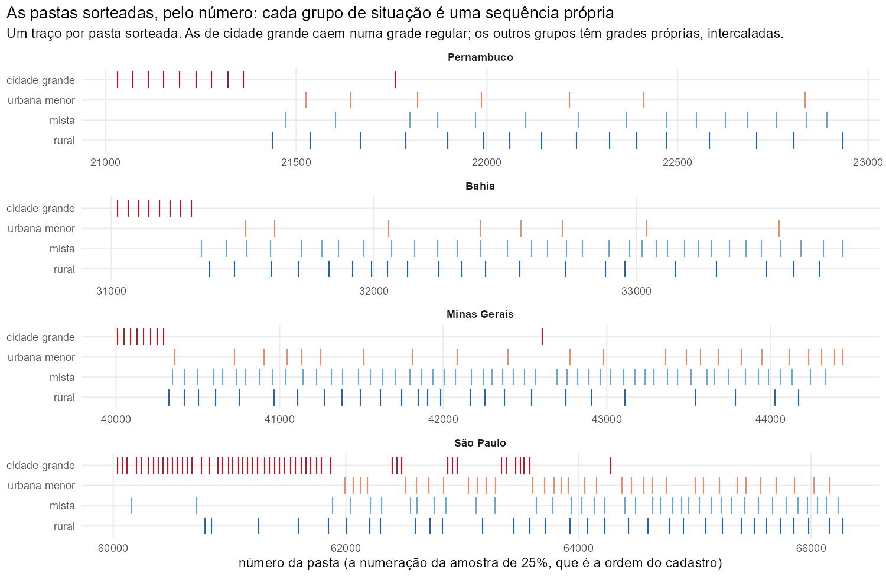
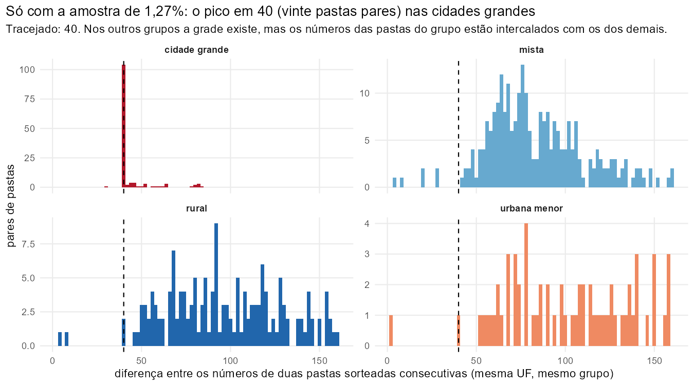
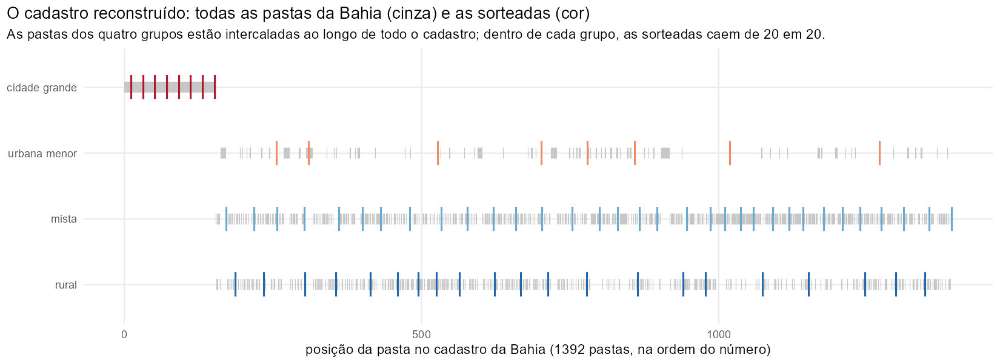
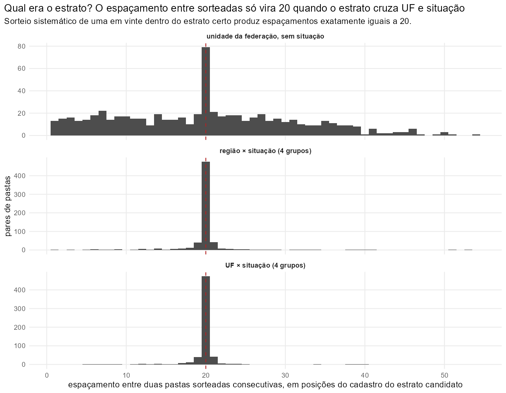
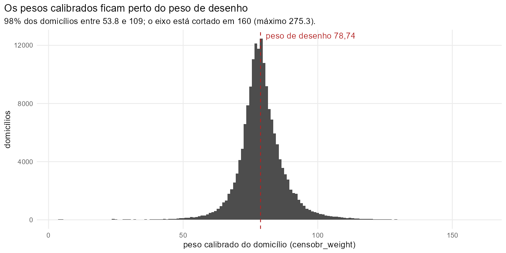
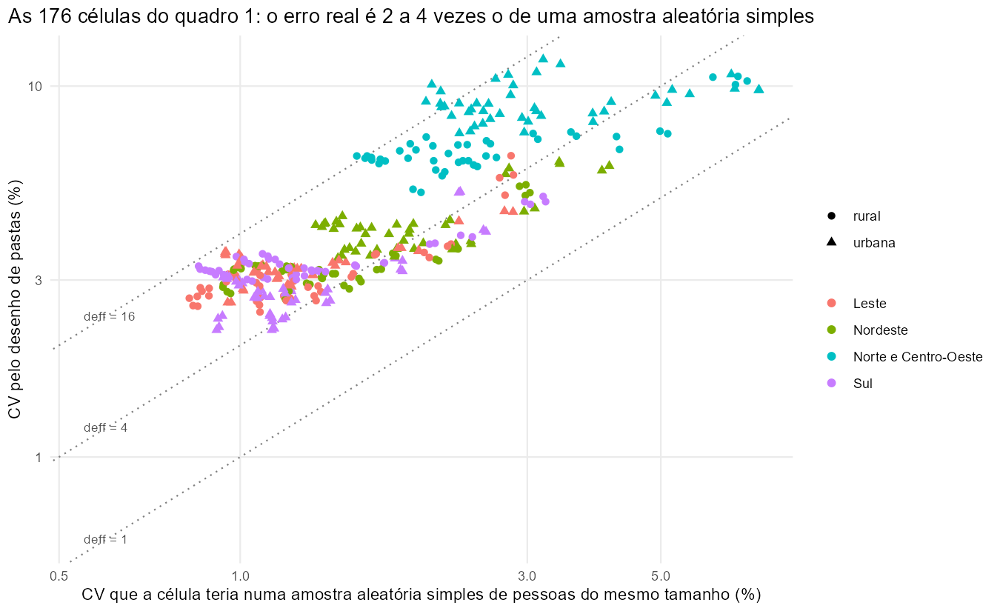
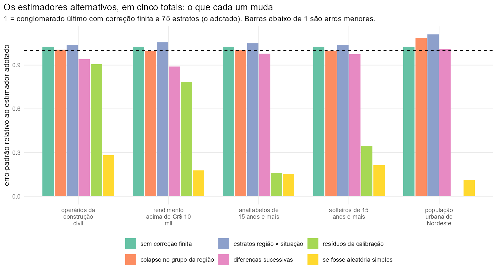

# A amostra de 1,27% do Censo de 1960: o desenho amostral, reconstruído passo a passo

Este texto acompanha `R/microdata_1960_amostra_127.R` e o documento de preparação (`references/microdata_1960_amostra_127_preparacao.md`). Ele foi escrito para um leitor que domina estatística e análise de dados, tem noções de amostragem (sabe o que é um estrato, um conglomerado, um peso), mas nunca ouviu falar desta amostra, não conhece o vocabulário do IBGE de 1960 e não tem nenhum contexto sobre como as decisões abaixo foram tomadas. Por isso o texto não pressupõe nada: cada afirmação vem acompanhada do documento que a sustenta, do dado que a demonstra ou da declaração explícita de que é uma escolha nossa.

A promessa é que, ao fim, o leitor saiba (1) como a amostra foi sorteada em 1960–1964, (2) o que sobreviveu no arquivo, (3) como o desenho foi reconstruído por engenharia reversa, com os dados e as figuras de cada passo, (4) o que cada coluna de desenho das tabelas significa, (5) como calcular um erro-padrão correto e (6) por que cada alternativa de cálculo foi adotada, deixada como opção ou descartada.

Tudo o que está aqui é reproduzível. Os números vêm da execução do pipeline (`targets::tar_make()` dos alvos de 1960) em 2026-09-15; as figuras e as tabelas da investigação vêm de `references/figuras/desenho_amostral_1960.R`, que refaz a engenharia reversa do começo ao fim; a conferência contra o pacote `survey` está em `references/conferencia_desenho_amostral_1960.R`.

**Organização.** A Parte I (seções 1 a 4) diz o que a amostra é e o que os documentos da época dizem sobre ela. A Parte II (seções 5 a 9) é a engenharia reversa: o que o próprio arquivo revela, o cadastro de sorteio reconstruído a partir da amostra de 25%, e os testes que identificam os estratos. A Parte III (seções 10 a 15) trata dos pesos, das colunas de desenho, do cálculo do erro-padrão e das alternativas. Ao fim há um glossário e a lista de fontes.

---

## Parte I — O que é a amostra

## 1. O Censo de 1960 e as suas duas amostras

O Censo Demográfico de 1960 teve data de referência em 1º de setembro de 1960: em cada domicílio foram recenseadas as pessoas que ali passaram a noite de 31 de agosto para 1º de setembro, mais os moradores temporariamente ausentes. O recenseador percorria o seu **setor censitário** — a área de trabalho de um recenseador, com algumas centenas de domicílios; o país foi dividido em 57.914 setores — e registrava todos os domicílios numa **Folha de Coleta**. Para a maioria dos domicílios preenchia um questionário curto. Esse questionário curto é o **universo** do censo, e é dele que saem as contagens totais de população, por sexo, idade, cor, nacionalidade e alfabetização.

Foi a primeira vez que um censo brasileiro usou amostragem na coleta. As perguntas longas — migração, instrução, estado conjugal, filhos tidos e vivos, rendimento, ocupação, ramo de atividade, e as características do domicílio como água, esgoto, fogão, rádio e geladeira — foram feitas a uma **amostra de 25%** dos domicílios, num questionário próprio, o **Boletim de Amostra** (formulário CD 2). O sorteio dessa amostra era sistemático e feito no campo, pela própria Folha de Coleta: os dois modelos de folha (CD 7 e CD 8) traziam impressas, em destaque, "Linhas de Amostra" a cada quatro linhas, e o domicílio registrado numa linha de amostra recebia o boletim longo. A posição da linha marcada mudava de página para página e de modelo para modelo, "de modo a permitir que todas as posições tivessem a possibilidade de constituírem Linhas de Amostra"; os dois modelos eram usados alternadamente conforme o setor tivesse número par ou ímpar, e a ordem de enumeração dos domicílios era fixada por regras, para que o recenseador não escolhesse quem entrava na amostra. Os volumes definitivos resumem: "vários processos foram adotados com a finalidade de proporcionar variação nas séries sistemáticas de seleção, de forma a evitar a introdução na amostra de tendenciosidades decorrentes de características cíclicas do universo" (Volume I, seção "Amostragem"). Essa amostra de 25% é a **amostra geral** do censo, e é dela que saíram os volumes definitivos publicados ao longo dos anos 1960 e 1970. Os seus microdados sobrevivem hoje para 17 unidades da federação, e o `censobr` os distribui na compilação de 1960.

A apuração mecânica de 25% do país levaria anos. Para publicar resultados rápidos, o IBGE sorteou, dentro da amostra de 25%, uma **subamostra de cerca de 1,27% da população**, perfurou-a em cartões e publicou com ela, em março de 1965, os *Resultados Preliminares do Censo Demográfico* (Série Especial, volume II). É dessa subamostra que trata este texto. Ela é a única amostra do Censo de 1960 que cobre todas as unidades da federação, e é por isso que ela importa mesmo onde a amostra de 25% existe: para onze unidades da federação (Rondônia, Acre, Amazonas, Roraima, Pará, Amapá, Maranhão, Piauí, Espírito Santo, Guanabara e Santa Catarina) ela é tudo o que resta do Censo de 1960 em microdados.

## 2. O vocabulário da época

Sem estas palavras o resto não se lê.

- **Boletim** — o questionário de um domicílio. O Boletim de Amostra (CD 2) tem a página do domicílio e uma linha por pessoa. No arquivo, cada boletim virou um cartão de família (a página do domicílio) e um cartão por pessoa.
- **Folha de Coleta** (CD 7 e CD 8) — a lista de todos os domicílios de um setor, na ordem em que o recenseador os visitou. As "linhas de amostra" impressas nela decidiam quem recebia o boletim longo.
- **Setor censitário** — a área de um recenseador, contínua e situada num só quadro (urbano, suburbano ou rural) de um só distrito. Os boletins de amostra de um setor ficavam juntos.
- **Pasta** — a palavra central deste texto. Quando os boletins de amostra chegavam ao órgão central, eram reunidos em lotes de trabalho de cerca de 250 boletins, na ordem dos setores, e cada lote era uma pasta física, numerada. A pasta é uma unidade administrativa (um pacote de papel que um codificador recebia), não uma unidade geográfica; mas, como os boletins entravam na ordem dos setores, uma pasta contém boletins de setores vizinhos, quase sempre do mesmo município, e é inteiramente urbana, inteiramente rural ou mista conforme os setores que a compõem. No desenho da subamostra, a pasta é a unidade sorteada: sorteou-se a pasta inteira.
- **Cadastro** — a lista completa das pastas de onde as sorteadas foram tiradas. Nenhum documento o publica; a seção 6 mostra como ele foi reconstruído.
- **Distrito** — a divisão administrativa abaixo do município (a sede é o distrito 01; os demais têm códigos ímpares, 03, 05, 07…). Na Guanabara, que era estado e cidade ao mesmo tempo, não há distritos: há bairros, circunscrições censitárias e favelas, com códigos próprios.
- **Zona fisiográfica** — a divisão regional que o IBGE usava dentro de cada estado (por exemplo, "Zona do Litoral", "Zona da Mata"). Cada município pertence a uma zona. Ela importa porque, como a seção 6 mostra, o cadastro de sorteio foi ordenado por zona.
- **Situação** — do domicílio: quadro urbano, suburbano ou rural. "Urbano" nas tabelas de 1965 soma urbano e suburbano.
- **População presente** e **população residente** — presente é quem estava no domicílio na noite de referência (moradores presentes mais não moradores presentes); residente é quem mora ali (moradores presentes mais moradores ausentes). As tabelas de 1965 usam presente para pessoas e residente para domicílios.
- **Chave do questionário** — a identificação que o arquivo guarda para cada boletim: unidade da federação, distrito, número da pasta e número do boletim dentro da pasta. É por ela que a pasta é reconhecível no arquivo, e é ela que torna possível tudo o que a Parte II faz.
- **Cartão** — o cartão perfurado de 62 colunas em que cada pessoa e cada página de domicílio da subamostra foram gravadas em 1964. O arquivo de hoje é a imagem desse baralho de cartões.

## 3. O que os documentos da época dizem sobre o sorteio

### 3.1 O Volume II de 1965: a única descrição do desenho

A descrição do desenho da subamostra que existe é a do volume dos *Resultados Preliminares* (Série Especial, vol. II, março de 1965), na seção "Planejamento de amostragem" das páginas 10 e 11. Ela é curta o bastante para ser citada quase por inteiro. Primeiro o porquê:

> "A adoção de um plano de grandes conglomerados coincidentes com as unidades naturais de trabalho se impunha dadas as condições expostas; além disso, grande parte dos itens selecionados para tabulação só constavam do Boletim de Amostra – CD-2; isto determinou que se optasse pelo desenho de uma sub-amostra da amostra geral selecionada na coleta censitária. A unidade de seleção da sub-amostra constituiu-se de 'Pastas' que reuniam Boletins de Amostra – CD-2. O plano utilizado corresponde por conseguinte ao de uma amostra bi-etápica em que a primeira etapa constituiu-se de uma amostra de cerca de 1/4 da população e a segunda etapa de cerca de 1/20 da etapa anterior; o que resultou em uma amostra de aproximadamente 1,27% do total da população e dos domicílios particulares."

Depois as duas etapas:

> "A primeira etapa foi formada pela amostra geral selecionada na coleta censitária, de uma forma 'sistemática', constando de aproximadamente 25% das pessoas recenseadas em domicílios particulares e coletivos. Compôs-se das pessoas recenseadas nos domicílios particulares registrados nas linhas previamente marcadas como pertencentes à amostra — uma em cada quatro linhas da folha de coleta — e de 25% das pessoas recenseadas em domicílios coletivos, selecionadas por processo equivalente ao adotado para os domicílios particulares.
>
> Na segunda etapa estes conglomerados constituídos pelos domicílios da amostra geral estavam reunidos em lotes de trabalho denominados 'Pastas', de tamanho variável, com a média de 250 questionários, mantida a ordem de setores de coleta. As 'Pastas' foram estratificadas de acordo com critérios geográfico e de situação do domicílio, considerando-se em relação à situação destes 4 grupos: pastas com questionários de cidades de 100 000 e mais habitantes, pastas com questionários de aglomerados urbanos de menos de 100 000 habitantes, pastas com questionários de situação rural, e pastas mistas, contendo questionários de situação rural e urbana (quadro urbano e quadro suburbano).
>
> A seleção das unidades de amostra foi sistemática, com início das séries aleatório. Foram selecionadas 814 pastas cujos questionários forneceram as informações que deram origem às estimativas apresentadas neste volume. Os cálculos de erros de amostragem para as características apresentadas estão sendo executados. Deixamos de incluí-los nesta publicação, a fim de evitar seu retardamento. Entretanto, farão parte de uma publicação especial em que se fará descrição detalhada do desenho da amostra e das técnicas utilizadas."

O volume também explica para que a amostra foi dimensionada: "o fornecimento de dados globais para o País e para as três Regiões Fisiográficas mais populosas, de vez que a obtenção de dados para as Regiões de menores contingentes populacionais ou para as Unidades da Federação repercutiria no tamanho da amostra e no seu desenho". As tabelas saem, por isso, para o Brasil e para as regiões Nordeste, Leste e Sul; o Norte e o Centro-Oeste só aparecem dentro do total do país.

Em nossas palavras, o desenho declarado é:

1. A primeira etapa é a própria amostra de 25%: os boletins de amostra do país inteiro, reunidos em pastas de cerca de 250 boletins cada, na ordem dos setores.
2. As pastas foram classificadas em **estratos**, definidos por dois critérios cruzados: um critério geográfico e a **situação** das pastas em quatro grupos — cidades com 100 mil habitantes ou mais; aglomerados urbanos menores; rurais; mistas.
3. Dentro de cada estrato, sorteou-se **uma pasta em vinte**, sistematicamente, com início aleatório: numa lista ordenada, escolhe-se um ponto de partida ao acaso entre as vinte primeiras e, a partir dele, toma-se uma pasta a cada vinte.
4. Todos os boletins da pasta sorteada entram na subamostra. Foram sorteadas **814 pastas**.

A fração de amostragem nominal é, portanto, $\tfrac{1}{4} \times \tfrac{1}{20} = \tfrac{1}{80} = 1{,}25\%$; o volume fala em "aproximadamente 1,27%" porque o número de boletins por pasta variava. O peso de desenho nominal, o inverso da fração, é 80: cada pessoa da subamostra representa oitenta pessoas.

Em figura:

```
todos os domicílios do país  ->  1 em 4, na Folha de Coleta   ->  amostra de 25% (Boletins de Amostra CD 2)
                                                                  reunidos em pastas de ~250 boletins, na ordem dos setores
                                                                  classificadas em estratos: [critério geográfico] x situação (4 grupos)
                                                             ->  1 pasta em 20, sistemático, início aleatório, dentro de cada estrato
                                                             ->  814 pastas = a amostra de 1,27% (todos os boletins de cada pasta)
```

Por que sortear pastas inteiras, e não pessoas? Porque era barato. As pastas já existiam como pacotes físicos; perfurar cartões para 814 pastas era um trabalho que cabia no calendário de uma publicação preliminar, e sortear pessoas espalhadas por milhares de pastas não cabia. O custo estatístico dessa escolha é o assunto da seção 12: as pessoas de uma mesma pasta são vizinhas e parecidas, e a amostra tem muito menos informação do que os seus 897 mil registros sugerem.

### 3.2 O que o Volume II não diz

Quatro coisas que a seção 3.1 deixa em aberto, e que a Parte II vai resolver ou decidir:

- **Qual é o critério geográfico dos estratos.** O texto diz "critérios geográfico e de situação" e não diz se o geográfico é a região, a unidade da federação, a zona fisiográfica ou outra coisa.
- **Como se operacionalizou "cidade de 100 000 e mais habitantes".** O volume define "cidade" como sede municipal, mas não diz se o corte foi aplicado à população da cidade, à do município, ou à urbana do município, nem qual foi a fonte.
- **Como as pastas foram ordenadas** antes do sorteio sistemático, o que importa para saber se a ordem do cadastro pode ser usada no cálculo da variância.
- **Os erros de amostragem** e "a descrição detalhada do desenho". A publicação especial prometida não existe na Biblioteca do IBGE, no Internet Archive nem nas citações dos volumes definitivos; os volumes definitivos, anos depois, prometem de novo "volume da Série Especial" com os erros de amostragem e "uma descrição detalhada do processo de amostragem". Tudo indica que nenhum dos dois saiu.

### 3.3 Os outros documentos, e o que cada um acrescenta

**Os tomos do Volume I (resultados definitivos, Série Regional, 19 tomos, um por unidade da federação).** A introdução de cada tomo tem uma seção "Amostragem" que descreve a amostra de 25% — o que está resumido na seção 1 — e o método de estimativa usado nos resultados definitivos: estimativa de razão em **48 grupos**, formados depois da seleção por situação (urbana, rural), sexo, posição na família (chefe, cônjuge, outros; moradores ausentes à parte) e faixa de idade, com pesos inteiros escolhidos ao acaso entre as pessoas do grupo para que a soma reproduzisse a contagem do universo. Grupos com razão universo/amostra acima de 16 ou com menos de 100 pessoas no universo eram fundidos com o seguinte. Isso é o desenho da **amostra de 25%**, não desta subamostra, mas importa por duas razões: mostra que a amostra de 25% é, para efeito de variância, uma amostra sistemática de domicílios com efeito de desenho próximo de 1 (seção 13.2), e mostra que as margens do universo por unidade da federação existem publicadas, o que abre uma alternativa de calibração (seção 13.5).

**Os dois grupos de tomos, e o que isso diz sobre a amostra de 25%.** A "Apresentação" do volume nacional dos resultados definitivos (*Série Nacional*, vol. I) conta como a divulgação foi feita: "O plano de divulgação inicialmente estabelecido previa a apuração dos dados em duas etapas, sendo os resultados, para cada Unidade da Federação, apresentados em duas partes. De acordo com esse plano inicial, foram publicados os resultados definitivos relativos às seguintes Unidades da Federação: Rondônia, Roraima, Amapá, Acre, Amazonas, Pará, Maranhão, Piauí, Espírito Santo, Guanabara e Santa Catarina. A apuração dos dados correspondentes às Unidades da Federação restantes foi feita com base apenas no formulário CD.2 – Boletim de Amostra, tendo sido modificado o plano inicial, com a redução do número de tabelas e a reunião dos resultados em um único volume para cada Unidade da Federação. Os resultados apresentados, entretanto, abrangem todos os itens investigados." Os tomos das onze primeiras unidades da federação saíram em duas partes ainda no Serviço Nacional de Recenseamento e nos primeiros anos da Fundação IBGE (a 1ª parte de Santa Catarina é datada de janeiro de 1968 e a 2ª, de novembro de 1968); os das outras dezessete saíram em volume único, na década de 1970, já sob a presidência de Isaac Kerstenetzky, e o volume nacional "encerra a apresentação dos resultados definitivos". Duas consequências para este texto. Primeira: a amostra de 25% foi apurada e publicada para **todas** as unidades da federação, com o mesmo método de estimativa de razão em 48 grupos, ainda que os seus microdados só sobrevivam para dezessete — e as dezessete são exatamente as do segundo grupo, apuradas mais tarde e, tudo indica, já em computador, enquanto as onze do primeiro grupo, apuradas em equipamento de cartões, são as que hoje só têm esta subamostra. Segunda: nos tomos das dezessete, **as tabelas de sexo, idade, cor e alfabetização também são estimativas da amostra de 25%**, ancoradas nos totais da Sinopse Preliminar de 1961–1962 (população total, urbana e rural e domicílios, por município, apurados na contagem completa); só nos onze tomos do primeiro grupo essas tabelas vêm do universo. Isso importa para a calibração da seção 13.5.

**O relatório do IPEA de abril de 1969** (*Processamento de uma amostra do Censo Demográfico de 1960*, 5 páginas datilografadas, cópia carbono de leitura difícil). Registra que o IPEA recebeu 29 caixas com cerca de 56 mil cartões — uma **subamostra** desta subamostra, para as regiões Nordeste, Leste e Sul, selecionada por grau de instrução do chefe da família —, que a dividiu em dez subamostras pelo último dígito do número de enumeração, excluiu não residentes, convidados e empregados e cartões com códigos impossíveis, e gravou tudo na fita magnética "IPEA 10" no Rio Datacentro da PUC-Rio. A página 4 lista o conteúdo de cada cartão de pessoa (situação, sexo e condição de presença, parentesco, idade, religião, cor, naturalidade, nacionalidade, procedência, tempo de residência, alfabetização, série concluída, curso, estado conjugal, ano do casamento, filhos tidos e vivos, rendimento, atividade, ocupação, ramo, posição na ocupação), que é exatamente o leiaute do arquivo de hoje. O relatório não descreve o desenho, mas prova três coisas: que os cartões circularam fora do IBGE já em 1969, que o leiaute do cartão é o que o arquivo tem, e que o nosso arquivo (1.074.328 cartões) é o baralho inteiro, não a subamostra do IPEA.

**O Volume IV da Série Especial** (*Favelas — Estado da Guanabara*, 108 páginas). Publica as favelas cariocas por zona e circunscrição censitária. A sua seção "Amostragem" é idêntica à dos tomos do Volume I: vem dos resultados **definitivos** (amostra de 25% e universo), e não desta subamostra. Serve de gabarito para os domicílios em favelas que a subamostra identifica, não como fonte sobre o desenho.

**O Código de Zonas Fisiográficas, Municípios e Distritos (situação em 1º-7-1960)** e o **Anuário Estatístico do Brasil de 1961**. O primeiro dá o código oficial de cada município e distrito, que é o que o campo `V116` do arquivo guarda, e a zona fisiográfica de cada município; o segundo dá a população total, urbana e rural de cada município em 1960. Os dois estão transcritos em `read_guides/1960_municipios.csv` e `read_guides/1960_distritos.csv`, e são o que permite classificar cada pasta por município, zona e tamanho da cidade.

O Volume II, o relatório do IPEA e o Volume IV estão em `references/fontes_1960/`, com um índice de procedência; os tomos do Volume I estão no Dropbox do projeto (seção 17).

## 4. O que sobreviveu no arquivo

A subamostra foi perfurada em cartões de 62 colunas, um por pessoa e um por página de domicílio. O arquivo de hoje, `HHOLDA.txt`, é a imagem desse baralho depois de décadas de cópias entre cartões, fitas e discos: 1.074.328 linhas de 62 caracteres. O documento de preparação descreve o dano (linhas deslocadas, caracteres corrompidos, blocos de cartões copiados duas vezes em Pernambuco, cartões de família perdidos) e o que se fez com ele. Aqui interessa o que o dano fez ao desenho:

- **As 814 pastas estão todas lá.** O arquivo tem 817 números de pasta distintos; os três a mais são uma pasta de Rondônia gravada em duas unidades da federação e chaves com um dígito trocado. Nenhum conglomerado inteiro se perdeu.
- **As pastas têm o tamanho esperado.** Mediana de 223 boletins por pasta (quartis 197 e 241, máximo 352), e mediana de 1.124 pessoas. Vinte e três pastas têm menos de 100 boletins: as de Roraima e de Fernando de Noronha, que eram pequenas mesmo, e algumas truncadas. O caso grave é o Distrito Federal: as duas pastas de Brasília têm 77 e 60 boletins no arquivo, quando a amostra de 25% mostra que tinham 520 e 257 (seção 6). O arquivo perdeu 85% e 75% dessas duas pastas, e o trecho perdido era um acampamento de operários da construção de Brasília. É a única perda parcial de conglomerado de que se tem prova.
- **A chave do questionário sobreviveu em quase todas as linhas**, e é ela que permite dizer a que pasta cada pessoa pertence. Onde o cartão de família se perdeu, a chave está nos cartões de pessoa.
- O resultado é uma tabela de **897.009 pessoas em 174.245 domicílios**, 885.127 delas presentes na noite de referência — 1,26% dos 70.119.071 presentes que o volume de 1965 publicou.

A distribuição das 817 pastas por unidade da federação, com a classificação de situação que a seção 7 justifica, dá a medida do que a amostra cobre e do que não cobre:

| UF | pastas | cidade grande | urbana menor | mista | rural | boletins por pasta (mediana) |
|---|---|---|---|---|---|---|
| Rondônia | 1 | 0 | 1 | 0 | 0 | 140 |
| Acre | 2 | 0 | 1 | 1 | 0 | 238 |
| Amazonas | 8 | 1 | 0 | 4 | 3 | 212 |
| Roraima | 4 | 0 | 2 | 0 | 2 | 17 |
| Pará | 16 | 4 | 1 | 7 | 4 | 222 |
| Amapá | 1 | 0 | 0 | 1 | 0 | 210 |
| Maranhão | 27 | 1 | 1 | 7 | 18 | 233 |
| Piauí | 14 | 1 | 1 | 3 | 9 | 219 |
| Ceará | 35 | 4 | 4 | 20 | 7 | 229 |
| Rio Grande do Norte | 13 | 2 | 1 | 6 | 4 | 227 |
| Paraíba | 23 | 2 | 3 | 9 | 9 | 233 |
| Pernambuco | 48 | 10 | 7 | 15 | 16 | 228 |
| Fernando de Noronha | 1 | 0 | 1 | 0 | 0 | 62 |
| Alagoas | 15 | 2 | 2 | 4 | 7 | 203 |
| Sergipe | 10 | 1 | 2 | 3 | 4 | 235 |
| Bahia | 70 | 8 | 8 | 33 | 21 | 224 |
| Minas Gerais | 112 | 9 | 23 | 54 | 26 | 212 |
| Serra dos Aimorés | 4 | 0 | 1 | 0 | 3 | 234 |
| Espírito Santo | 9 | 0 | 2 | 5 | 2 | 302 |
| Rio de Janeiro | 39 | 14 | 6 | 13 | 6 | 224 |
| Guanabara | 41 | 40 | 0 | 0 | 1 | 226 |
| São Paulo | 156 | 52 | 34 | 38 | 32 | 232 |
| Paraná | 48 | 4 | 8 | 17 | 19 | 224 |
| Santa Catarina | 23 | 0 | 5 | 12 | 6 | 221 |
| Rio Grande do Sul | 62 | 8 | 16 | 25 | 13 | 220 |
| Mato Grosso | 10 | 0 | 2 | 5 | 3 | 210 |
| Goiás | 23 | 1 | 3 | 11 | 8 | 201 |
| Distrito Federal | 2 | 0 | 2 | 0 | 0 | 68 |

Rondônia só tem Porto Velho; o Amapá tem uma pasta mista; o Acre, duas; Fernando de Noronha, uma; o Distrito Federal, duas pastas urbanas truncadas. Nenhum peso cria o que não foi sorteado: para essas unidades, a amostra descreve o que foi sorteado e sobreviveu, e nada mais (seção 15).

---

## Parte II — A engenharia reversa do sorteio

Como não há publicação especial, o desenho teve de ser reconstruído a partir dos dados. A reconstrução andou em quatro passos, e cada um é apresentado com o que se perguntou, o que se mediu e o que se concluiu. O leitor que quiser só o resultado pode ir à seção 9; o que quiser conferir pode rodar `references/figuras/desenho_amostral_1960.R`, que refaz tudo o que está aqui.

## 5. Passo 1: o que a amostra de 1,27% diz sozinha

A primeira pergunta foi se a chave do questionário — em particular o **número da pasta** — carregava alguma informação sobre o sorteio. Carrega, e muita.

### 5.1 Os números das pastas são todos pares

Das 817 pastas, 816 têm número par; a única ímpar é uma chave danificada. Isso diz que as pastas da amostra de 25% foram numeradas de dois em dois, e que o número da pasta sorteada é o número que ela tinha no cadastro inteiro, não uma numeração nova dada às sorteadas. Os números também carregam a unidade da federação como prefixo: as pastas do Ceará vão de 14002 a 15426, as da Bahia de 31002 a 33786, as de São Paulo de 60002 a 66292. Cada unidade da federação tem a sua própria numeração, e ela não atravessa fronteiras.

### 5.2 A grade de 40 nas cidades grandes

Se o sorteio foi de uma pasta em vinte numa lista numerada de dois em dois, duas pastas sorteadas consecutivas de uma mesma série devem diferir em 40 no número. A figura 1 mostra os números das pastas sorteadas de quatro unidades da federação, com cada pasta classificada num dos quatro grupos de situação do Volume II (pela situação dos seus próprios boletins e pelo tamanho do município — a regra exata está na seção 8):



Três coisas se veem a olho nu. As pastas das cidades grandes estão no começo da numeração de cada unidade da federação (as capitais foram as primeiras pastas do cadastro, como a seção 6 confirma) e caem numa grade regular. As pastas mistas e rurais têm, cada grupo, uma grade própria, e as duas grades estão intercaladas ao longo do resto da numeração. E as pastas de um grupo nunca se aproximam demais umas das outras: são sequências sistemáticas separadas, exatamente a assinatura de estratos de situação sorteados cada um por si.

A figura 2 mede isso: para cada grupo, o histograma da diferença entre os números de duas pastas sorteadas consecutivas da mesma unidade da federação.



| grupo de situação | pares de pastas consecutivas | diferença exatamente 40 | 40, 42, 44 ou 46 | diferença mediana |
|---|---|---|---|---|
| cidade grande | 146 | 71% | 78% | 40 |
| urbana menor | 112 | 1% | 1% | 140 |
| mista | 271 | 0% | 2% | 80 |
| rural | 200 | 1% | 2% | 110 |

Nas cidades grandes, cujas pastas são contíguas no cadastro, a grade é quase perfeita. Município a município, entre os que têm quatro ou mais pastas de cidade grande:

| cidade | pastas | diferenças entre números consecutivos |
|---|---|---|
| Rio de Janeiro (Guanabara) | 40 | 37 vezes 40, uma vez 82, e uma pasta com número danificado |
| São Paulo | 39 | 21 vezes 40; 44 ou 46 seis vezes; onze saltos de 50 a 82 onde a numeração pulou |
| Recife | 9 | 40 40 40 42 44 40 44 40 |
| Salvador | 8 | 40 40 40 40 40 40 40 |
| Belo Horizonte | 8 | 40 40 40 40 40 40 40 |
| Porto Alegre | 7 | 40 40 40 40 40 40 |
| Belém | 4 | 40 40 40 |
| Fortaleza | 4 | 40 40 42 |
| Curitiba | 4 | 40 40 40 |

Nos outros três grupos a diferença mediana é de 80 a 140, e quase nunca 40: não porque o sorteio ali fosse outro, mas porque os números das pastas rurais, mistas e urbanas menores estão intercalados no cadastro, de modo que entre duas rurais sorteadas há muitas pastas de outros grupos. Quando se ignora o grupo e se olha só a unidade da federação, apenas 15% das diferenças são 40. O sorteio, portanto, foi feito por grupo de situação — e isso já se sabe com a amostra de 1,27% sozinha.

### 5.3 O peso realizado bate com o nominal

Uma segunda verificação independente do "uma em vinte" é o fator de expansão implícito: a população presente que o IBGE publicou em 1965, dividida pela contagem do arquivo. Se a fração for de fato 1/80 e o arquivo estiver íntegro, o fator é 80.

| domínio | publicado em 1965 | pessoas presentes no arquivo | fator implícito |
|---|---|---|---|
| Brasil | 70.119.071 | 885.127 | 79,2 |
| Brasil, urbana | 32.471.377 | 406.021 | 80,0 |
| Brasil, rural | 37.647.694 | 479.106 | 78,6 |
| Nordeste | 15.524.609 | 195.288 | 79,5 |
| Leste | 24.659.232 | 311.219 | 79,2 |
| Sul | 24.445.902 | 307.859 | 79,4 |
| Norte e Centro-Oeste | 5.489.328 | 70.761 | 77,6 |

O urbano dá 79,5 a 80,1 em todas as regiões; o rural dá um pouco menos (76,3 a 79,3), e o Norte e Centro-Oeste dá 77,6, puxado pelo Distrito Federal truncado. A fração nominal está confirmada, e o desvio para baixo é o dano do arquivo, não o desenho.

### 5.4 O que ficou em aberto depois do passo 1

O passo 1 confirma o sorteio sistemático de uma em vinte por grupo de situação, mas não responde à pergunta que mais importa para a variância: **qual era o critério geográfico dos estratos**. A numeração não atravessa unidades da federação, então ela não distingue entre "cada unidade da federação é um estrato" e "cada região é um estrato" — nos dois casos as pastas de uma unidade da federação formam sequências próprias. E ela não diz onde começa e termina cada estrato, porque só se veem as sorteadas, não as que não foram.

## 6. Passo 2: o cadastro de sorteio, reconstruído a partir da amostra de 25%

### 6.1 A ideia

A resposta veio de onde não se esperava. A compilação da amostra de **25%** do Censo de 1960 que o `censobr` distribui guarda, para cada domicílio, o número da pasta em que o seu boletim foi arquivado (`v001`). Como essa amostra é a amostra geral inteira — todos os boletins de amostra, não só os das pastas sorteadas —, os seus números de pasta são **o cadastro completo**: a lista de onde as 814 pastas foram tiradas. Para as 17 unidades da federação em que a amostra de 25% sobreviveu, isso permite refazer o sorteio e olhá-lo por dentro: ver todas as pastas, marcar as sorteadas, e perguntar em que lista ordenada elas caem de vinte em vinte.

### 6.2 O cadastro

O cadastro reconstruído tem **13.411 pastas**, com mediana de 235 boletins por pasta (quartis 216 e 250), a média de 250 que o Volume II declara. A sua composição por grupo de situação é 4.989 mistas, 3.610 rurais, 2.432 de cidade grande e 2.380 urbanas menores. Por unidade da federação:

| UF | pastas no cadastro | pastas sorteadas | cadastro / sorteadas | números de pasta |
|---|---|---|---|---|
| Ceará | 706 | 35 | 20,2 | 14002 a 15426 |
| Rio Grande do Norte | 266 | 13 | 20,5 | 17002 a 17532 |
| Paraíba | 461 | 23 | 20,0 | 19000 a 20034 |
| Pernambuco | 968 | 48 | 20,2 | 21002 a 22936 |
| Fernando de Noronha | 1 | 1 | 1,0 | 27002 |
| Alagoas | 300 | 15 | 20,0 | 25002 a 25600 |
| Sergipe | 195 | 10 | 19,5 | 30002 a 30390 |
| Bahia | 1.392 | 70 | 19,9 | 31002 a 33786 |
| Minas Gerais | 2.229 | 112 | 19,9 | 40002 a 44462 |
| Serra dos Aimorés | 74 | 4 | 18,5 | 50002 a 50148 |
| Rio de Janeiro | 764 | 39 | 19,6 | 52002 a 53530 |
| São Paulo | 3.140 | 156 | 20,1 | 60002 a 66292 |
| Paraná | 945 | 48 | 19,7 | 70002 a 71900 |
| Rio Grande do Sul | 1.265 | 62 | 20,4 | 81002 a 83532 |
| Mato Grosso | 211 | 10 | 21,1 | 91002 a 91424 |
| Goiás | 456 | 23 | 19,8 | 94002 a 94914 |
| Distrito Federal | 38 | 2 | 19,0 | 97002 a 97076 |

Quatro fatos saem da tabela:

1. **Todas as 671 pastas** que a subamostra tem nessas 17 unidades da federação estão no cadastro. Nenhuma pasta "inventada", nenhuma chave inconsistente.
2. **A razão entre o cadastro e as sorteadas é 20 em toda parte** — de 18,5 (Serra dos Aimorés, 4 pastas) a 21,1 (Mato Grosso, 10), mediana 19,9. É a confirmação direta e independente do "uma pasta em vinte", e é também a prova de que o sorteio foi feito **separadamente em cada unidade da federação**: se a série sistemática atravessasse fronteiras, a razão por unidade da federação flutuaria muito mais do que isso nas pequenas. Fernando de Noronha, com uma única pasta no cadastro e ela sorteada, é a exceção que confirma: ali não houve sorteio possível.
3. **As sorteadas não são maiores nem menores que as demais**: mediana de 235 boletins nas duas. O sorteio não foi enviesado por tamanho.
4. **O Distrito Federal**: as duas pastas sorteadas têm 520 e 257 boletins no cadastro, e 77 e 60 no arquivo da subamostra. É daqui que vem a certeza de que o arquivo as truncou.

### 6.3 Como o cadastro está ordenado

O sorteio sistemático depende da ordem da lista. Percorrendo o cadastro de cada unidade da federação na ordem do número da pasta e contando quantas vezes cada atributo muda de uma pasta para a seguinte:

| UF | pastas | zonas fisiográficas | mudanças de zona | municípios | mudanças de município | mudanças de grupo de situação |
|---|---|---|---|---|---|---|
| São Paulo | 3.140 | 70 | 70 | 503 | 502 | 1.048 |
| Minas Gerais | 2.229 | 56 | 56 | 483 | 482 | 1.008 |
| Bahia | 1.392 | 26 | 26 | 194 | 193 | 648 |
| Rio Grande do Sul | 1.265 | 20 | 20 | 150 | 149 | 468 |
| Pernambuco | 968 | 15 | 15 | 102 | 101 | 438 |
| Paraná | 945 | 21 | 21 | 162 | 161 | 461 |
| Rio de Janeiro | 764 | 12 | 12 | 61 | 60 | 218 |
| Ceará | 706 | 22 | 21 | 142 | 141 | 305 |
| Paraíba | 461 | 12 | 11 | 88 | 87 | 236 |
| Goiás | 456 | 25 | 25 | 179 | 178 | 235 |

A leitura: **o cadastro é ordenado por zona fisiográfica e, dentro dela, por município**. Cada município é um bloco contíguo de pastas (502 mudanças para 503 municípios em São Paulo é o mínimo possível: uma mudança a cada município novo), e cada zona é um bloco contíguo de municípios — com uma exceção regular: a zona da capital aparece em dois blocos, porque **as pastas da capital vêm primeiro no cadastro** e o resto da sua zona vem na posição natural. Em São Paulo, a zona 623 ocupa as posições 1 a 965 (965 pastas, 833 delas puramente urbanas de cidade grande) e depois as posições 1643 a 1799; em Minas, a zona de Belo Horizonte ocupa as posições 1 a 171 e depois 1610 a 1639. A figura 4 mostra isso para São Paulo:


A situação, ao contrário, **não** ordena o cadastro: o grupo muda 1.048 vezes em São Paulo, embora só existam quatro grupos. As pastas urbanas, rurais e mistas estão intercaladas ao longo de todo o cadastro, porque a ordem é a dos setores dentro de cada município, e um município tem setores urbanos e rurais. A figura 3 mostra o cadastro inteiro da Bahia, com as sorteadas em cor:



Isto importa por duas razões. Primeiro, é assim que se deve ler "estratificadas de acordo com critérios geográfico e de situação": a estratificação por situação não reordenou o cadastro; ela apenas separou, dentro da lista já ordenada por zona e município, quatro sublistas — e em cada sublista se sorteou uma em vinte. Segundo, a ordem por zona e município é o que torna a amostra sistemática melhor do que uma amostra aleatória de pastas (pastas vizinhas na lista são vizinhas no mapa), e o que justifica o estimador de diferenças sucessivas da seção 13.4.

## 7. Passo 3: em que estrato o sorteio foi feito?

### 7.1 O teste

Com o cadastro em mãos, a pergunta "qual era o estrato?" vira uma pergunta com resposta empírica. O raciocínio:

> Se o sorteio foi sistemático de uma em vinte **dentro de um estrato**, então, ordenando o cadastro daquele estrato (e só dele) e numerando as pastas de 1 em diante, as posições das sorteadas formam uma progressão aritmética de razão 20: $a, a+20, a+40, \ldots$, com $a$ sorteado entre 1 e 20. Logo, para cada estratificação candidata, basta medir a fração dos pares de sorteadas consecutivas cujo espaçamento em posições é **exatamente 20**. A estratificação verdadeira produz espaçamentos de 20; uma estratificação errada, não.

Um exemplo de brinquedo mostra por que estratificações erradas falham nos dois sentidos. Suponha um cadastro de 80 pastas de uma unidade da federação, 40 urbanas (U) e 40 rurais (R), intercaladas, e que o IBGE sorteou uma em vinte dentro de cada grupo: nas urbanas, começando pela 5ª urbana (posições 5 e 25 dentro da lista urbana); nas rurais, começando pela 12ª rural (12 e 32).

```
cadastro (uma UF, 80 pastas, U e R intercaladas):  U R U U R R U R U R U U R R U R ...
lista urbana (40):   U1 U2 U3 U4 [U5] U6 ... U24 [U25] U26 ... U40        espaçamento = 20  <- estrato certo
lista rural  (40):   R1 R2 ... R11 [R12] R13 ... R31 [R32] R33 ... R40    espaçamento = 20  <- estrato certo
lista da UF  (80):   as 4 sorteadas caem em posicoes como 9, 23, 47, 66   espaçamentos 14, 24, 19: nada de 20  <- estrato grosso demais
```

Se a estratificação candidata for **grossa demais** (juntar U e R), as posições das sorteadas na lista conjunta dependem de quantas pastas do outro grupo se intrometem entre elas, e o espaçamento vira qualquer número. Se for **fina demais** (por exemplo, quebrar a lista urbana em duas metades), os pares que ficam dentro de cada metade continuam espaçados de 20 — a estratificação fina não é refutada pelos pares que sobrevivem —, mas ela perde os pares que atravessam a fronteira, e são justamente esses que distinguiriam uma lista contínua de duas listas com inícios aleatórios independentes. Por isso o teste tem dois lados: a fração de espaçamentos exatos e o número de pares que a estratificação candidata consegue medir.

### 7.2 As candidatas

Cada estratificação foi testada com o mesmo cadastro, a mesma classificação das pastas e as mesmas sorteadas:

| estratificação candidata | estratos | pares medidos | espaçamento exatamente 20 | entre 19 e 21 | espaçamento mediano |
|---|---|---|---|---|---|
| zona fisiográfica × situação (4 grupos) | 891 | 185 | 84,9% | 88,6% | 20 |
| **unidade da federação × situação (4 grupos)** | **60** | **613** | **77,0%** | **90,2%** | **20** |
| unidade da federação × urbana/rural/mista (3 grupos) | 48 | 625 | 74,4% | 87,4% | 20 |
| região × situação (4 grupos) | 16 | 655 | 72,4% | 85,0% | 20 |
| unidade da federação × município | 2.344 | 161 | 44,1% | 47,8% | 20 |
| zona fisiográfica, sem situação | 312 | 421 | 18,1% | 23,3% | 18 |
| unidade da federação, sem situação | 17 | 654 | 12,1% | 18,3% | 20 |
| região, sem situação | 4 | 667 | 11,8% | 18,1% | 20 |



A leitura, de baixo para cima:

- **Sem a situação, o padrão desaparece.** Unidade da federação sozinha dá 12,1% de espaçamentos exatos; região sozinha, 11,8%; zona sozinha, 18,1%. Isso é o que se espera do acaso quando as sorteadas de quatro séries independentes são olhadas numa lista só (a figura 6, painel de cima, mostra a distribuição espalhada). A situação entra na estratificação, como o Volume II diz.
- **Com a situação, o padrão aparece**, e ele é mais nítido com a unidade da federação (77,0%) do que com a região (72,4%). A diferença entre as duas são exatamente os pares que se quebram quando as unidades da federação de uma mesma região são emendadas numa lista só: em "região × situação" a lista rural do Nordeste é Maranhão, depois Piauí, depois Ceará…, e a cada fronteira o espaçamento deixa de ser 20 porque cada unidade da federação recomeçou a sua série com o seu próprio início aleatório. É o mesmo mecanismo do exemplo de brinquedo, agora entre unidades da federação.
- **Os quatro grupos são melhores que três.** Separar as cidades grandes das outras pastas urbanas sobe de 74,4% para 77,0%. O quarto grupo existia, como o Volume II diz.
- **A zona fisiográfica não é o estrato**, embora "zona × situação" tenha a maior fração de exatos. É o caso "fino demais" do exemplo de brinquedo: com 891 estratos, essa candidata só consegue medir 185 pares — os que caem dentro de uma mesma zona —, e esses pares sairiam exatos de qualquer maneira, porque a zona é um bloco contíguo do cadastro da unidade da federação (seção 6.3) e uma progressão de razão 20 continua sendo de razão 20 dentro de qualquer bloco contíguo. O que decide são os pares que **atravessam** a fronteira de uma zona: se cada zona fosse um estrato com início aleatório próprio, esses pares teriam espaçamento arbitrário e só por acaso (cerca de 5% das vezes) cairiam em 20. Medido: dos 599 pares de "UF × situação" em que as duas pastas têm zona conhecida, os 168 que ficam dentro de uma zona são 85,1% exatos, e os **431 que atravessam zonas são 73,1% exatos** — catorze vezes mais do que o acaso daria. As séries continuam através das zonas; a zona ordena o cadastro, mas não o estratifica. O mesmo vale para o município (44,1% com 161 pares), pelo mesmo motivo.

### 7.3 Unidade da federação × situação, de perto

Dentro da estratificação vencedora, a distribuição dos 613 espaçamentos é concentrada em 20 e simétrica em volta dele: 472 valem 20, 41 valem 21, 40 valem 19, 12 valem 18, 7 valem 17, 5 valem 22. Por grupo de situação:

| grupo | pares | exatamente 20 | entre 19 e 21 |
|---|---|---|---|
| cidade grande | 105 | 92% | 94% |
| urbana menor | 109 | 79% | 90% |
| mista | 236 | 74% | 91% |
| rural | 163 | 70% | 87% |

E, olhados um a um, os estratos são bonitos de ver. Cada um começa num ponto próprio, sorteado ao acaso entre 1 e 20, e daí anda de vinte em vinte (a posição é a da pasta no cadastro do estrato):

```
Bahia, cidade grande   (cadastro de  153, 8 sorteadas):  12  32  52  72  92 112 132 152
Bahia, urbana menor    (cadastro de  170, 8 sorteadas):  19  39  59  79  99 119 139 159
Bahia, rural           (cadastro de  427, 21 sorteadas): 12  32  52  72  92 112 132 152 172 192 212 232 252 269 289 309 ...
Bahia, mista           (cadastro de  642, 33 sorteadas):  6  26  46  66  86 106 126 146 166 186 206 226 246 266 289 305 ...
São Paulo, cidade grande (cadastro de 1.074, 54 sorteadas): 19 39 59 79 99 119 139 159 179 199 219 239 259 279 299 319 ...
Minas Gerais, rural    (cadastro de  531, 26 sorteadas):  2  21  41  61  81 101 121 141 161 181 201 220 240 252 261 281 ...
Pernambuco, mista      (cadastro de  315, 15 sorteadas): 24  47  67  82 102 122 142 162 182 202 222 242 262 282 302
```


Os inícios — 12, 19, 12, 6, 19, 2, 24 — são o "início das séries aleatório" que o Volume II menciona numa linha e nunca explica. A razão cadastro/sorteadas por estrato tem mediana 19,9, com quartis 19,1 e 21,3.

**O que a imperfeição significa.** Dos 60 estratos candidatos, 58 têm pastas sorteadas e 48 têm três ou mais; desses 48, 25 têm 80% ou mais de espaçamentos exatos e 14 são perfeitos. Os desvios de uma unidade (19 ou 21, que somam 13% dos pares) são o que se espera quando **uma pasta do cadastro está classificada num grupo diferente do que o IBGE lhe deu**: uma pasta a mais ou a menos na lista desloca em um todas as posições seguintes. A nossa classificação usa a situação dos boletins da amostra de 25% e o tamanho do município; a do IBGE usou os boletins físicos e uma tabela que não temos; discordâncias pontuais são inevitáveis. Os desvios maiores concentram-se em três unidades da federação do Nordeste — Paraíba, Ceará e Rio Grande do Norte, onde os estratos rurais e mistos ficam entre 17% e 42% de exatos, e o urbano menor da Paraíba, com três pastas, em 0% — e no rural do Rio Grande do Sul (42%); em quatro estratos a primeira sorteada está além da posição 20 (Porto Alegre começa em 38), o que indica que ali uma pasta sorteada está classificada em outro grupo ou faltou no cadastro. Não se sabe se a causa é a classificação ou a compilação da amostra de 25% nessas unidades; o efeito sobre a variância é pequeno, porque o estrato errado de uma pasta muda pouco a soma de quadrados, e é conservador, porque a aproximação errada é sempre para um estrato mais grosso.

Uma última confirmação, de outra natureza: as **corridas** de espaçamentos exatamente 20 — sequências de sorteadas consecutivas, todas a 20 uma da outra — nunca misturam grupos de situação (por construção do teste) e **atravessam zonas fisiográficas com toda a naturalidade**: das 105 corridas com duas ou mais pastas, 98 passam por mais de uma zona. Se a zona fosse estrato, uma corrida acabaria em cada fronteira de zona.

## 8. Passo 4: como o IBGE separava a "cidade de 100 000 e mais habitantes"?

O Volume II diz que o primeiro grupo é o das "pastas com questionários de cidades de 100 000 e mais habitantes", e noutra seção define cidade como a sede do município. Não diz que população usou nem de que fonte. O corte não se deduz da própria amostra: um município que recebeu uma pasta inteira já aparenta ter 90 mil habitantes (uma pasta × 80), e a estimativa acusaria mais de duzentos municípios acima de 100 mil. O tamanho tem de vir de fora: a população total, urbana e rural de cada município em 1960, publicada no Anuário Estatístico de 1961 e transcrita em `read_guides/1960_municipios.csv`.

O mesmo teste da seção 7 decide entre as definições: fixa-se "UF × situação" e troca-se só a regra do quarto grupo, vendo qual delas produz a progressão mais limpa.

| definição de "cidade grande" (pasta puramente urbana de município com…) | estratos | pares | exatamente 20 | entre 19 e 21 |
|---|---|---|---|---|
| **população urbana ≥ 100 mil** | **60** | **613** | **77,0%** | **90,2%** |
| população urbana ≥ 200 mil | 56 | 617 | 75,2% | 88,2% |
| não separar cidades grandes (3 grupos) | 48 | 625 | 74,4% | 87,4% |
| população total ≥ 100 mil | 60 | 613 | 72,6% | 85,8% |
| população urbana ≥ 50 mil | 61 | 612 | 69,0% | 81,9% |

A população **urbana** do município no corte de 100 mil é a definição que melhor reproduz o sorteio, e o grupo "cidade grande" é justamente o de ajuste mais alto (92% de espaçamentos exatos, contra 70% a 79% dos outros três). A população total do município seria pior do que não separar as cidades: ela promove a cidade grande municípios extensos de sede pequena, que o IBGE claramente não tratava assim. São 34 os municípios com população urbana de 100 mil ou mais em 1960 — de São Paulo e Rio de Janeiro (3,3 e 3,2 milhões) a Olinda e Teresina (100 mil) — e todos os 34 têm pasta de cidade grande na amostra.

Fica uma ressalva honesta: "população urbana do município" não é exatamente "população da cidade" (ela inclui as vilas, sedes de distrito), e o IBGE pode ter usado uma lista própria. Mas nenhuma outra definição testada chega perto, e a diferença prática entre "urbana do município" e "da cidade" no corte de 100 mil é nula para as 34 cidades em questão.

## 9. O desenho, reconstruído

Juntando os quatro passos, o desenho da amostra de 1,27% é:

- **Primeira etapa**: um domicílio em quatro, sistematicamente, na Folha de Coleta de cada setor — a amostra de 25%.
- **Cadastro**: os boletins de amostra de cada unidade da federação, reunidos em pastas de cerca de 250 na ordem dos setores, e as pastas numeradas de dois em dois na ordem zona fisiográfica → município → setor, com as pastas da capital em primeiro lugar.
- **Estratos**: a unidade da federação cruzada com quatro grupos de situação da pasta — puramente urbana de município com população urbana de 100 mil ou mais; puramente urbana dos demais municípios; puramente rural; mista.
- **Segunda etapa**: em cada estrato, uma pasta em vinte, sistematicamente, com início aleatório próprio; todos os boletins da pasta sorteada.
- **Resultado**: 814 pastas, 1,27% da população; 817 chaves de pasta no arquivo.

O que é fato documentado, o que é demonstrado e o que é escolha:

| afirmação | natureza | fonte |
|---|---|---|
| duas etapas, 1/4 e 1/20; pastas de ~250 boletins na ordem dos setores; 4 grupos de situação; sistemático com início aleatório; 814 pastas | fato documentado | Volume II, 1965, pp. 10–11 |
| a fração é 1/20 em cada unidade da federação | demonstrado | seção 6.2: razão cadastro/sorteadas 18,5 a 21,1 |
| o critério geográfico é a unidade da federação | demonstrado | seção 7.2: 77,0% contra 72,4% (região) e 12,1% (sem situação) |
| a zona e o município ordenam o cadastro mas não o estratificam | demonstrado | seções 6.3 e 7.2: pares através de zonas 73,1% exatos |
| "cidade de 100 000 e mais" = população urbana do município no Anuário | melhor definição testada | seção 8 |
| a classificação de cada pasta nos quatro grupos | escolha nossa, pela situação dos boletins da própria pasta | seções 7.3 e 11 |
| a extensão do critério às 11 unidades da federação sem amostra de 25% | escolha nossa, sem verificação possível | seção 11 |
| a regra de colapso dos estratos com uma pasta só | escolha nossa | seção 11 |

---

## Parte III — Pesos, colunas de desenho e erros amostrais

## 10. Os pesos

### 10.1 O peso de desenho

Cada domicílio da subamostra recebe o inverso da fração de amostragem que o Volume II declara:

$$
w^{d} = \frac{1}{0{,}0127} = 78{,}74
$$

Está na coluna `censobr_weight_desenho`, igual para todos os domicílios e todas as pessoas. Se o arquivo fosse íntegro e a fração exata, bastaria multiplicar contagens por esse número para estimar totais do país. A seção 5.3 mostrou que o fator realizado é de fato 79 a 80 nos domínios grandes.

### 10.2 Por que calibrar

O arquivo não é íntegro (pastas truncadas, cartões perdidos, cópias removidas), a fração real variou um pouco por estrato, e o IBGE publicou em 1965, com estes mesmos cartões antes do dano, as tabelas que a amostra deveria reproduzir. **Calibrar** é ajustar os pesos o mínimo necessário para que a amostra reproduza totais conhecidos. A intuição: se a amostra tem 3.582 mulheres de 20 a 24 anos no urbano do Nordeste e o IBGE publicou que elas eram 286.222, o peso médio delas tem de ser 79,9; a calibração faz isso simultaneamente para todas as células, mexendo o menos possível em cada peso.

### 10.3 A que se calibra

Às margens demográficas: as 176 células do quadro 1 de 1965 (4 regiões × 2 situações × 2 sexos × 11 faixas de idade, população presente) e as 8 do quadro 2 que contam quem sabe ler e escrever, por sexo e região, entre os presentes de 5 anos e mais. São 184 restrições, reproduzidas exatamente. A regra é calibrar ao que é demográfico e determina quase tudo o mais, e deixar as tabelas de resultado (ramo de atividade, rendimento, estado conjugal, domicílios) como validação, para que se possa medir quanto a amostra reparada reproduz o que foi publicado.

Duas ampliações foram testadas e rejeitadas. Acrescentar o estado conjugal (quadro 5) faz os pesos explodirem, porque força os domicílios que perderam o cartão do chefe a compensar com peso o que falta. Acrescentar o ramo de atividade (quadro 3) conserta o ramo à custa de inflar até 5,8 vezes os domicílios do Norte e Centro-Oeste com operários da construção — isto é, cria com peso os operários de Brasília que o arquivo perdeu — e piora rendimento e instalações. Ficou a regra demográfica.

### 10.4 Como se calibra

Pelo método de Deville e Särndal (1992) com a distância "raking". Para cada domicílio $k$ da amostra $s$, seja $\mathbf{x}_k$ o vetor de 184 posições que conta quantas pessoas do domicílio caem em cada célula de restrição, e $\mathbf{T}$ o vetor dos 184 totais publicados. O peso calibrado é

$$
w_k = w^{d}_k \, \exp\!\left(\mathbf{x}_k^{\top}\boldsymbol{\lambda}\right), \qquad \text{com } \boldsymbol{\lambda} \text{ tal que } \sum_{k \in s} w_k\,\mathbf{x}_k = \mathbf{T}.
$$

O vetor $\boldsymbol{\lambda}$ de 184 multiplicadores é resolvido por Newton em seis iterações. O peso é **um por domicílio**, o mesmo para todas as suas pessoas (peso integrado): isso garante que pessoas e domicílios sejam estimados com os mesmos pesos, e que um domicílio nunca "represente" 80 chefes e 90 cônjuges. A razão $w_k / w^d_k = \exp(\mathbf{x}_k^{\top}\boldsymbol{\lambda})$ está na coluna `censobr_weight_fator`.

### 10.5 O resultado

`censobr_weight` vai de 38,6 a 384,5, com 98% dos domicílios entre 72,8 e 89,6 e mediana 78,8:



O fator de calibração vai de 0,49 a 4,88; os extremos estão nos domínios pequenos e danificados, e o Distrito Federal, com fator mediano 1,065, é o mais alto por unidade da federação (Guanabara 1,011, São Paulo 1,006). Para as 184 células a estimativa é exata por construção; para qualquer outra variável, a calibração reduz a variância na medida em que a variável se correlaciona com idade, sexo, situação, região e alfabetização.

### 10.6 O que o peso não faz

Nenhum peso cria o que não foi amostrado. Rondônia só tem Porto Velho urbano; o Amapá tem uma pasta; o Acre, duas; Fernando de Noronha só tem urbano; o Distrito Federal perdeu dois terços dos seus boletins. A calibração reproduz totais regionais, e a estimativa para essas unidades isoladas descreve só o que foi sorteado e sobreviveu.

## 11. As colunas de desenho nas tabelas

Duas colunas, presentes nas tabelas de pessoas e de domicílios, dizem como o sorteio foi feito:

- `censobr_upa` — a **unidade primária de amostragem**: a pasta, identificada por unidade da federação e número (817 valores). O número da pasta, sozinho, está em `pasta`.
- `censobr_estrato` — o **estrato**: a unidade da federação cruzada com o grupo de situação da pasta, como a Parte II demonstrou. São **47 estratos**, dos quais 39 são de unidade da federação (rótulo `UF 60 - cidade grande`, por exemplo) e 8 são de região (rótulo `Leste - rural`), pela regra de colapso explicada abaixo. Cada estrato tem de 2 a 72 pastas, mediana 12.

**Como cada pasta foi classificada.** Pela situação dos seus próprios boletins: mista se tem urbanos e rurais; rural se só tem rurais; e as puramente urbanas se dividem pelo tamanho do município — cidade grande é a pasta puramente urbana de município com população urbana de 100 mil ou mais no Anuário de 1961, casada pelo código de município (`read_guides/1960_municipios.csv`); urbana menor são as demais. É a regra que a seção 8 mostrou reproduzir melhor o sorteio. Nas 11 unidades da federação em que a amostra de 25% não sobreviveu, a regra é a mesma, mas sem a verificação que o cadastro permite.

**A regra de colapso.** Um estrato com uma pasta só não permite medir variância: não há com o que comparar. Onde isso acontece, o grupo de situação inteiro daquela região vira um estrato único. São oito casos, todos previsíveis, causados pelas unidades da federação pequenas que receberam uma única pasta de um grupo:

| estrato colapsado | pastas | por causa de |
|---|---|---|
| Leste – cidade grande | 72 | Sergipe (uma pasta: Aracaju) |
| Leste – urbana menor | 42 | Serra dos Aimorés (uma pasta) |
| Leste – rural | 63 | Guanabara (uma pasta rural) |
| Nordeste – cidade grande | 22 | Maranhão e Piauí (uma pasta cada: São Luís e Teresina) |
| Nordeste – urbana menor | 20 | Maranhão, Piauí, Rio Grande do Norte, Fernando de Noronha |
| Norte e Centro-Oeste – cidade grande | 6 | Amazonas e Goiás (uma pasta cada) |
| Norte e Centro-Oeste – urbana menor | 12 | Rondônia, Acre e Pará |
| Norte e Centro-Oeste – mista | 29 | Acre e Amapá |

Esses oito estratos reúnem 266 das 817 pastas e são mais grossos que o desenho, o que **aumenta** o erro-padrão estimado — é o lado seguro do erro. Uma regra mais fina (juntar só a unidade da federação solitária a uma vizinha da mesma região e do mesmo grupo, em vez de dissolver o grupo inteiro da região) é possível e pouparia variância nos domínios do Leste, do Nordeste e do Norte e Centro-Oeste; está na lista de tarefas da seção 13.10, e exige uma tabela de vizinhas.

As regiões são as do Volume II: Nordeste (MA, PI, CE, RN, PB, PE, FN, AL), Leste (SE, BA, MG, Serra dos Aimorés, ES, RJ, GB), Sul (SP, PR, SC, RS) e Norte e Centro-Oeste (RO, AC, AM, RR, PA, AP, MT, GO, DF).

**Por que isso basta para o erro-padrão.** Para estimar variância de uma amostra de conglomerados é preciso saber (a) quais observações foram sorteadas juntas — a pasta — e (b) dentro de que grupos o sorteio foi independente — o estrato. Errar o estrato para mais grosso (juntar estratos que o IBGE separava) superestima a variância, porque atribui ao acaso diferenças que na verdade estavam controladas pela estratificação. Errar para mais fino subestima. As colunas dão o desenho demonstrado, e onde há dúvida o erro é para o lado grosso.

**A pasta é a última unidade sorteada, e não há unidade secundária.** Uma dúvida natural é se o domicílio não seria a unidade secundária de amostragem. Não é, e a razão é que neste desenho a ordem das etapas é invertida em relação ao livro-texto. No desenho comum, sorteiam-se conglomerados e depois unidades dentro deles. Aqui, o domicílio foi sorteado **primeiro**, no campo, um em cada quatro na Folha de Coleta; as pastas foram formadas **depois**, no órgão central, com os boletins que já estavam na amostra; e o sorteio de uma pasta em vinte veio por último. Dentro de uma pasta sorteada **não há subamostragem**: todos os seus boletins entram. Por isso a pasta é a unidade primária para efeito de variância — é a última coisa sorteada e é tomada inteira — e o domicílio não é uma unidade secundária, mas a unidade da etapa anterior. A consequência prática está na seção 13.2: a aleatoriedade da etapa dos domicílios é uma componente de variância à parte, que se mede e se mostra desprezível.

(A compilação antiga do `censobr` traz colunas `censobr_upa` e `censobr_usa` com outra convenção: nos registros da amostra de 25% a unidade primária é o próprio domicílio, e nos registros de 1,27% é o município. Nenhuma das duas corresponde ao desenho descrito aqui; as colunas deste estágio substituem essa convenção.)

## 12. Como calcular o erro-padrão, e o que ele diz

### 12.1 Por que não tratar as 897 mil linhas como 897 mil sorteios

As pessoas de uma pasta são vizinhas: mesmos setores, mesmo bairro ou mesma zona rural, mesma situação. Se a pasta sorteada é um bairro operário, ela traz 1.100 pessoas parecidas; a próxima pasta, vinte posições adiante no cadastro, pode ser outro mundo. A informação que a amostra contém sobre o país é, em boa medida, a informação de 817 pastas, não de 897 mil pessoas. Quem calcula o erro-padrão como se fossem sorteios independentes publica intervalos de confiança várias vezes estreitos demais — a seção 12.4 mostra quantas.

### 12.2 O estimador

Seja $y_k$ a variável de interesse na pessoa $k$ e $w_k$ o seu peso calibrado. O total estimado e o total de cada pasta $i$ do estrato $h$ são

$$
\hat{Y} = \sum_{k \in s} w_k\, y_k, \qquad t_{hi} = \sum_{k \in (h,i)} w_k\, y_k .
$$

A variância estimada é a dispersão dos totais das pastas dentro de cada estrato, somada sobre os $H = 47$ estratos, com a correção de população finita da etapa que sorteou as pastas:

$$
\widehat{V}(\hat{Y}) = \sum_{h=1}^{H} \left(1 - \frac{1}{20}\right) \frac{n_h}{n_h - 1} \sum_{i=1}^{n_h} \left(t_{hi} - \bar{t}_h\right)^2 , \qquad \bar{t}_h = \frac{1}{n_h} \sum_{i=1}^{n_h} t_{hi},
$$

onde $n_h$ é o número de pastas sorteadas no estrato $h$. O erro-padrão é a raiz quadrada. Isto é o estimador de **conglomerado último** (*ultimate cluster*): a variância vem inteiramente da dispersão entre pastas dentro de cada estrato, como se as pastas tivessem sido sorteadas com reposição, e o fator $(1 - 1/20) = 0{,}95$ desconta a fração de pastas que o sorteio de uma em vinte tomou (a seção 13.2 justifica a correção). Dois detalhes: as pastas que não têm ninguém do domínio estimado entram com total zero, e é por isso que $n_h$ é o número de pastas do estrato na amostra toda, e não só das que têm o domínio; e a calibração é ignorada no cálculo, o que é conservador (seção 13.5).

O passo 11 do pipeline faz essa conta à mão, para que o cálculo não dependa de pacote externo. Que ela está certa se verifica com o `survey`, que está no `renv` do projeto: `svydesign(ids = ~censobr_upa, strata = ~censobr_estrato, weights = ~censobr_weight, fpc = ~fpc)`, com `fpc` igual a 1/20, seguido de `svytotal`, devolve os mesmos números até o último dígito — 298.019 no Leste, 261.593 no Nordeste, 188.363 no Norte e Centro-Oeste, 325.023 no Sul. O script da conferência é `references/conferencia_desenho_amostral_1960.R`.

### 12.3 O efeito de desenho

É a razão entre a variância assim calculada e a que uma amostra aleatória simples de pessoas do mesmo tamanho teria:

$$
\text{deff} = \frac{\widehat{V}(\hat{Y})}{\widehat{V}_{\text{AAS}}(\hat{Y})}, \qquad \widehat{V}_{\text{AAS}}(\hat{Y}) = N^2 \left(1 - \frac{n}{N}\right) \frac{p\,(1-p)}{n-1}, \quad p = \hat{Y}/N,
$$

com $n$ o número de pessoas presentes na amostra e $N$ a soma dos seus pesos. Ele diz "quantas vezes menos precisa" a amostra é do que parece. Um efeito de desenho 10 numa célula com 4.810 pessoas significa que ela vale o que valeriam 481 sorteios independentes. Para o total do país ele não existe, porque uma amostra calibrada a esse total o reproduz sem erro por construção.

### 12.4 O que os números dizem

Para a população presente:

| domínio | estimativa | erro-padrão | coeficiente de variação | efeito de desenho |
|---|---|---|---|---|
| Brasil, urbana | 32.471.377 | 504.122 | 1,55% | 186 |
| Brasil, rural | 37.647.694 | 555.285 | 1,47% | 226 |
| Leste | 24.659.232 | 298.019 | 1,21% | 71 |
| Sul | 24.445.902 | 325.023 | 1,33% | 85 |
| Nordeste | 15.524.609 | 261.593 | 1,69% | 72 |
| Norte e Centro-Oeste | 5.489.328 | 188.363 | 3,43% | 90 |
| Sul, urbana | 12.724.140 | 278.402 | 2,19% | 95 |
| Leste, urbana | 12.054.978 | 320.371 | 2,66% | 131 |
| Leste, rural | 12.604.254 | 317.873 | 2,52% | 125 |
| Sul, rural | 11.721.762 | 327.300 | 2,79% | 140 |
| Nordeste, rural | 10.075.186 | 259.134 | 2,57% | 100 |
| Nordeste, urbana | 5.449.423 | 180.114 | 3,31% | 83 |
| Norte e Centro-Oeste, rural | 3.246.492 | 181.721 | 5,60% | 136 |
| Norte e Centro-Oeste, urbana | 2.242.836 | 203.845 | 9,09% | 245 |

Os efeitos de desenho de 70 a 245 nesses domínios grandes assustam, e têm uma razão simples: a situação e a região são atributos da pasta inteira. Estimar quanta gente mora no urbano do Nordeste é contar quantas pastas urbanas foram sorteadas no Nordeste e o tamanho de cada uma — e isso varia de sorteio para sorteio muito mais do que a contagem de pessoas sugere. Nas 176 células do quadro 1 (região × situação × sexo × idade), onde a variável de interesse varia dentro das pastas, o efeito de desenho tem mediana 6,0 (quartis 4,2 e 9,5, máximo 27,3) e o coeficiente de variação mediana 3,5%, máximo 11,6%:



O efeito de desenho cai com a idade — mediana 11,6 na faixa de 0 a 4 anos, 9,5 de 10 a 14, 5,9 de 20 a 24, 4,1 de 50 a 59, 2,9 de 60 a 69, 2,7 de 70 e mais —, porque famílias grandes e jovens se concentram em pastas (bairros e zonas rurais inteiros são jovens ou velhos), enquanto os idosos se espalham. Um exemplo completo, mulheres do urbano do Nordeste:

| faixa de idade | estimativa | erro-padrão | CV | efeito de desenho | pessoas na amostra |
|---|---|---|---|---|---|
| 0 a 4 | 417.327 | 18.072 | 4,3% | 10,1 | 5.294 |
| 5 a 9 | 381.630 | 16.584 | 4,4% | 9,3 | 4.810 |
| 20 a 24 | 286.222 | 10.343 | 3,6% | 4,8 | 3.582 |
| 40 a 49 | 240.804 | 8.884 | 3,7% | 4,2 | 3.039 |
| 60 a 69 | 101.760 | 5.817 | 5,7% | 4,3 | 1.277 |
| 70 e mais | 67.782 | 4.224 | 6,2% | 3,4 | 837 |

Uma célula dessas, que com 4.810 pessoas pareceria ter um erro relativo de 1,4% se fosse aleatória simples, tem 4,4%.

**Duas ausências.** Não há erro-padrão para o total do país nem, a rigor, para as 184 células calibradas: a soma dos pesos foi calibrada a esses totais, e eles são reproduzidos por construção. Os erros-padrão que a tabela traz para essas células são os do estimador acima, que ignora a calibração e é, para elas, conservador (seção 13.5 explica por que isso é o certo a fazer). A tabela completa, com 191 domínios, está em `data_raw/microdata/1960/amostra_127/erros_amostrais.csv`.

## 13. As alternativas de cálculo, uma a uma

Esta seção percorre cada forma de calcular o erro-padrão que foi considerada, com a intuição, um exemplo numérico calculado neste arquivo e o que cada uma exige. Nada aqui muda os pesos nem os estratos das tabelas; muda o que se faz com eles. Cinco totais servem de exemplo ao longo da seção, todos para a população presente:

| total (pessoas) | estimativa | pastas com o atributo | CV | efeito de desenho |
|---|---|---|---|---|
| operários da construção civil (classe 351) | 748.117 | 657 | 3,7% | 13 |
| pessoas com rendimento acima de Cr\$ 10 mil | 2.525.829 | 748 | 3,2% | 34 |
| analfabetos de 15 anos e mais | 15.828.389 | 816 | 1,3% | 43 |
| solteiros de 15 anos e mais | 13.425.845 | 814 | 1,0% | 22 |
| população urbana do Nordeste | 5.449.423 | 106 | 3,3% | 83 |

E o resumo, em milhares de pessoas, dos erros-padrão que cada alternativa dá; as subseções explicam cada coluna:

| total | **adotado** (47 estratos, com correção finita) | sem correção finita | estratos região × situação | diferenças sucessivas | resíduos da calibração | jackknife | se fosse aleatória simples |
|---|---|---|---|---|---|---|---|
| construção civil | **28** | 28 | 28 | 26 | 25 | 28 | 8 |
| rendimento > 10 mil | **80** | 82 | 81 | 68 | 63 | 82 | 14 |
| analfabetos 15+ | **204** | 209 | 209 | 193 | 33 | 209 | 31 |
| solteiros 15+ | **137** | 141 | 138 | 131 | 50 | 141 | 29 |
| urbana do Nordeste | **180** | 185 | 188 | 185 | 0 | 185 | 20 |



A última coluna é o erro-padrão que uma amostra aleatória simples de pessoas do mesmo tamanho teria; a razão entre ela e a primeira, ao quadrado, é o efeito de desenho. É a medida do que a amostragem por pastas custa.

### 13.1 O ponto de partida: o que o estimador adotado supõe

O estimador da seção 12.2 trata a amostra como se, em cada um dos 47 estratos, as pastas tivessem sido sorteadas **independentemente umas das outras**, e como se os pesos fossem fixos. Nenhuma das duas coisas é exatamente verdade: as pastas foram sorteadas sistematicamente num cadastro ordenado (o que é melhor que independente), e os pesos foram calibrados (o que os torna dependentes da amostra). As duas simplificações erram para o lado seguro, isto é, produzem erros-padrão maiores que os verdadeiros. As alternativas abaixo relaxam uma simplificação de cada vez.

Uma imagem para fixar. Pense no cadastro de uma unidade da federação como uma fila de pastas, e nos grupos de situação como cores:

```
cadastro (uma UF)      U U U U U U U U U U U U U U U U U U U U   M M M M M M M M   R R R R R R R R R R R R
número da pasta        02 04 06 08 10 12 14 16 18 20 22 24 ...   ...              ...
sorteio (uma em 20)          ^                                       ^                         ^
```

U, M e R são as pastas urbanas, mistas e rurais; cada grupo é uma sequência própria (é o que a Parte II demonstrou), e em cada sequência sorteia-se uma pasta a cada vinte. O estimador adotado olha para as pastas sorteadas de um estrato e mede o quanto os seus totais diferem entre si; quanto mais diferem, maior o erro-padrão.

### 13.2 A correção de população finita: adotada, e por quê

**A ideia.** Se uma amostra tomasse todas as pastas do cadastro, não haveria erro amostral nenhum. Tomando uma fração $f$ delas, a variância de um total é proporcional a $(1 - f)$: sortear 5% das pastas deixa 95% do "espaço" para variar. A correção multiplica a variância por $(1 - 1/20) = 0{,}95$ e o erro-padrão por $0{,}975$.

**A dúvida.** A amostra tem duas etapas, e — como a seção 11 explica — elas estão em ordem invertida: primeiro o domicílio (um em quatro, no campo), depois a pasta (uma em vinte, no escritório). Para a variância a ordem cronológica não importa, e vale a decomposição clássica da amostragem em duas etapas:

$$
V(\hat{Y}) = V_{\text{pastas}} + V_{\text{dom}}, \qquad V_{\text{dom}} = \frac{N_h}{n_h} \sum_{j=1}^{N_h} V_{2j},
$$

onde $V_{\text{pastas}}$ é a variância entre os totais verdadeiros das pastas, $V_{2j}$ é a variância que o sorteio de um domicílio em quatro produz no total estimado da pasta $j$, e a soma percorre todas as $N_h$ pastas do cadastro. A pergunta era o que o estimador da seção 12.2 faz com $V_{\text{dom}}$. A resposta, também clássica, é que o estimador entre pastas **já contém $(1 - 1/20)$ de $V_{\text{dom}}$**: cada total de pasta $t_{hi}$ carrega o ruído da etapa dos domicílios, e a dispersão entre pastas o absorve. O que fica de fora é só a fração $1/20$ — a mesma fração que a correção finita desconta. A dúvida era se valia a pena descontar 5% de $V_{\text{pastas}}$ deixando de fora $V_{\text{dom}}/20$.

**A medida.** $V_{\text{dom}}$ se estima com a própria amostra, sem nenhuma informação externa, porque dentro de cada pasta o sorteio de um em quatro é, para todos os efeitos, aleatório simples com fração $1/4$ (é o que os "vários processos" de variação das linhas de amostra garantem), de modo que o cadastro da pasta tinha $4 n_i$ domicílios. Com $u_k = w_k y_k / 20$ o total do domicílio $k$ na escala da amostra de 25%,

$$
\widehat{V}_{2i} = \left(1 - \tfrac{1}{4}\right) \frac{n_i}{n_i - 1} \sum_{k \in i} \left(u_k - \bar{u}_i\right)^2, \qquad \widehat{V}_{\text{dom}} = 20^2 \sum_{i \in s} \widehat{V}_{2i}, \qquad \text{parte que falta} = \tfrac{1}{20}\widehat{V}_{\text{dom}} = 20 \sum_{i \in s} \widehat{V}_{2i},
$$

o que, em termos dos totais ponderados dos domicílios $w_k y_k$, dá a parte que falta igual a $0{,}0375$ vezes a soma, sobre as pastas sorteadas, da soma de quadrados dos totais dos domicílios em torno da média da pasta — três linhas de código sobre a tabela de domicílios. Medida nos cinco totais-exemplo e em duas células:

| total | $V_{\text{dom}}$ como fração da variância | parte que falta ($V_{\text{dom}}/20$) | aumento do erro-padrão se incluída |
|---|---|---|---|
| operários da construção civil | 7,4% | 0,37% | +0,19% |
| rendimento acima de Cr\$ 10 mil | 2,0% | 0,10% | +0,05% |
| analfabetos de 15 anos e mais | 2,6% | 0,13% | +0,07% |
| solteiros de 15 anos e mais | 8,2% | 0,41% | +0,21% |
| população urbana do Nordeste | 2,4% | 0,12% | +0,06% |
| mulheres de 20 a 24 anos, urbano do Nordeste | 16% | 0,81% | +0,41% |
| mulheres de 70 anos e mais, urbano do Nordeste | 24% | 1,20% | +0,60% |

A etapa dos domicílios pesa de 2% a 24% da variância — mais nas células pequenas e nos idosos, que se espalham entre os domicílios —, mas 95% disso o estimador já mede. A parte que falta vale entre 0,1% e 1,2% da variância, ou seja, entre 0,05% e 0,6% do erro-padrão, contra os 5% da variância que a correção finita desconta. Não há compensação: omitir a correção seria inflar o erro-padrão em 2,5% para compensar uma omissão de 0,3%.

**A decisão.** A correção entra, com $f = 1/20$ em todos os estratos. O valor nominal da fração é o do desenho declarado, e o cadastro reconstruído o confirma (razão cadastro/sorteadas 19,9, quartis 19,1 e 21,3). A parte que falta de $V_{\text{dom}}$ está anotada como tarefa (seção 13.10): incluí-la custa três linhas e completa a conta, mas muda o erro-padrão em menos de 1%.

### 13.3 A estratificação: por que unidade da federação × situação, e o que a alternativa mais grossa daria

**A intuição.** O estrato diz de que grupo de pastas a variação "conta". Se o estrato fosse região × situação, duas pastas urbanas menores do Ceará e do Maranhão estariam no mesmo estrato, e a diferença entre elas — que é, em boa parte, a diferença entre Ceará e Maranhão — entraria no erro-padrão. Mas essa diferença não existia no sorteio: cada unidade da federação teve a sua própria série sistemática, com o seu próprio início (seção 7). Atribuí-la ao acaso é inflar a variância.

**A alternativa mais grossa, medida.** Região × situação seria a escolha prudente se o critério geográfico não fosse conhecido: 16 estratos, nenhum com pasta sozinha. Recalculando os erros-padrão com ela, tudo o mais igual:

| domínio | erro-padrão com região × situação (16) | com UF × situação (47) | razão |
|---|---|---|---|
| Norte e Centro-Oeste, total | 213.176 | 188.363 | 0,88 |
| Norte e Centro-Oeste, rural | 207.322 | 181.721 | 0,88 |
| Nordeste, urbana | 187.963 | 180.114 | 0,96 |
| Brasil, rural | 561.831 | 555.285 | 0,99 |
| Leste, rural | 308.755 | 317.873 | 1,03 |

Nas 176 células do quadro 1 a razão vai de 0,83 a 1,03, com mediana 1,00; nos cinco totais-exemplo, a diferença é de 1 a 4%. O ganho é modesto no agregado e grande onde a estratificação mais importava (o Norte e Centro-Oeste, com muitas unidades da federação pequenas e heterogêneas). Os poucos domínios em que o erro-padrão **sobe** não são um erro: o estimador de variância é ele próprio uma variável aleatória, e estratos mais finos têm menos graus de liberdade, o que o torna mais instável. A justificativa da escolha não é o ganho; é a correspondência com o desenho real, demonstrada na Parte II.

### 13.4 Usar a ordem do cadastro: o estimador de diferenças sucessivas (opção)

**A ideia.** Numa amostra sistemática sobre uma lista ordenada, as pastas sorteadas vêm em ordem: a primeira da zona A, depois outra da zona A, depois uma da zona B, e assim por diante. Pastas vizinhas na lista são parecidas (mesma zona, municípios contíguos), e o que o sorteio realmente deixa ao acaso é o ponto de partida dentro do intervalo de vinte. Um estimador que mede a variância pelas **diferenças entre pastas consecutivas na ordem do sorteio** captura essa estrutura: em vez de comparar cada pasta com a média do estrato inteiro, compara cada pasta com a sua vizinha. Dentro de cada estrato, com as pastas ordenadas pelo número,

$$
\widehat{V}_{\text{SD}}(\hat{Y}) = \sum_{h=1}^{H} \left(1 - \frac{1}{20}\right) \frac{n_h}{2\,(n_h - 1)} \sum_{i=2}^{n_h} \left(t_{h,i} - t_{h,i-1}\right)^2 .
$$

É o estimador que o Census Bureau americano usa para amostras sistemáticas (o "v2" de Wolter) e que o próprio IBGE recomenda para a PNAD. A figura:

```
ordem no cadastro (pastas urbanas de São Paulo, sorteadas):
  pasta   60118  60158  60198  60238  60278  60318 ...
  zona      A      A      A      A      B      B   ...
  total    t1     t2     t3     t4     t5     t6   ...
conglomerado último:    (t1 - t̄)² + (t2 - t̄)² + ...      compara cada pasta com a média do estrato
diferenças sucessivas:  (t2 - t1)² + (t3 - t2)² + ...   compara cada pasta com a vizinha
```

**O exemplo.** Rendimento alto: 80 vira 68 (−15%); analfabetos: 204 vira 193 (−5%); solteiros: 137 vira 131; construção: 28 vira 26; o urbano do Nordeste sobe de 180 para 185, porque as pastas urbanas do Nordeste não têm padrão espacial que a ordem aproveite. O ganho é maior justamente nas variáveis com forte padrão espacial, que é onde a ordenação por zona e município mais ajuda.

**O que exige e o que arrisca.** Exige a ordem do sorteio, que as tabelas trazem (`pasta` e `UF`; a seção 6.3 demonstra que ela é a do cadastro). Arrisca duas coisas: se a ordem usada não for a do sorteio, o estimador perde a justificativa; e se houver periodicidade no cadastro alinhada com o intervalo de vinte, subestima. A ordem por zona, município e setor não mostra periodicidade.

**Como se faz no R.** O pacote `survey` sozinho não constrói pesos de diferenças sucessivas; ele os *consome*, via `svrepdesign(type = "successive-difference")`. Quem os constrói a partir de um desenho é o pacote `svrep`, com `as_sdr_design()`. A receita, com as colunas destas tabelas:

```r
library(survey); library(svrep)

# 1. a ordem do sorteio: o número da pasta dentro da UF é a ordem do cadastro (seção 6)
pessoas$ordem_cadastro <- as.integer(pessoas$pasta)
pessoas$fpc <- 1 / 20
pessoas <- pessoas[order(pessoas$censobr_estrato, pessoas$ordem_cadastro), ]

# 2. o desenho como de costume
desenho <- svydesign(ids = ~censobr_upa, strata = ~censobr_estrato,
                     weights = ~censobr_weight, fpc = ~fpc, data = pessoas)

# 3. os pesos de diferenças sucessivas (o número de réplicas deve ser múltiplo de 4)
sdr <- as_sdr_design(desenho, replicates = 96, sort_variable = "ordem_cadastro",
                     use_normal_hadamard = TRUE)

svytotal(~I(V223B == 351), subset(sdr, !(V202 %in% c(3, 4))), na.rm = TRUE)
```

Dois cuidados. `as_sdr_design()` exige que os dados estejam **ordenados na ordem do sorteio** antes de construir o desenho, e ordena por estrato e depois pela variável indicada; é por isso que a ordenação vem antes. E o método pressupõe que essa ordem seja de fato a do cadastro — o que a seção 6.3 demonstra para esta amostra, mas que deixaria de valer se alguém reordenasse as tabelas.

**Quanto custa.** Nada, se for pela fórmula: o estimador de conglomerado último e o de diferenças sucessivas levam **menos de um décimo de segundo cada um** neste arquivo — os dois operam sobre os 817 totais por pasta, não sobre as 897 mil linhas, e a única diferença entre eles é uma ordenação. O que custa é a outra forma de calcular a mesma coisa: construir os **pesos replicados** de diferenças sucessivas (`as_sdr_design` com 96 réplicas) leva cerca de dez segundos e produz 96 colunas de peso. Os pesos replicados só compensam se o usuário for calcular muitas estatísticas não lineares.

**Por que é opção, e não padrão.** O estimador de conglomerado último é o que qualquer usuário do `survey` obtém das colunas de desenho sem saber nada sobre a ordem do cadastro; o de diferenças sucessivas dá erros menores, mas depende de uma hipótese a mais (a ordem) e de o usuário preservá-la. Fica documentado como a alternativa mais bem fundamentada para variáveis com padrão espacial.

### 13.5 A variância depois da calibração: por que ela **não** é o padrão

**A aritmética.** Os pesos foram calibrados para que 184 totais sejam reproduzidos exatamente. A teoria de Deville e Särndal diz que o estimador calibrado se comporta como um estimador de regressão, e que a sua variância é a do **resíduo** da regressão ponderada da variável nas colunas de calibração, e não a da variável em si:

$$
e_k = y_k - \mathbf{x}_k^{\top}\hat{\mathbf{B}}, \qquad \hat{\mathbf{B}} = \left(\sum_{k \in s} w_k\,\mathbf{x}_k \mathbf{x}_k^{\top}\right)^{-1} \sum_{k \in s} w_k\,\mathbf{x}_k\, y_k ,
$$

e $\widehat{V}_{\text{cal}}(\hat{Y})$ é o estimador da seção 12.2 aplicado a $w_k e_k$ em vez de $w_k y_k$. Calculada assim, a variância cai muito, e para os próprios totais calibrados cai a zero:

| total | erro-padrão adotado | pelos resíduos da calibração |
|---|---|---|
| população urbana do Nordeste | 180 mil | **0** |
| analfabetos de 15 anos e mais | 204 mil | 33 mil |
| solteiros de 15 anos e mais | 137 mil | 50 mil |
| rendimento acima de Cr\$ 10 mil | 80 mil | 63 mil |
| operários da construção civil | 28 mil | 25 mil |

**Por que o zero é um sinal de alarme, e não um resultado.** A fórmula está certa; a hipótese é que não vale aqui. Ela supõe que os totais de calibração são **constantes conhecidas**, sem erro — é o caso normal, em que se calibra a um registro administrativo ou a um censo completo. Aqui não é o caso: os totais de 1965 **foram calculados com esta mesma amostra**. O IBGE pegou as 814 pastas, expandiu-as pelo peso de desenho e publicou o resultado. Calibrar a eles não traz nenhuma informação nova sobre o Brasil de 1960; traz de volta os pesos que o IBGE usou, e repara o dano que o arquivo sofreu depois.

Escrito em uma linha: seja $S$ a amostra íntegra de 814 pastas, $A$ o nosso arquivo danificado, e $Y$ a população verdadeira. A calibração faz $\hat{Y}(A) = \hat{Y}(S)$ para as margens. O erro que interessa ao usuário se decompõe em

$$
\hat{Y}(A) - Y = \underbrace{\left[\hat{Y}(A) - \hat{Y}(S)\right]}_{\text{erro do dano}} + \underbrace{\left[\hat{Y}(S) - Y\right]}_{\text{erro amostral de } S}.
$$

O primeiro termo é o erro do dano, e é dele que a variância pós-calibração trata. O segundo é o erro amostral da amostra de 1,27%, e **nenhuma calibração a ela mesma o elimina** — é o termo dominante, o que tem efeito de desenho de 3 a 245. Para uma margem, o primeiro termo é zero por construção, e a fórmula devolve zero; mas o segundo continua valendo 180 mil pessoas no caso do urbano do Nordeste.

**Portanto.** O padrão é o estimador de conglomerado último aplicado aos pesos calibrados, que é o que a seção 12 descreve e o que o passo 11 calcula. Ele estima a ordem de grandeza certa de $\hat{Y}(S) - Y$. A variância pós-calibração responde a outra pergunta, legítima mas diferente: "quanto o dano do arquivo afastou este número do que a amostra íntegra teria dado?" — útil para avaliar a reparação, não para publicar um intervalo de confiança sobre o Brasil de 1960.

**Onde ela seria legítima, e isso é uma oportunidade real.** A calibração a totais externos, conhecidos com precisão muito maior que a desta amostra, reduz a variância de verdade, e aí a fórmula dos resíduos é a correta. Esses totais existem, em dois níveis. A Sinopse Preliminar de 1961–1962 traz, da **contagem completa** e para todos os municípios, a população total, urbana e rural e o número de domicílios. Os tomos do Volume I trazem sexo, idade, cor, nacionalidade e alfabetização por unidade da federação e situação — do universo nos onze tomos do primeiro grupo e da amostra de 25% nos dezessete do segundo (seção 3.3); a estimativa da amostra de 25% tem variância vinte vezes menor que a desta subamostra, o que para efeito prático a torna uma constante. Calibrar a esses totais — em vez de às estimativas de 1965 — tornaria real a redução de variância e ancoraria a amostra na contagem completa e nas estimativas definitivas. As duas calibrações não se somam: os totais externos substituem os de 1965 nas margens demográficas, e as tabelas de 1965 passam a servir só de validação, como os quadros 3 a 7 já servem. É a melhoria de maior valor que resta (seção 13.10).

### 13.6 Pesos replicados: jackknife (não será feito)

**Decisão.** As tabelas não trazem, nem trarão, colunas de pesos replicados de nenhum tipo. As duas subseções seguintes explicam o que eles são, para que o leitor saiba o que está deixando de lado e como obtê-los por conta própria a partir das colunas de desenho, com uma linha do `survey`.

**A ideia.** Em vez de fórmula, repetição. Constrói-se uma coleção de conjuntos de pesos, cada um simulando "a amostra sem uma pasta": retira-se a pasta $i$ do estrato $h$ e multiplicam-se os pesos das outras $n_h - 1$ pastas do estrato por $n_h/(n_h - 1)$, para que o estrato continue somando o mesmo. Calcula-se a estimativa $\hat{Y}_{(hi)}$ com cada conjunto; a dispersão das 817 estimativas em torno da estimativa completa é a variância:

$$
\widehat{V}_{\text{JK}}(\hat{Y}) = \sum_{h=1}^{H} \frac{n_h - 1}{n_h} \sum_{i=1}^{n_h} \left(\hat{Y}_{(hi)} - \hat{Y}\right)^2 .
$$

```
pasta       peso original   réplica 1 (sem a pasta 1)   réplica 2 (sem a pasta 2) ...
  1 (h=A)        78,8              0                         78,8 · 3/2
  2 (h=A)        78,8           78,8 · 3/2                       0
  3 (h=A)        78,8           78,8 · 3/2                    78,8 · 3/2
  4 (h=B)        80,1             80,1                         80,1
  ...
```

**O exemplo.** Para totais e médias o jackknife dá **exatamente** o estimador de conglomerado último sem a correção finita (é uma identidade algébrica): 28, 82, 209, 141 e 185 mil, os mesmos números da coluna "sem correção finita". Não é ganho de precisão; é ganho de conveniência: o usuário não precisa saber o que é estrato nem pasta, só multiplicar pelas colunas de peso.

**O que custa.** 817 colunas a mais em 897 mil linhas (uns 6 GB em ponto flutuante), inviável para distribuir. As alternativas de tamanho razoável são o jackknife por grupos aleatórios de pastas (por exemplo, 100 réplicas) ou o bootstrap da subseção seguinte. Com o `survey`, `as.svrepdesign(desenho, type = "JK1")` constrói as réplicas a partir de `censobr_upa` e `censobr_estrato` sem gravar nada.

### 13.7 Pesos replicados: bootstrap de Rao e Wu (não será feito)

**A ideia.** Em cada estrato, sorteiam-se $n_h - 1$ pastas com reposição entre as $n_h$ sorteadas; se a pasta $i$ saiu $m_{hi}^{(b)}$ vezes na réplica $b$, os seus pesos são multiplicados por

$$
\frac{n_h}{n_h - 1}\, m_{hi}^{(b)} .
$$

Repete-se, digamos, 200 vezes; a variância é a dispersão das 200 estimativas. Diferente do jackknife, o bootstrap funciona também para estatísticas não lineares — medianas, quantis, índice de Gini, coeficientes de modelos —, que são o que muita gente quer estimar com esta amostra.

**O que custa.** 200 colunas de peso (cerca de 1,4 GB). Quem precisar deles os gera a partir das colunas de desenho: `as.svrepdesign(desenho, type = "subbootstrap", replicates = 200)`.

### 13.8 Domínios pequenos e o que não fazer

A estimativa de um domínio usa as pastas que têm alguém do domínio, mas a variância usa todas as pastas do estrato (as sem ninguém entram com zero), e é assim que deve ser: um município com uma pasta sorteada é, para fins de variância, um domínio que poderia ter recebido outra pasta e não recebeu nenhuma. Duas regras práticas:

- Um domínio precisa de pastas em pelo menos dois estratos ou de várias pastas num estrato para ter erro-padrão calculável; com uma pasta o erro é indefinido, e com duas é uma estimativa com um grau de liberdade.
- Estimativas por município a partir desta amostra não devem ser publicadas. A amostra foi desenhada para regiões e situações; para municípios ela é uma ou duas pastas de um bairro. O caminho para estimativas locais é a amostra de 25%, que tem dezenas de pastas por município médio, ou modelos de pequenas áreas, que estão fora do escopo deste pipeline.

### 13.9 O que muda com a amostra de 25%

A amostra de 25% sobreviveu para 17 unidades da federação, com a mesma chave de questionário (distrito, pasta, boletim). O seu desenho é outro e mais simples: um domicílio em quatro, sistematicamente, dentro de cada setor — quase uma amostra aleatória simples estratificada por setor, com efeito de desenho perto de 1. Na compilação, as duas amostras se combinam: onde a de 25% existe, ela domina; onde não existe, a de 1,27% é tudo o que há. Três consequências para o desenho:

- O Distrito Federal volta a ter os seus boletins: a truncagem das duas pastas deixa de importar.
- Nas 17 unidades da federação, os erros-padrão caem para uma fração dos daqui, e a estratificação passa a ser por setor.
- A amostra de 1,27% continua sendo a única nacional, e a única em que se pode reproduzir 1965. Para estimativas nacionais consistentes com as publicadas, ela é a referência; para estimativas estaduais e locais, a de 25%.

### 13.10 O que está adotado, o que é opção, o que foi descartado e o que é tarefa

**Adotado** (o que o passo 11 calcula e o que as colunas de desenho dão a qualquer usuário do `survey`):

1. **Estimador de conglomerado último com correção de população finita** (12.2, 13.2), sobre os 47 estratos de unidade da federação × situação (11, 13.3). Confere com o `survey` até o último dígito, e responde à pergunta que interessa: quanto erra esta amostra em relação ao Brasil de 1960.
2. **Sem variância pós-calibração** (13.5), enquanto a calibração for às tabelas de 1965, que saíram desta mesma amostra.
3. **Sem unidade secundária de amostragem** (11): a pasta é a última unidade sorteada e o domicílio é a etapa anterior, cuja variância o estimador já contém em 95% (13.2).

**Opção documentada**, não padrão:

4. **Diferenças sucessivas** (13.4), para variáveis com padrão espacial. As tabelas trazem tudo o que ela exige (`censobr_estrato`, `censobr_upa` e a ordem do cadastro em `pasta`); a fórmula é instantânea.

**Descartado:**

5. **Pesos replicados** de qualquer tipo (13.6, 13.7). As colunas de desenho bastam para quem quiser construí-los.

**Tarefa**, em ordem de valor:

6. **Calibrar aos totais externos, e não às estimativas de 1965** (13.5): os totais da contagem completa da Sinopse Preliminar (população por situação e domicílios, por município) e as margens de sexo, idade, cor, nacionalidade e alfabetização dos tomos do Volume I. Torna real a redução de variância, permite a fórmula dos resíduos e ancora a amostra por unidade da federação, e não só por região. Implica transcrever essas tabelas como se fez com as de 1965, escolher o nível das margens (por unidade da federação onde há pastas suficientes; por região onde não há) e limitar os fatores nas unidades da federação truncadas ou de uma pasta só.
7. **Uma regra de colapso mais fina** para os oito estratos de região (11), que reúnem 266 das 817 pastas: juntar só a unidade da federação solitária a uma vizinha da mesma região e do mesmo grupo. Exige uma tabela de vizinhas; o ganho aparece nos domínios do Leste, do Nordeste e do Norte e Centro-Oeste.
8. **A parte que falta da variância da etapa dos domicílios** (13.2): três linhas no passo 11, sem informação externa; completa a conta e muda o erro-padrão em menos de 1%.

## 14. Como usar em R

```r
library(arrow); library(survey)
pessoas <- read_parquet("data_raw/microdata/1960/amostra_127/pessoas_1960_amostra_127.parquet")
pessoas$fpc <- 1 / 20                     # uma pasta em vinte, em todos os estratos

desenho <- svydesign(ids = ~censobr_upa, strata = ~censobr_estrato,
                     weights = ~censobr_weight, fpc = ~fpc, data = pessoas)
options(survey.lonely.psu = "adjust")     # nenhum estrato tem pasta sozinha, mas subconjuntos podem ter

# um total com erro-padrão: pessoas presentes por estrato
presentes <- subset(desenho, !(V202 %in% c(3, 4)))
svyby(~I(rep(1, nrow(presentes))), ~censobr_estrato, presentes, svytotal)

# uma proporção: sabem ler entre os presentes de 5 anos e mais
alf <- subset(presentes, V204 == 1 & V204B >= 5 | V204 == 5)
svymean(~I(V211 %in% c(0, 1)), alf, na.rm = TRUE)

# uma média com domínio: idade média dos operários da construção civil, com o efeito de desenho
svymean(~V204B, subset(presentes, V223B == 351 & V204 == 1), deff = TRUE)
```

Três cuidados. Subconjuntos devem ser feitos com `subset()` sobre o objeto de desenho, não filtrando a tabela antes, para que as pastas sem ninguém do domínio continuem contadas. Domicílios usam as mesmas colunas e os mesmos pesos, uma linha por domicílio. Estimativas para um município são, em geral, estimativas de uma ou duas pastas: não têm erro-padrão calculável e não devem ser publicadas como estimativas municipais — a amostra não foi desenhada para isso.

## 15. Limitações e cuidados

- **O desenho é reconstruído.** O critério geográfico, a regra da cidade grande e a classificação de cada pasta são a leitura do Volume II verificada contra o cadastro (Parte II). Onde a verificação não é possível (as 11 unidades da federação sem amostra de 25%) ou onde a classificação de uma pasta pode diferir da do IBGE, o erro do estimador é para o lado conservador.
- **O Distrito Federal está truncado** e o trecho perdido não é aleatório (um acampamento de construção). Estimativas para o DF a partir desta amostra subestimam a construção civil; a compilação com a amostra de 25% resolve, porque lá o DF está inteiro.
- **Cobertura parcial** de Rondônia, Amapá, Acre, Roraima, Fernando de Noronha e Distrito Federal: poucas pastas, e em alguns casos uma situação só.
- **Domínios pequenos.** Com efeitos de desenho de 4 a 10, uma célula precisa de milhares de pessoas na amostra para ter erro relativo abaixo de 5%.
- **Comparações com 1965.** Os quadros 1 e 2 são reproduzidos exatamente por construção; os demais diferem por poucos por cento, e as diferenças estão explicadas ou documentadas no documento de preparação (seção 7).

## 16. Glossário

- **Amostra de 25%**: a amostra geral do Censo de 1960, um domicílio em quatro, com o Boletim de Amostra.
- **Amostra de 1,27%**: subamostra de uma pasta em vinte da amostra de 25%, com que o IBGE publicou os resultados preliminares de 1965. É este arquivo.
- **Boletim de Amostra (CD 2)**: o questionário longo, de um domicílio, aplicado à amostra de 25%.
- **Cadastro**: a lista de todas as pastas de uma unidade da federação, de onde as sorteadas foram tiradas; reconstruído a partir da amostra de 25%.
- **Calibração**: ajuste dos pesos para que a amostra reproduza totais conhecidos; aqui, as margens demográficas de 1965.
- **Coeficiente de variação (CV)**: erro-padrão dividido pela estimativa.
- **Conglomerado**: um grupo de unidades sorteado em bloco; aqui, a pasta.
- **Correção de população finita**: o fator $(1 - f)$ que desconta da variância a fração $f$ do cadastro que a amostra tomou; aqui, $1 - 1/20$.
- **Efeito de desenho (deff)**: variância do desenho real dividida pela de uma amostra aleatória simples do mesmo tamanho.
- **Estrato**: grupo dentro do qual o sorteio foi feito separadamente; aqui, unidade da federação × grupo de situação da pasta.
- **Folha de Coleta (CD 7, CD 8)**: a lista dos domicílios de um setor; as suas "linhas de amostra" a cada quatro linhas sortearam a amostra de 25%.
- **Pasta**: lote de trabalho de cerca de 250 boletins de amostra, na ordem dos setores; a unidade sorteada.
- **Peso de desenho**: inverso da fração de amostragem, 78,74.
- **Peso integrado**: um peso por domicílio, igual para todas as suas pessoas.
- **Raking**: a forma de calibração usada, que multiplica cada peso de desenho por um fator $\exp(\mathbf{x}^{\top}\boldsymbol{\lambda})$.
- **Situação**: urbana, suburbana ou rural, do domicílio ou da pasta.
- **Unidade primária de amostragem (UPA)**: a unidade sorteada na etapa que interessa à variância; aqui, a pasta.
- **Zona fisiográfica**: divisão regional do IBGE dentro de cada estado, que ordena o cadastro.

## 17. Fontes

- IBGE, Serviço Nacional de Recenseamento. *Censo Demográfico: resultados preliminares*. Série Especial, vol. II. Rio de Janeiro, março de 1965 (Biblioteca do IBGE, `liv84480`; cópia em `references/fontes_1960/1965_resultados_preliminares_vol2.pdf`), pp. 10–11 para o desenho; transcrição dos sete quadros em `references/censo_1960_resultados_preliminares_1965.csv`.
- IBGE. *Censo Demográfico de 1960*, Série Regional, Volume I (19 tomos; onze unidades da federação em duas partes, 1967–1969; dezessete em volume único, anos 1970): a seção "Amostragem" da introdução descreve a amostra de 25% (linhas de amostra nas Folhas de Coleta CD 7 e CD 8) e a estimativa de razão em 48 grupos, e promete de novo o volume com os erros de amostragem. Em `D:\Dropbox\Bancos_Dados\Censos\Censo 1960\4 - Ponderação do Censo de 1960\3-Publicações Originais dos Resultados\` (as primeiras partes e os volumes únicos) e na Biblioteca do IBGE, `biblioteca.ibge.gov.br/visualizacao/periodicos/68/cd_1960_v1_t<tomo>[_p1|_p2]_<uf>.pdf` (inclusive as segundas partes).
- IBGE. *Censo Demográfico de 1960 — Brasil*, Série Nacional, Volume I (177 p., 62 tabelas; Fundação IBGE, anos 1970): a "Apresentação" que explica os dois grupos de tomos e a apuração das dezessete unidades da federação só pelo Boletim de Amostra. Internet Archive, item `censodem1960br`.
- IPEA. *Processamento de uma amostra do Censo Demográfico de 1960*, abril de 1969: a história dos cartões e o leiaute do cartão de pessoa. Cópia em `references/fontes_1960/1969_ipea_processamento_amostra_1960.pdf`.
- IBGE. *Censo Demográfico de 1960 — Favelas, Estado da Guanabara*. Série Especial, vol. IV: as favelas cariocas por zona e circunscrição censitária, a partir dos resultados **definitivos**, não desta subamostra. Cópia em `references/fontes_1960/1960_serie_especial_vol4_favelas.pdf`.
- IBGE, Serviço Nacional de Recenseamento. *Código do Censo Demográfico – 1960* (manual de codificação, 25 p.); *Código para uso da Agência Municipal de Estatística* (236 p.); *Código de Zonas Fisiográficas, Municípios e Distritos, situação em 1º-7-1960* (313 p.). Transcrições em `read_guides/1960_codigo_do_censo.csv`, `read_guides/1960_municipios.csv` e `read_guides/1960_distritos.csv`.
- IBGE. *Anuário Estatístico do Brasil, 1961*: população total, urbana e rural dos municípios em 1960, em `read_guides/1960_municipios.csv`.
- A amostra de 25% do Censo de 1960, na compilação que o `censobr` distribui (`release_legacy`): o cadastro de pastas que permitiu demonstrar os estratos (Parte II).
- Deville, J.-C. e Särndal, C.-E. (1992). Calibration estimators in survey sampling. *Journal of the American Statistical Association*, 87, 376–382.
- Wolter, K. M. (2007). *Introduction to Variance Estimation*, 2ª ed. Springer — o estimador de diferenças sucessivas para amostras sistemáticas.
- Rao, J. N. K. e Wu, C. F. J. (1988). Resampling inference with complex survey data. *Journal of the American Statistical Association*, 83, 231–241.
- O pipeline: `R/microdata_1960_amostra_127.R`, passos 8 (desenho), 9 (calibração) e 11 (erros amostrais); `references/microdata_1960_amostra_127_preparacao.md`, seções 7 e 8.
- A investigação e as figuras: `references/figuras/desenho_amostral_1960.R` (refaz a Parte II e as figuras 1 a 9) e `references/conferencia_desenho_amostral_1960.R` (confere o passo 11 contra o `survey` e mede o custo dos estimadores).
