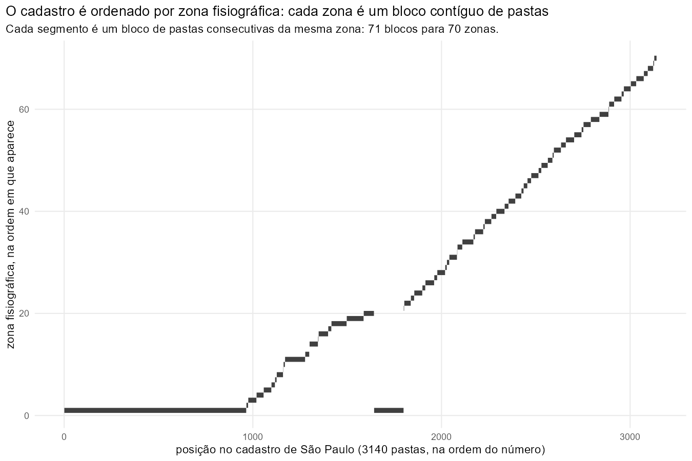
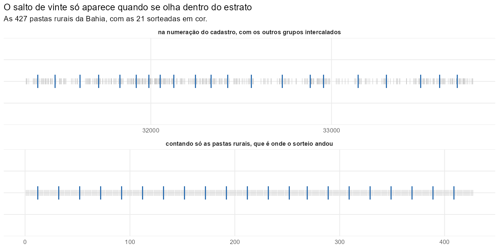
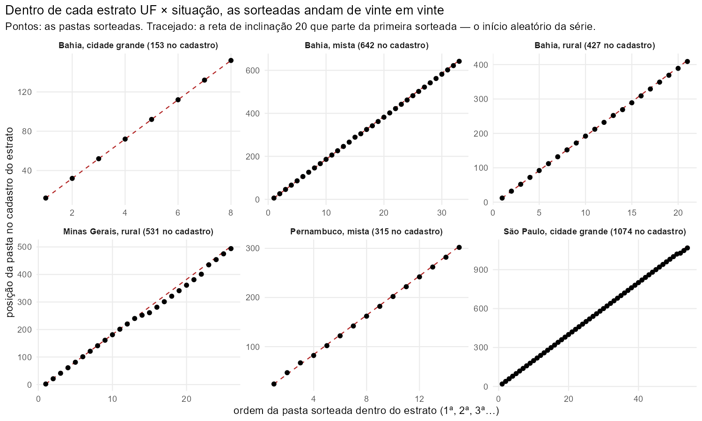
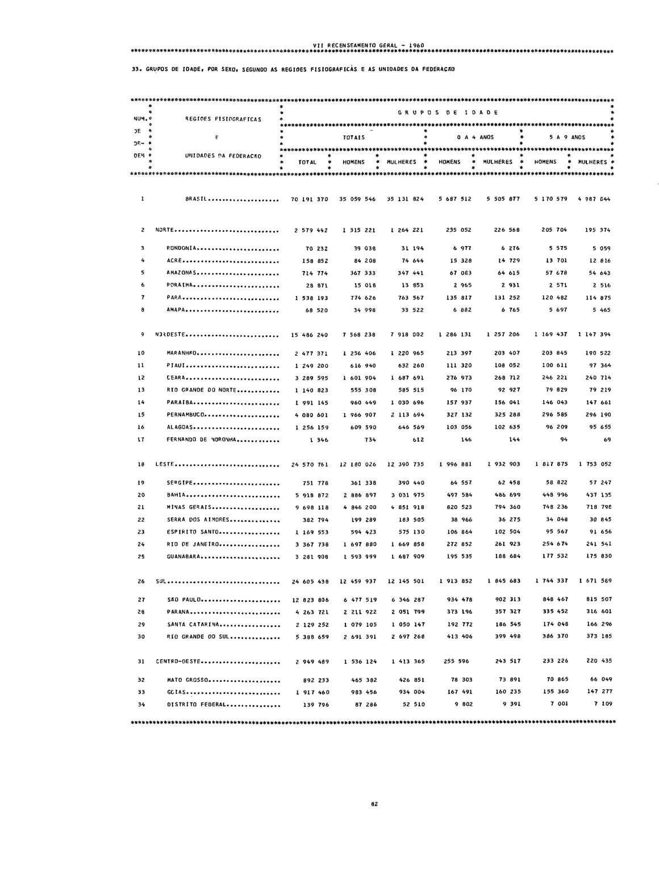
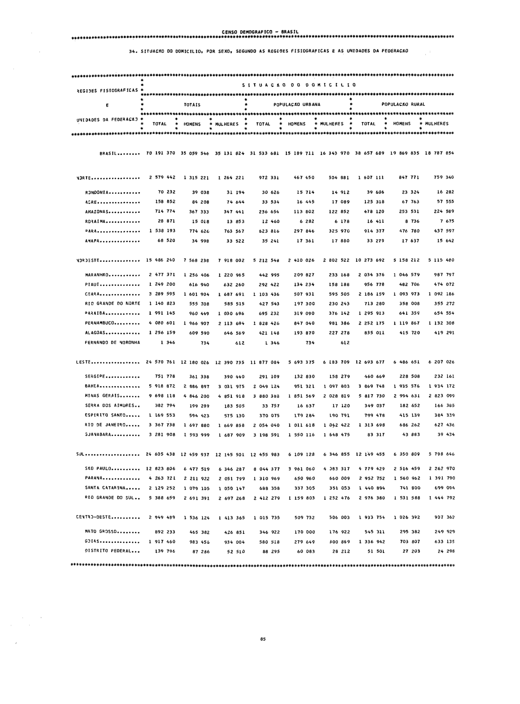
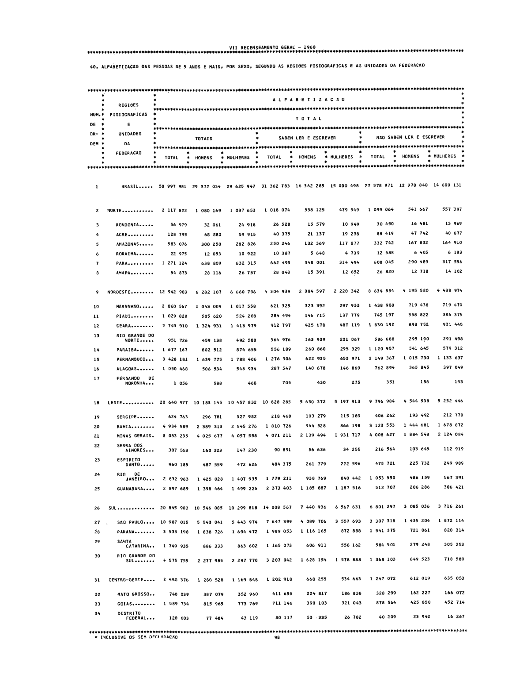
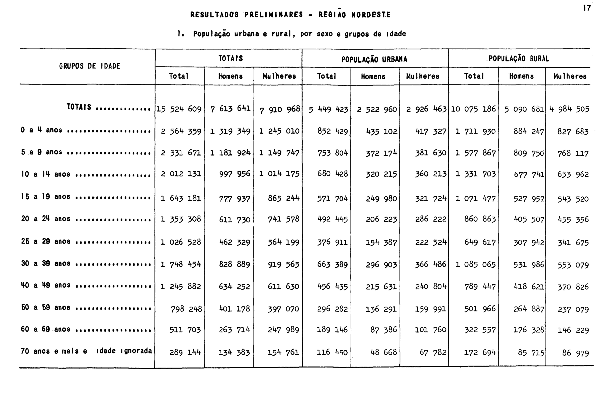
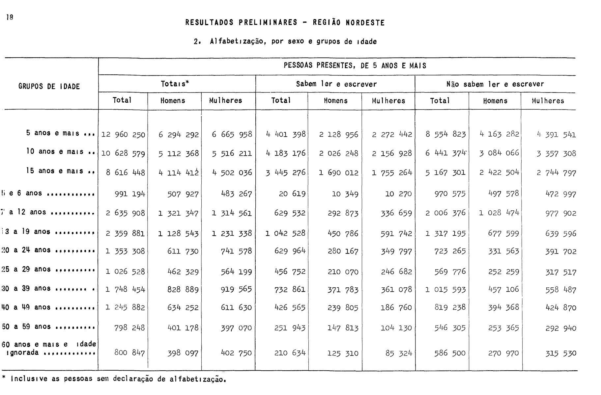
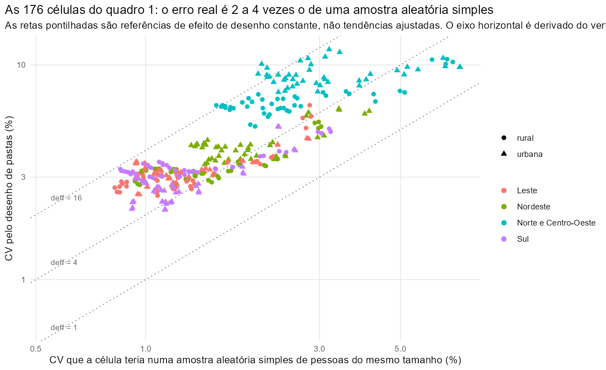

# A amostra de 1,27% do Censo de 1960: o desenho amostral, reconstruído passo a passo

> **Rodada de registros mais recente — 22/09/2026:** [correções incorporadas, exemplos e limites](fechamento_registros_1960_20260922.md). Foram integradas decisões sobre 954 conjuntos repetidos, 169 vínculos novos, 33 reparos/40 campos e 30 cartões para 74 pessoas existentes. As pendências sem prova permanecem bloqueadas; base completa e pesos127 não foram reconstruídos. Esse resultado prevalece sobre contagens e estados de execução anteriores, sem homologar desenho ou variâncias.

> **Parecer vigente — 21/09/2026:** consultar a [revisão integrativa](microdata_1960_amostra_127_revisao_integrativa.md), que prevalece sobre contagens e conclusões incompatíveis abaixo. UF×situação e certeza de FN continuam hipóteses operacionais; fechamento das margens não certifica desenho ou universos. Variâncias calibradas permanecem adiadas; figuras históricas não foram regeneradas.

Este texto acompanha `R/microdata_1960_amostra_127.R` e o documento de preparação (`references/microdata_1960_amostra_127_preparacao.md`). Ele foi escrito para um leitor que domina estatística e análise de dados, tem noções de amostragem (sabe o que é um estrato, um conglomerado, um peso), mas nunca ouviu falar desta amostra, não conhece o vocabulário do IBGE de 1960 e não tem nenhum contexto sobre como as decisões abaixo foram tomadas. Por isso o texto não pressupõe nada: cada afirmação vem acompanhada do documento que a sustenta, do dado que a demonstra ou da declaração explícita de que é uma escolha nossa.

A proposta é que, ao fim, o leitor saiba (1) o que está documentado sobre o sorteio em 1960–1964, (2) o que sobreviveu no arquivo, (3) como o desenho foi reconstruído por engenharia reversa, com os dados e as figuras de cada passo, (4) o que cada coluna de desenho das tabelas significa, (5) quais hipóteses sustentam o cálculo do erro-padrão e (6) por que cada alternativa de cálculo foi adotada, deixada como opção ou descartada.

Os números vêm da execução do pipeline (`targets::tar_make()` dos alvos de 1960) em 2026-09-15, com o peso final `censobr_weight` salvo indicação em contrário. As figuras e tabelas da investigação têm como fonte `references/figuras/desenho_amostral_1960.R`; a comparação com o pacote `survey` está em `references/conferencia_desenho_amostral_1960.R`. A revisão abaixo identifica limites dessas verificações.

**Revisão de 2026-09-21.** A [nota de revisão do desenho](microdata_1960_amostra_127_revisao_desenho.md) distingue fonte histórica, reconstrução empírica e hipótese de análise. As estimativas, erros, figuras e percentuais de espaçamento são resultados de execuções anteriores, não recalculados nesta revisão; a seção 8 acrescenta uma auditoria de classificação em Python. A reconstrução de UF × situação tem evidência favorável, mas não constitui prova completa do desenho original. A análise e a implementação das variâncias calibradas foram adiadas: as colunas existentes de resíduos condicionam os totais de calibração a valores fixos e não incorporam a incerteza dos controles estimados nas dezessete UFs. Esses controles continuam sendo os referenciais disponíveis adotados pelo projeto.

**Organização.** A Parte I (seções 1 a 4) diz o que a amostra é e o que os documentos da época dizem sobre ela. A Parte II (seções 5 a 9) é a engenharia reversa: o que o próprio arquivo revela, o cadastro de sorteio reconstruído a partir da amostra de 25%, e os testes que identificam os estratos. A Parte III (seções 10 a 15) trata dos pesos, das colunas de desenho, do cálculo do erro-padrão e das alternativas. Ao fim há um glossário e a lista de fontes.

---

## Parte I — O que é a amostra

## 1. O Censo de 1960 e as suas duas amostras

O Censo Demográfico de 1960 teve data de referência em 1º de setembro de 1960: em cada domicílio foram recenseadas as pessoas que ali passaram a noite de 31 de agosto para 1º de setembro, mais os moradores temporariamente ausentes. O recenseador percorria o seu **setor censitário** — a área de trabalho de um recenseador, com algumas centenas de domicílios; o país foi dividido em 57.914 setores — e registrava todos os domicílios numa **Folha de Coleta**. Para a maioria dos domicílios preenchia um questionário curto. Esse questionário curto é o **universo** do censo, e é dele que saem as contagens totais de população, por sexo, idade, cor, nacionalidade e alfabetização.

Foi a primeira vez que um censo brasileiro usou amostragem na coleta. As perguntas longas — migração, instrução, estado conjugal, filhos tidos e vivos, rendimento, ocupação, ramo de atividade, e as características do domicílio como água, esgoto, fogão, rádio e geladeira — foram feitas a uma **amostra de 25%** dos domicílios, num questionário próprio, o **Boletim de Amostra** (formulário CD 2). O sorteio dessa amostra era sistemático e feito no campo, pela própria Folha de Coleta: os dois modelos de folha (CD 7 e CD 8) traziam impressas, em destaque, "Linhas de Amostra" a cada quatro linhas, e o domicílio registrado numa linha de amostra recebia o boletim longo. A posição da linha marcada mudava de página para página e de modelo para modelo, "de modo a permitir que todas as posições tivessem a possibilidade de constituírem Linhas de Amostra"; os dois modelos eram usados alternadamente conforme o setor tivesse número par ou ímpar, e a ordem de enumeração dos domicílios era fixada por regras, para que o recenseador não escolhesse quem entrava na amostra. Os volumes definitivos resumem: "vários processos foram adotados com a finalidade de proporcionar variação nas séries sistemáticas de seleção, de forma a evitar a introdução na amostra de tendenciosidades decorrentes de características cíclicas do universo" (Volume I, seção "Amostragem"). Essa amostra de 25% é a **amostra geral** do censo, e é dela que saíram os volumes definitivos publicados ao longo dos anos 1960 e 1970. Os seus microdados sobrevivem hoje para 17 unidades da federação, e o `censobr` os distribui na compilação de 1960.

A apuração mecânica de 25% do país levaria anos. Para publicar resultados rápidos, o IBGE sorteou, dentro da amostra de 25%, uma **subamostra de cerca de 1,27% da população**, perfurou-a em cartões e publicou com ela, em março de 1965, os *Resultados Preliminares do Censo Demográfico* (Série Especial, volume II). É dessa subamostra que trata este texto. Ela é a única amostra do Censo de 1960 que cobre todas as unidades da federação, e é por isso que ela importa mesmo onde a amostra de 25% existe: para onze unidades da federação (Rondônia, Acre, Amazonas, Roraima, Pará, Amapá, Maranhão, Piauí, Espírito Santo, Guanabara e Santa Catarina) ela é tudo o que resta do Censo de 1960 em microdados.

## 2. O vocabulário da época

Sem estas palavras o resto não se lê.

- **Boletim** — o questionário de um domicílio. O Boletim de Amostra (CD 2) tem a página do domicílio e uma linha por pessoa. No arquivo, cada boletim virou um cartão de família (a página do domicílio) e um cartão por pessoa.
- **Folha de Coleta** (CD 7 e CD 8) — a lista de todos os domicílios de um setor, na ordem em que o recenseador os visitou. As "linhas de amostra" impressas nela decidiam quem recebia o boletim longo.
- **Setor censitário** — a área de um recenseador, contínua e situada num só quadro (urbano, suburbano ou rural) de um só distrito. Os boletins de amostra de um setor ficavam juntos.
- **Pasta** — a palavra central deste texto. Quando os boletins de amostra chegavam ao órgão central, eram reunidos em lotes de trabalho de cerca de 250 boletins, na ordem dos setores, e cada lote era uma pasta física, numerada. A pasta é uma unidade administrativa (um pacote de papel que um codificador recebia), não uma unidade geográfica; mas, como os boletins entravam na ordem dos setores, uma pasta contém boletins de setores vizinhos, quase sempre do mesmo município, e é inteiramente urbana, inteiramente rural ou mista conforme os setores que a compõem. No desenho da subamostra, a pasta é a unidade sorteada: sorteou-se a pasta inteira.
- **Cadastro** — a lista completa das pastas de onde as sorteadas foram tiradas. Nenhum documento o publica; a seção 6 mostra como ele foi reconstruído.
- **Distrito** — a divisão administrativa abaixo do município (a sede é o distrito 01; os demais têm códigos ímpares, 03, 05, 07…). Na Guanabara, que era estado e cidade ao mesmo tempo, não há distritos: há bairros, circunscrições censitárias e favelas, com códigos próprios.
- **Zona fisiográfica** — a divisão regional que o IBGE usava dentro de cada estado (por exemplo, "Zona do Litoral", "Zona da Mata"). Cada município pertence a uma zona. Ela importa porque, como a seção 6 mostra, o cadastro de sorteio foi ordenado por zona.
- **Situação** — do domicílio: quadro urbano, suburbano ou rural. "Urbano" nas tabelas de 1965 soma urbano e suburbano.
- **População presente** e **população residente** — presente é quem estava no domicílio na noite de referência (moradores presentes mais não moradores presentes); residente é quem mora ali (moradores presentes mais moradores ausentes). As tabelas de 1965 usam presente para pessoas e residente para domicílios.
- **Chave do questionário** — a identificação que o arquivo guarda para cada boletim: unidade da federação, distrito, número da pasta e número do boletim dentro da pasta. É por ela que a pasta é reconhecível no arquivo, e é ela que torna possível tudo o que a Parte II faz.
- **Cartão** — o cartão perfurado de 62 colunas em que cada pessoa e cada página de domicílio da subamostra foram gravadas em 1964. O arquivo de hoje é a imagem desse baralho de cartões.

### 2.1 Boletim, família e domicílio são três coisas diferentes

Esta distinção decide o que cada tabela conta, e é a primeira coisa a acertar, porque o vocabulário do censo de 1960 não é o de hoje.

**O boletim é por família, não por domicílio.** O recenseador preenchia um Boletim de Amostra para cada família: a página do domicílio na frente, uma linha por pessoa atrás. Onde duas famílias dividiam a mesma casa, saíam dois boletins — e a página do domicílio era preenchida **só no da família principal**. O boletim da segunda família traz essa página em branco, no papel e no arquivo (é a decisão registrada no `ipea/censobr#87`: ela fica em branco aqui também, porque copiá-la da família principal seria inventar dado).

Quem diz o que cada família é dentro do seu domicílio é o quesito `V101`:

| `V101` | o que é | abre um domicílio? | famílias |
|---|---|---|---|
| 1 | família que ocupa o domicílio sozinha | sim | 172.909 |
| 2 | família principal de um domicílio com mais de uma | sim | 348 |
| 3 | domicílio coletivo | sim | 835 |
| 4 | segunda família do domicílio | não — entra no da anterior | 345 |
| 5 | terceira família | não — entra no da anterior | 28 |
| — | página de domicílio perdida na fita | sim, por não haver o que a prenda | 151 |

O domicílio se reconstrói lendo o arquivo na ordem em que ele foi gravado: os códigos 1, 2 e 3 abrem um domicílio novo, e os códigos 4 e 5 entram no domicílio da família imediatamente anterior — o que funciona porque uma família convivente vem sempre logo depois da sua principal, 345 de 345 vezes.

Um exemplo torna isto concreto. Três boletins consecutivos com `V101` igual a 1, 2 e 4 não são três domicílios: são dois. O primeiro é uma casa com uma família só; o segundo e o terceiro são **a mesma casa**, com duas famílias, e as perguntas sobre água, fogão e número de cômodos foram respondidas uma vez só, no segundo.

Daí os três números da subamostra, que são diferentes entre si e frequentemente confundidos:

- **897.009 pessoas**;
- **174.616 famílias** — isto é, boletins;
- **174.244 domicílios**, dos quais 173.899 têm uma família, 318 têm duas e 27 têm três.

A tabela de domicílios que este estágio entrega tem 174.245 linhas, uma a mais do que os domicílios que as pessoas apontam: o domicílio 127134 (São Paulo, pasta 63936, boletim 230) é um registro de família cujos cartões de pessoa se perderam por inteiro, e fica na tabela com as contagens de moradores em branco. É o único caso.

**O peso é um por domicílio** (seção 10.5), igual para todas as suas pessoas e para todas as suas famílias. Quem quiser a página do domicílio ao lado de cada pessoa junta as duas tabelas por `censobr_idhousehold`; quem quiser contar famílias usa `censobr_idfamily`.

## 3. O que os documentos da época dizem sobre o sorteio

### 3.1 O Volume II de 1965: a única descrição do desenho

A descrição do desenho da subamostra que existe é a do volume dos *Resultados Preliminares* (Série Especial, vol. II, março de 1965), na seção "Planejamento de amostragem" das páginas 10 e 11. Ela é curta o bastante para ser citada quase por inteiro. Primeiro o porquê:

> "A adoção de um plano de grandes conglomerados coincidentes com as unidades naturais de trabalho se impunha dadas as condições expostas; além disso, grande parte dos itens selecionados para tabulação só constavam do Boletim de Amostra – CD-2; isto determinou que se optasse pelo desenho de uma sub-amostra da amostra geral selecionada na coleta censitária. A unidade de seleção da sub-amostra constituiu-se de 'Pastas' que reuniam Boletins de Amostra – CD-2. O plano utilizado corresponde por conseguinte ao de uma amostra bi-etápica em que a primeira etapa constituiu-se de uma amostra de cerca de 1/4 da população e a segunda etapa de cerca de 1/20 da etapa anterior; o que resultou em uma amostra de aproximadamente 1,27% do total da população e dos domicílios particulares."

Depois as duas etapas:

> "A primeira etapa foi formada pela amostra geral selecionada na coleta censitária, de uma forma 'sistemática', constando de aproximadamente 25% das pessoas recenseadas em domicílios particulares e coletivos. Compôs-se das pessoas recenseadas nos domicílios particulares registrados nas linhas previamente marcadas como pertencentes à amostra — uma em cada quatro linhas da folha de coleta — e de 25% das pessoas recenseadas em domicílios coletivos, selecionadas por processo equivalente ao adotado para os domicílios particulares.
>
> Na segunda etapa estes conglomerados constituídos pelos domicílios da amostra geral estavam reunidos em lotes de trabalho denominados 'Pastas', de tamanho variável, com a média de 250 questionários, mantida a ordem de setores de coleta. As 'Pastas' foram estratificadas de acordo com critérios geográfico e de situação do domicílio, considerando-se em relação à situação destes 4 grupos: pastas com questionários de cidades de 100 000 e mais habitantes, pastas com questionários de aglomerados urbanos de menos de 100 000 habitantes, pastas com questionários de situação rural, e pastas mistas, contendo questionários de situação rural e urbana (quadro urbano e quadro suburbano).
>
> A seleção das unidades de amostra foi sistemática, com início das séries aleatório. Foram selecionadas 814 pastas cujos questionários forneceram as informações que deram origem às estimativas apresentadas neste volume. Os cálculos de erros de amostragem para as características apresentadas estão sendo executados. Deixamos de incluí-los nesta publicação, a fim de evitar seu retardamento. Entretanto, farão parte de uma publicação especial em que se fará descrição detalhada do desenho da amostra e das técnicas utilizadas."

O volume também explica para que a amostra foi dimensionada: "o fornecimento de dados globais para o País e para as três Regiões Fisiográficas mais populosas, de vez que a obtenção de dados para as Regiões de menores contingentes populacionais ou para as Unidades da Federação repercutiria no tamanho da amostra e no seu desenho". As tabelas saem, por isso, para o Brasil e para as regiões Nordeste, Leste e Sul; o Norte e o Centro-Oeste só aparecem dentro do total do país.

Em nossas palavras, o desenho declarado é:

1. A primeira etapa é a própria amostra de 25%: os boletins de amostra do país inteiro, reunidos em pastas de cerca de 250 boletins cada, na ordem dos setores.
2. As pastas foram classificadas em **estratos**, definidos por dois critérios cruzados: um critério geográfico e a **situação** das pastas em quatro grupos — cidades com 100 mil habitantes ou mais; aglomerados urbanos menores; rurais; mistas.
3. Dentro de cada estrato, sorteou-se **uma pasta em vinte**, sistematicamente, com início aleatório: numa lista ordenada, escolhe-se um ponto de partida ao acaso entre as vinte primeiras e, a partir dele, toma-se uma pasta a cada vinte.
4. Todos os boletins da pasta sorteada entram na subamostra. Foram sorteadas **814 pastas**.

A multiplicação das frações nominais é $\tfrac{1}{4} \times \tfrac{1}{20} = \tfrac{1}{80} = 1{,}25\%$, cujo inverso é 80. O volume denomina a amostra "aproximadamente 1,27%"; a diferença pode envolver a realização amostral e as aproximações das duas frações, mas sua decomposição exata não foi recuperada. O pipeline usa $1/0{,}0127 \approx 78{,}74$ como peso-base convencional. Essa convenção não prova que a probabilidade individual de inclusão fosse exatamente 0,0127 e foi preservada nesta revisão (seção 10.1).

Em figura:

```
todos os domicílios do país  ->  1 em 4, na Folha de Coleta   ->  amostra de 25% (Boletins de Amostra CD 2)
                                                                  reunidos em pastas de ~250 boletins, na ordem dos setores
                                                                  classificadas em estratos: [critério geográfico] x situação (4 grupos)
                                                             ->  1 pasta em 20, sistemático, início aleatório, dentro de cada estrato
                                                             ->  814 pastas = a amostra de 1,27% (todos os boletins de cada pasta)
```

Por que sortear pastas inteiras, e não pessoas? Porque era barato. As pastas já existiam como pacotes físicos; perfurar cartões para 814 pastas era um trabalho que cabia no calendário de uma publicação preliminar, e sortear pessoas espalhadas por milhares de pastas não cabia. O custo estatístico dessa escolha é o assunto da seção 12: as pessoas de uma mesma pasta são vizinhas e parecidas, e a amostra tem muito menos informação do que os seus 897 mil registros sugerem.

### 3.2 O que o Volume II não diz

Quatro coisas que a seção 3.1 deixa em aberto, e que a Parte II vai resolver ou decidir:

- **Qual é o critério geográfico dos estratos.** O texto diz "critérios geográfico e de situação" e não diz se o geográfico é a região, a unidade da federação, a zona fisiográfica ou outra coisa.
- **Como se operacionalizou "cidade de 100 000 e mais habitantes".** O volume define "cidade" como sede municipal, mas não diz se o corte foi aplicado à população da cidade, à do município, ou à urbana do município, nem qual foi a fonte.
- **Como as pastas foram ordenadas** antes do sorteio sistemático, o que importa para saber se a ordem do cadastro pode ser usada no cálculo da variância.
- **Os erros de amostragem** e "a descrição detalhada do desenho". A publicação especial prometida não existe na Biblioteca do IBGE, no Internet Archive nem nas citações dos volumes definitivos; os volumes definitivos, anos depois, prometem de novo "volume da Série Especial" com os erros de amostragem e "uma descrição detalhada do processo de amostragem". Tudo indica que nenhum dos dois saiu.

### 3.3 Os outros documentos, e o que cada um acrescenta

**Os tomos do Volume I (resultados definitivos, Série Regional, 19 tomos, um por unidade da federação).** A introdução de cada tomo tem uma seção "Amostragem" que descreve a amostra de 25% — o que está resumido na seção 1 — e o método de estimativa usado nos resultados definitivos: estimativa de razão em **48 grupos**, formados depois da seleção por situação (urbana, rural), sexo, posição na família (chefe, cônjuge, outros; moradores ausentes à parte) e faixa de idade, com pesos inteiros escolhidos ao acaso entre as pessoas do grupo para que a soma reproduzisse a contagem do universo. Grupos com razão universo/amostra acima de 16 ou com menos de 100 pessoas no universo eram fundidos com o seguinte. Isso é o desenho da **amostra de 25%**, não desta subamostra, mas importa por duas razões: mostra que a amostra de 25% é, para efeito de variância, uma amostra sistemática de domicílios com efeito de desenho próximo de 1 (seção 13.2), e mostra que as margens do universo por unidade da federação existem publicadas, o que abre uma alternativa de calibração (seção 13.5).

**Os dois grupos de tomos, e o que isso diz sobre a amostra de 25%.** A "Apresentação" do volume nacional dos resultados definitivos (*Série Nacional*, vol. I) conta como a divulgação foi feita: "O plano de divulgação inicialmente estabelecido previa a apuração dos dados em duas etapas, sendo os resultados, para cada Unidade da Federação, apresentados em duas partes. De acordo com esse plano inicial, foram publicados os resultados definitivos relativos às seguintes Unidades da Federação: Rondônia, Roraima, Amapá, Acre, Amazonas, Pará, Maranhão, Piauí, Espírito Santo, Guanabara e Santa Catarina. A apuração dos dados correspondentes às Unidades da Federação restantes foi feita com base apenas no formulário CD.2 – Boletim de Amostra, tendo sido modificado o plano inicial, com a redução do número de tabelas e a reunião dos resultados em um único volume para cada Unidade da Federação. Os resultados apresentados, entretanto, abrangem todos os itens investigados." Os tomos das onze primeiras unidades da federação saíram em duas partes ainda no Serviço Nacional de Recenseamento e nos primeiros anos da Fundação IBGE (a 1ª parte de Santa Catarina é datada de janeiro de 1968 e a 2ª, de novembro de 1968); os das outras dezessete saíram em volume único, na década de 1970, já sob a presidência de Isaac Kerstenetzky, e o volume nacional "encerra a apresentação dos resultados definitivos". Duas consequências para este texto. Primeira: a amostra de 25% foi apurada e publicada para **todas** as unidades da federação, com o mesmo método de estimativa de razão em 48 grupos, ainda que os seus microdados só sobrevivam para dezessete — e as dezessete são exatamente as do segundo grupo, apuradas mais tarde e, tudo indica, já em computador, enquanto as onze do primeiro grupo, apuradas em equipamento de cartões, são as que hoje só têm esta subamostra. Segunda: nos tomos das dezessete, **as tabelas de sexo, idade, cor e alfabetização também são estimativas da amostra de 25%**, ancoradas nos totais da Sinopse Preliminar de 1961–1962 (população total, urbana e rural e domicílios, por município, apurados na contagem completa); só nos onze tomos do primeiro grupo essas tabelas vêm do universo. Isso importa para a calibração da seção 13.5.

**O relatório do IPEA de abril de 1969** (*Processamento de uma amostra do Censo Demográfico de 1960*, 5 páginas datilografadas, cópia carbono de leitura difícil). Registra que o IPEA recebeu 29 caixas com cerca de 56 mil cartões — uma **subamostra** desta subamostra, para as regiões Nordeste, Leste e Sul, selecionada por grau de instrução do chefe da família —, que a dividiu em dez subamostras pelo último dígito do número de enumeração, excluiu não residentes, convidados e empregados e cartões com códigos impossíveis, e gravou tudo na fita magnética "IPEA 10" no Rio Datacentro da PUC-Rio. A página 4 lista o conteúdo de cada cartão de pessoa (situação, sexo e condição de presença, parentesco, idade, religião, cor, naturalidade, nacionalidade, procedência, tempo de residência, alfabetização, série concluída, curso, estado conjugal, ano do casamento, filhos tidos e vivos, rendimento, atividade, ocupação, ramo, posição na ocupação), que é exatamente o leiaute do arquivo de hoje. O relatório não descreve o desenho, mas prova três coisas: que os cartões circularam fora do IBGE já em 1969, que o leiaute do cartão é o que o arquivo tem, e que o nosso arquivo (1.074.328 cartões) é o baralho inteiro, não a subamostra do IPEA.

**O Volume IV da Série Especial** (*Favelas — Estado da Guanabara*, 108 páginas). Publica as favelas cariocas por zona e circunscrição censitária. A sua seção "Amostragem" é idêntica à dos tomos do Volume I: vem dos resultados **definitivos** (amostra de 25% e universo), e não desta subamostra. Serve de gabarito para os domicílios em favelas que a subamostra identifica, não como fonte sobre o desenho.

**O Código de Zonas Fisiográficas, Municípios e Distritos (situação em 1º-7-1960)** e o **Anuário Estatístico do Brasil de 1961**. O primeiro dá o código oficial de cada município e distrito, que é o que o campo `V116` do arquivo guarda, e a zona fisiográfica de cada município; o segundo dá a população total, urbana e rural de cada município em 1960. Os dois estão transcritos em `read_guides/1960_municipios.csv` e `read_guides/1960_distritos.csv`, e são o que permite classificar cada pasta por município, zona e tamanho da cidade.

O Volume II, o relatório do IPEA e o Volume IV estão em `references/fontes_1960/`, com um índice de procedência; os tomos do Volume I estão no Dropbox do projeto (seção 17).

## 4. O que sobreviveu no arquivo

A subamostra foi perfurada em cartões de 62 colunas, um por pessoa e um por página de domicílio. O arquivo de hoje, `HHOLDA.txt`, é a imagem desse baralho depois de décadas de cópias entre cartões, fitas e discos: 1.074.328 linhas de 62 caracteres. O documento de preparação descreve o dano (linhas deslocadas, caracteres corrompidos, blocos de cartões copiados duas vezes em Pernambuco, cartões de família perdidos) e o que se fez com ele. Aqui interessa o que o dano fez ao desenho:

- **O arquivo é representado por 815 conglomerados reconstruídos.** Há correções de chave em Rondônia e duas inferências no passo 8, com **um domicílio cada**: `54-541` é associado a `54-54142` pela chave truncada e pelo distrito; `71-70382` é associado a `71-70380` pela vizinhança no cadastro, pela baixa cobertura e pelo boletim 088 ausente na segunda pasta. As marcas ficam em `censobr_diagnostico`, e `pasta` preserva o registro original. São decisões de reconstrução, não registros originais do sorteio. Das 815 unidades resultantes, **670 estão nas dezessete UFs com cadastro reconstruído e foram encontradas nele** (seção 6.2). Encontrar todas as observadas não demonstra que nenhuma pasta originalmente selecionada se perdeu. A diferença frente às 814 declaradas pelo Volume II tem uma conciliação possível envolvendo **Fernando de Noronha**, apresentada a seguir.

Em Fernando de Noronha, o cadastro reconstruído contém uma única pasta, também presente na subamostra. O fator de expansão implícito — a população publicada dividida pelo que o peso-base de 78,74 daria — é **0,06**, contra 0,95 em Roraima, 0,70 no Acre e 1,34 em Rondônia. Esses indícios sustentam a hipótese operacional de inclusão da pasta com certeza e de fração nominal global 1/4. Não demonstram, isoladamente, a regra de seleção histórica: observar uma pasta selecionada em um cadastro de uma pasta não basta para identificar sua probabilidade de inclusão.

815 − 1 = 814 é uma conciliação possível se a publicação tiver contado somente as pastas sujeitas a sorteio e excluído Noronha. Nenhuma fonte recuperada declara essa convenção. A diferença de contagem e a hipótese de certeza em Noronha permanecem explicitamente separadas dos fatos observados.
- **As pastas têm o tamanho esperado.** Mediana de 223 boletins por pasta (quartis 197 e 241, máximo 352), e mediana de 1.124 pessoas. Vinte e uma pastas têm menos de 100 boletins: as de Roraima e de Fernando de Noronha, que eram pequenas mesmo, e algumas truncadas. O caso grave é o Distrito Federal: as duas pastas de Brasília têm 77 e 60 boletins no arquivo, quando o cadastro reconstruído mostra que tinham 520 e 257 (seção 6) — restaram 15% e 23%. **Não são as únicas.** Confrontando cada pasta sorteada com o que o cadastro lhe dá, nas dezessete unidades da federação em que isso é possível, uma terceira perdeu mais do que elas: a pasta 31144, de Salvador, guarda **18 dos seus 247 boletins**, e os dezoito são os últimos, do 230 ao 247. Aqui o dano se lê com nitidez incomum: perdeu-se um bloco contíguo pela cabeça da pasta, não cartões avulsos. Outras cinco pastas ficam entre 31% e 54% de cobertura; a mediana das demais é de 99%.

**O que se perdeu em Brasília** merece separar o que se sabe do que se infere, porque este texto afirmava mais do que a evidência dá. Sabe-se que as duas pastas perderam quatro quintos dos seus boletins. Sabe-se também que a construção civil é o **único ramo de atividade do quadro 3 de 1965 que não fecha** com a nossa contagem: −36% no Norte e Centro-Oeste, contra −2,7% no Leste e no Sul (documento de preparação, seção 7). E sabe-se, pela amostra de 25% — processada depois e para o mesmo Distrito Federal —, que **8.698 dos seus 14.818 boletins são boletins individuais de morador de domicílio coletivo**, sorteados pessoa a pessoa pela Lista CD 3: os alojamentos da obra. Daí a inferência de que o que falta é desproporcionalmente operário da construção, que é sólida. O que **não** se sabe é quais boletins a fita perdeu: nenhum registro diz isso, e a afirmação de que o trecho perdido "era um acampamento de operários" é leitura, não constatação.
- **A chave do questionário sobreviveu em quase todas as linhas**, e é ela que permite dizer a que pasta cada pessoa pertence. Onde o cartão de família se perdeu, a chave está nos cartões de pessoa.
- O resultado é uma tabela de **897.009 pessoas em 174.245 domicílios**, 885.127 delas presentes na noite de referência — 1,26% dos 70.119.071 presentes que o volume de 1965 publicou.

A distribuição das 815 pastas por unidade da federação, com a classificação de situação que a seção 7 justifica, dá a medida do que a amostra cobre e do que não cobre:

| UF | pastas | cidade grande | urbana menor | mista | rural | boletins por pasta (mediana) |
|---|---|---|---|---|---|---|
| Rondônia | 1 | 0 | 1 | 0 | 0 | 140 |
| Acre | 2 | 0 | 1 | 1 | 0 | 238 |
| Amazonas | 8 | 1 | 0 | 4 | 3 | 212 |
| Roraima | 4 | 0 | 2 | 0 | 2 | 17 |
| Pará | 16 | 4 | 1 | 7 | 4 | 222 |
| Amapá | 1 | 0 | 0 | 1 | 0 | 210 |
| Maranhão | 27 | 1 | 1 | 7 | 18 | 233 |
| Piauí | 14 | 1 | 1 | 3 | 9 | 219 |
| Ceará | 35 | 4 | 4 | 20 | 7 | 229 |
| Rio Grande do Norte | 13 | 2 | 1 | 6 | 4 | 227 |
| Paraíba | 23 | 2 | 3 | 9 | 9 | 233 |
| Pernambuco | 48 | 10 | 7 | 15 | 16 | 228 |
| Fernando de Noronha | 1 | 0 | 1 | 0 | 0 | 62 |
| Alagoas | 15 | 2 | 2 | 4 | 7 | 203 |
| Sergipe | 10 | 1 | 2 | 3 | 4 | 235 |
| Bahia | 70 | 8 | 8 | 33 | 21 | 224 |
| Minas Gerais | 112 | 9 | 23 | 54 | 26 | 212 |
| Serra dos Aimorés | 4 | 0 | 1 | 0 | 3 | 234 |
| Espírito Santo | 9 | 0 | 2 | 5 | 2 | 302 |
| Rio de Janeiro | 39 | 14 | 6 | 13 | 6 | 224 |
| Guanabara | 40 | 39 | 0 | 0 | 1 | 230,5 |
| São Paulo | 156 | 52 | 34 | 38 | 32 | 232 |
| Paraná | 47 | 4 | 7 | 17 | 19 | 225 |
| Santa Catarina | 23 | 0 | 5 | 12 | 6 | 221 |
| Rio Grande do Sul | 62 | 8 | 16 | 25 | 13 | 220 |
| Mato Grosso | 10 | 0 | 2 | 5 | 3 | 210 |
| Goiás | 23 | 1 | 3 | 11 | 8 | 201 |
| Distrito Federal | 2 | 0 | 2 | 0 | 0 | 68 |

Rondônia só tem Porto Velho; o Amapá tem uma pasta mista; o Acre, duas; Fernando de Noronha, uma; o Distrito Federal, duas pastas urbanas truncadas. Nenhum peso cria o que não foi sorteado: para essas unidades, a amostra descreve o que foi sorteado e sobreviveu, e nada mais (seção 15).

---

## Parte II — A engenharia reversa do sorteio

Como não há publicação especial, o desenho teve de ser reconstruído a partir dos dados. A reconstrução andou em quatro passos, e cada um é apresentado com o que se perguntou, o que se mediu e o que se concluiu. O leitor que quiser só o resultado pode ir à seção 9; o que quiser conferir pode rodar `references/figuras/desenho_amostral_1960.R`, que refaz tudo o que está aqui.

## 5. Passo 1: o que a amostra de 1,27% diz sozinha

A primeira pergunta foi se a chave do questionário — em particular o **número da pasta** — carregava alguma informação sobre o sorteio. Carrega, e muita.

### 5.1 Os números das pastas são todos pares

As 815 pastas têm **todas** número par — a única ímpar do arquivo era a chave danificada da Guanabara, devolvida à sua pasta (seção 4). Isso diz que as pastas da amostra de 25% foram numeradas de dois em dois, e que o número da pasta sorteada é o número que ela tinha no cadastro inteiro, não uma numeração nova dada às sorteadas. Os números também carregam a unidade da federação como prefixo: as pastas do Ceará vão de 14002 a 15426, as da Bahia de 31002 a 33786, as de São Paulo de 60002 a 66292. Cada unidade da federação tem a sua própria numeração, e ela não atravessa fronteiras.

### 5.2 A grade de 40 nas cidades grandes

Se o sorteio foi de uma pasta em vinte numa lista numerada de dois em dois, duas pastas sorteadas consecutivas de uma mesma série devem diferir em 40 no número.

**Antes de olhar os números, um aviso sobre a régua**, porque esta seção e a seção 7 medem a mesma coisa com réguas diferentes e o leitor que não perceber isso vai achar que elas se contradizem. Aqui a distância entre duas pastas sorteadas é medida em **números de pasta**, e o valor esperado é 40. Na seção 7, com o cadastro em mãos, ela passa a ser medida em **posições dentro da sublista do estrato** — ordena-se só as pastas daquele estrato, numera-se 1, 2, 3… — e o valor esperado é 20.

As duas réguas coincidem num caso só: quando as pastas do estrato são contíguas no cadastro, andar 20 posições é andar 40 no número. Isso vale para as cidades grandes, cujas pastas vêm todas juntas no começo da numeração de cada unidade da federação. Não vale para os outros três grupos, cujas pastas estão **intercaladas** com as dos demais ao longo de todo o cadastro: ali, 20 posições adiante podem ser 80, 140 ou qualquer outro número. A consequência é que a medida desta seção **não tem como enxergar** o salto sistemático fora das cidades grandes — não porque ele não exista, mas porque a régua é a errada. O que a seção 5.2 decide, portanto, é só o caso das cidades grandes; os outros três grupos ficam indecididos até a seção 7.

A figura 1 mostra os números das pastas sorteadas de quatro unidades da federação, com cada pasta classificada num dos quatro grupos de situação do Volume II (pela situação dos seus próprios boletins e pelo tamanho do município — a regra exata está na seção 8):


Três coisas se veem a olho nu. As pastas das cidades grandes estão no começo da numeração de cada unidade da federação (as capitais foram as primeiras pastas do cadastro, como a seção 6 confirma) e caem numa grade regular. As pastas mistas e rurais ocupam o resto da numeração, intercaladas umas com as outras — e ali, pelo que já se disse sobre a régua, nenhuma grade tem como aparecer. E as pastas de um mesmo grupo nunca se aproximam demais umas das outras, o que é a assinatura de séries sistemáticas separadas, uma por grupo de situação.

A figura 2 mede isso: para cada grupo, o histograma da diferença entre os números de duas pastas sorteadas consecutivas da mesma unidade da federação.


| grupo de situação | pares de pastas consecutivas | diferença exatamente 40 | 40, 42, 44 ou 46 | diferença mediana |
|---|---|---|---|---|
| cidade grande | 145 | 72% | 79% | 40 |
| urbana menor | 111 | 1% | 1% | 140 |
| mista | 271 | 0% | 2% | 80 |
| rural | 200 | 1% | 2% | 110 |

Nas cidades grandes, cujas pastas são contíguas no cadastro, a grade é quase perfeita. Município a município, entre os que têm quatro ou mais pastas de cidade grande:

| cidade | pastas | diferenças entre números consecutivos |
|---|---|---|
| Rio de Janeiro (Guanabara) | 39 | 37 vezes 40 e uma vez 82 |
| São Paulo | 39 | 21 vezes 40; 44 ou 46 seis vezes; onze saltos de 50 a 82 onde a numeração pulou |
| Recife | 9 | 40 40 40 42 44 40 44 40 |
| Salvador | 8 | 40 40 40 40 40 40 40 |
| Belo Horizonte | 8 | 40 40 40 40 40 40 40 |
| Porto Alegre | 7 | 40 40 40 40 40 40 |
| Belém | 4 | 40 40 40 |
| Fortaleza | 4 | 40 40 42 |
| Curitiba | 4 | 40 40 40 |

Nos outros três grupos a diferença mediana é de 80 a 140, e quase nunca 40: não porque o sorteio ali fosse outro, mas porque os números das pastas rurais, mistas e urbanas menores estão intercalados no cadastro, de modo que entre duas rurais sorteadas há muitas pastas de outros grupos. Quando se ignora o grupo e se olha só a unidade da federação, apenas 16% das diferenças são 40.

O passo 1 mostra regularidade compatível com seleção de uma em vinte nas cidades grandes. A separação em quatro grupos é documentada pelo Volume II; a grade observada a corrobora, mas não identifica sozinha os inícios ou limites das séries. Para os outros grupos, a evidência de espaçamento é examinada na seção 7 com o cadastro reconstruído.

### 5.3 O peso realizado bate com o nominal

Uma segunda verificação independente do "uma em vinte" é o fator de expansão implícito: a população presente que o IBGE publicou em 1965, dividida pela contagem do arquivo. Se a fração for de fato 1/80 e o arquivo estiver íntegro, o fator é 80.

| domínio | publicado em 1965 | pessoas presentes no arquivo | fator implícito |
|---|---|---|---|
| Brasil | 70.119.071 | 885.127 | 79,2 |
| Brasil, urbana | 32.471.377 | 406.021 | 80,0 |
| Brasil, rural | 37.647.694 | 479.106 | 78,6 |
| Nordeste | 15.524.609 | 195.288 | 79,5 |
| Leste | 24.659.232 | 311.219 | 79,2 |
| Sul | 24.445.902 | 307.859 | 79,4 |
| Norte e Centro-Oeste | 5.489.328 | 70.761 | 77,6 |

O urbano dá 79,5 a 80,1 nas regiões; o rural dá 76,3 a 79,3, e o Norte e Centro-Oeste dá 77,6. A proximidade de 80 é compatível com as frações nominais. O quociente também depende dos pesos e ajustes utilizados na publicação, da cobertura e do dano do arquivo; não permite atribuir isoladamente o desvio ao dano nem identificar probabilidades exatas.

### 5.4 O que ficou em aberto depois do passo 1

O passo 1 confirma o sorteio sistemático de uma em vinte por grupo de situação, mas não responde à pergunta que mais importa para a variância: **qual era o critério geográfico dos estratos**. A numeração não atravessa unidades da federação, então ela não distingue entre "cada unidade da federação é um estrato" e "cada região é um estrato" — nos dois casos as pastas de uma unidade da federação formam sequências próprias. E ela não diz onde começa e termina cada estrato, porque só se veem as sorteadas, não as que não foram.

## 6. Passo 2: o cadastro de sorteio, reconstruído a partir da amostra de 25%

### 6.1 A ideia

A compilação legada da amostra de **25%** guarda o número da pasta de cada boletim (`v001`), inclusive pastas não selecionadas para a subamostra. A lista dessas pastas é a base da **reconstrução do cadastro**, nas 17 unidades da federação disponíveis. Ela permite marcar as pastas presentes nas duas amostras e examinar os espaçamentos. Tratar essa lista como cadastro histórico completo é uma hipótese a auditar: a compilação legada também pode conter perdas, recodificações e exclusões.

### 6.2 O cadastro

O cadastro reconstruído tem **13.411 pastas**, com mediana de 235 boletins por pasta (quartis 216 e 250), a média de 250 que o Volume II declara. A sua composição por grupo de situação é 4.989 mistas, 3.610 rurais, 2.432 de cidade grande e 2.380 urbanas menores. Por unidade da federação:

| UF | pastas no cadastro | pastas sorteadas | cadastro / sorteadas | números de pasta |
|---|---|---|---|---|
| Ceará | 706 | 35 | 20,2 | 14002 a 15426 |
| Rio Grande do Norte | 266 | 13 | 20,5 | 17002 a 17532 |
| Paraíba | 461 | 23 | 20,0 | 19000 a 20034 |
| Pernambuco | 968 | 48 | 20,2 | 21002 a 22936 |
| Fernando de Noronha | 1 | 1 | 1,0 | 27002 |
| Alagoas | 300 | 15 | 20,0 | 25002 a 25600 |
| Sergipe | 195 | 10 | 19,5 | 30002 a 30390 |
| Bahia | 1.392 | 70 | 19,9 | 31002 a 33786 |
| Minas Gerais | 2.229 | 112 | 19,9 | 40002 a 44462 |
| Serra dos Aimorés | 74 | 4 | 18,5 | 50002 a 50148 |
| Rio de Janeiro | 764 | 39 | 19,6 | 52002 a 53530 |
| São Paulo | 3.140 | 156 | 20,1 | 60002 a 66292 |
| Paraná | 945 | 47 | 20,1 | 70002 a 71900 |
| Rio Grande do Sul | 1.265 | 62 | 20,4 | 81002 a 83532 |
| Mato Grosso | 211 | 10 | 21,1 | 91002 a 91424 |
| Goiás | 456 | 23 | 19,8 | 94002 a 94914 |
| Distrito Federal | 38 | 2 | 19,0 | 97002 a 97076 |

Quatro fatos saem da tabela:

1. **Todas as 670 pastas** que a subamostra tem nessas 17 unidades da federação estão no cadastro. Nenhuma pasta "inventada", nenhuma chave inconsistente.
2. **A razão é próxima de 20 fora de Noronha** — de 18,5 (Serra dos Aimorés, 4 pastas) a 21,1 (Mato Grosso, 10), mediana 19,9. Isso corrobora a fração nominal, mas não prova reinícios independentes por UF: uma série sistemática que atravesse blocos contíguos também pode produzir frações realizadas próximas de 1/20 em cada bloco. A evidência sobre fronteiras é examinada na seção 7. Noronha, com uma pasta observada em cada arquivo, recebe tratamento de certeza por hipótese operacional.
3. **As medianas de tamanho coincidem**: 235 boletins nas sorteadas e nas demais. É uma verificação descritiva favorável; igualdade de medianas não prova igualdade de probabilidades nem ausência de seleção associada ao tamanho.
4. **O Distrito Federal**: as duas pastas sorteadas têm 520 e 257 boletins no cadastro, e 77 e 60 no arquivo da subamostra. É daqui que vem a certeza de que o arquivo as truncou.

### 6.3 Como o cadastro está ordenado

O sorteio sistemático depende da ordem da lista. Percorrendo o cadastro de cada unidade da federação na ordem do número da pasta e contando quantas vezes cada atributo muda de uma pasta para a seguinte:

| UF | pastas | zonas fisiográficas | mudanças de zona | municípios | mudanças de município | mudanças de grupo de situação |
|---|---|---|---|---|---|---|
| São Paulo | 3.140 | 70 | 70 | 503 | 502 | 1.048 |
| Minas Gerais | 2.229 | 56 | 56 | 483 | 482 | 1.008 |
| Bahia | 1.392 | 26 | 26 | 194 | 193 | 648 |
| Rio Grande do Sul | 1.265 | 20 | 20 | 150 | 149 | 468 |
| Pernambuco | 968 | 15 | 15 | 102 | 101 | 438 |
| Paraná | 945 | 21 | 21 | 162 | 161 | 461 |
| Rio de Janeiro | 764 | 12 | 12 | 61 | 60 | 218 |
| Ceará | 706 | 22 | 21 | 142 | 141 | 305 |
| Paraíba | 461 | 12 | 11 | 88 | 87 | 236 |
| Goiás | 456 | 25 | 25 | 179 | 178 | 235 |

A leitura: **o cadastro é ordenado por zona fisiográfica e, dentro dela, por município**. Cada município é um bloco contíguo de pastas (502 mudanças para 503 municípios em São Paulo é o mínimo possível: uma mudança a cada município novo), e cada zona é um bloco contíguo de municípios — com uma exceção regular: a zona da capital aparece em dois blocos, porque **as pastas da capital vêm primeiro no cadastro** e o resto da sua zona vem na posição natural. Em São Paulo, a zona 623 ocupa as posições 1 a 965 (965 pastas, 833 delas puramente urbanas de cidade grande) e depois as posições 1643 a 1799; em Minas, a zona de Belo Horizonte ocupa as posições 1 a 171 e depois 1610 a 1639. A figura 3 mostra isso para São Paulo:



A situação, ao contrário, **não** ordena o cadastro: o grupo muda 1.048 vezes em São Paulo, embora só existam quatro grupos. As pastas urbanas, rurais e mistas estão intercaladas ao longo de todo o cadastro, porque a ordem é a dos setores dentro de cada município, e um município tem setores urbanos e rurais. A figura 4 mostra o cadastro inteiro da Bahia, com as sorteadas em cor:


**"A situação não ordena o cadastro" é a frase que mais confunde neste texto**, e vale desdobrá-la, porque dela depende tudo o que vem a seguir. Ordenar uma lista é escolher por qual chave ela é classificada. As chaves do cadastro são zona fisiográfica, depois município, depois setor — e mais nada. A situação **não é chave**: ela é apenas um atributo que cada pasta carrega, e que varia de uma pasta para a seguinte porque um município tem setores urbanos e setores rurais, e as pastas foram formadas na ordem em que os setores chegaram.

O que a estratificação por situação fez, portanto, não foi reordenar coisa alguma. Foi **recortar quatro sublistas** da lista já ordenada — as pastas de cidade grande, as urbanas menores, as rurais e as mistas, cada uma na ordem em que aparecem — e sortear uma em vinte dentro de cada sublista, com um ponto de partida próprio. Em esquema, com U, M e R para os grupos, e as sorteadas entre colchetes:

```
cadastro da UF (ordem: zona -> municipio -> setor)
  pasta    02  04  06  08  10  12  14  16  18  20  22  24  26  28  30  32  34  36 ...
  grupo     U   R   M   U   R   R   M   U   R   M   U   U   R   M   R   U   M   R

a sublista rural, e so ela, numerada de 1 em diante
  pasta    04  10  12  18  26  30  36  ...          <- as mesmas pastas, na mesma ordem
  posicao   1   2   3   4   5   6   7   ...
                                                    <- aqui o sorteio anda de 20 em 20
```

Veja o que isso faz com a medida da seção 5.2. Duas pastas rurais sorteadas estão a vinte **posições** uma da outra na sublista rural; mas entre elas, no cadastro, passaram dezenas de pastas urbanas e mistas, de modo que a diferença entre os seus **números** pode ser 80, 140 ou qualquer coisa. O salto existe; é a régua que não o alcança.

A figura 5 mostra isso com dados reais, nas duas réguas, para as pastas rurais da Bahia — 427 no cadastro, 21 sorteadas. Os espaçamentos falam por si. **Em posição dentro da sublista rural:**

```
20  20  20  20  20  20  20  20  20  20  20  20  17  20  20  20  20  20  20  20
```

**Os mesmos vinte intervalos, medidos em número de pasta:**

```
96  138  104  118  90  70  62  76  120  86  92  130  172  154  74  192  156  190  104  98
```

É o mesmo sorteio, visto de duas maneiras. A primeira linha é um relógio; a segunda parece ruído.




Essa reconstrução interpreta a estratificação como quatro sublistas de situação que preservam a ordem geográfica. Uma ordenação associada à variável de interesse pode melhorar a precisão da amostra sistemática e motiva examinar diferenças sucessivas (seção 13.4). O ganho não é garantido para toda variável ou periodicidade.

## 7. Passo 3: em que estrato o sorteio foi feito?

### 7.1 O teste

Com o cadastro em mãos, a pergunta "qual era o estrato?" vira uma pergunta com resposta empírica. O raciocínio:

> Sob seleção sistemática linear de intervalo 20, cadastro completo e classificação correta, as posições selecionadas de cada série formam $a, a+20, a+40, \ldots$, com início entre 1 e 20. A frequência dos espaçamentos exatos é, portanto, um diagnóstico de compatibilidade de cada candidata. Não é teste suficiente para identificá-la de modo único: subdivisões de uma mesma série preservam intervalos internos e mudanças no cadastro também alteram os intervalos.

Um exemplo de brinquedo mostra por que estratificações erradas falham nos dois sentidos. Suponha um cadastro de 80 pastas de uma unidade da federação, 40 urbanas (U) e 40 rurais (R), intercaladas, e que o IBGE sorteou uma em vinte dentro de cada grupo: nas urbanas, começando pela 5ª urbana (posições 5 e 25 dentro da lista urbana); nas rurais, começando pela 12ª rural (12 e 32).

```
cadastro (uma UF, 80 pastas, U e R intercaladas):  U R U U R R U R U R U U R R U R ...
lista urbana (40):   U1 U2 U3 U4 [U5] U6 ... U24 [U25] U26 ... U40        espaçamento = 20  <- estrato certo
lista rural  (40):   R1 R2 ... R11 [R12] R13 ... R31 [R32] R33 ... R40    espaçamento = 20  <- estrato certo
lista da UF  (80):   as 4 sorteadas caem em posicoes como 9, 23, 47, 66   espaçamentos 14, 24, 19: nada de 20  <- estrato grosso demais
```

Se a estratificação candidata for **grossa demais** (juntar U e R), as posições das sorteadas na lista conjunta dependem de quantas pastas do outro grupo se intrometem entre elas, e o espaçamento vira qualquer número. Se for **fina demais** (por exemplo, quebrar a lista urbana em duas metades), os pares que ficam dentro de cada metade continuam espaçados de 20 — a estratificação fina não é refutada pelos pares que sobrevivem —, mas ela perde os pares que atravessam a fronteira, e são justamente esses que distinguiriam uma lista contínua de duas listas com inícios aleatórios independentes. Por isso o teste tem dois lados: a fração de espaçamentos exatos e o número de pares que a estratificação candidata consegue medir.

### 7.2 As candidatas

Cada estratificação foi testada com o mesmo cadastro, a mesma classificação das pastas e as mesmas sorteadas:

| estratificação candidata | estratos | pares medidos | espaçamento exatamente 20 | entre 19 e 21 | espaçamento mediano |
|---|---|---|---|---|---|
| zona fisiográfica × situação (4 grupos) | 891 | 184 | 85,3% | 89,1% | 20 |
| **unidade da federação × situação (4 grupos)** | **60** | **612** | **77,3%** | **90,4%** | **20** |
| unidade da federação × urbana/rural/mista (3 grupos) | 48 | 624 | 74,7% | 87,5% | 20 |
| região × situação (4 grupos) | 16 | 654 | 72,6% | 85,2% | 20 |
| unidade da federação × município | 2.344 | 160 | 44,4% | 48,1% | 20 |
| zona fisiográfica, sem situação | 312 | 420 | 18,1% | 23,1% | 18 |
| unidade da federação, sem situação | 17 | 653 | 12,1% | 18,2% | 20 |
| região, sem situação | 4 | 666 | 11,9% | 18,0% | 20 |


A leitura, de baixo para cima:

- **Sem a situação, o padrão desaparece.** Unidade da federação sozinha dá 12,1% de espaçamentos exatos; região sozinha, 11,8%; zona sozinha, 18,1%. Isso é o que se espera do acaso quando as sorteadas de quatro séries independentes são olhadas numa lista só (a figura 6, painel de cima, mostra a distribuição espalhada). A situação entra na estratificação, como o Volume II diz.
- **Com a situação, o padrão aparece**, mais nítido com UF (77,3%) do que com região (72,6%). O resultado favorece reinícios por UF, mas essas porcentagens têm denominadores diferentes: 612 e 654 pares. É necessário examinar os pares que atravessam fronteiras, a classificação e as perdas do cadastro para distinguir reinícios independentes de uma série contínua perturbada. A superioridade descritiva é evidência, não prova de independência.
- **Os quatro grupos são melhores que três.** Separar as cidades grandes das outras pastas urbanas sobe de 74,7% para 77,3%. O quarto grupo existia, como o Volume II diz.
- **A zona fisiográfica não é o estrato**, embora "zona × situação" tenha a maior fração de exatos. É o caso "fino demais" do exemplo de brinquedo: com 891 estratos, essa candidata só consegue medir 185 pares — os que caem dentro de uma mesma zona —, e esses pares sairiam exatos de qualquer maneira, porque a zona é um bloco contíguo do cadastro da unidade da federação (seção 6.3) e uma progressão de razão 20 continua sendo de razão 20 dentro de qualquer bloco contíguo. O que decide são os pares que **atravessam** a fronteira de uma zona: se cada zona fosse um estrato com início aleatório próprio, esses pares teriam espaçamento arbitrário e só por acaso (cerca de 5% das vezes) cairiam em 20. Medido: dos 598 pares de "UF × situação" em que as duas pastas têm zona conhecida, os 167 que ficam dentro de uma zona são 85,6% exatos, e os **431 que atravessam zonas são 73,3% exatos** — catorze vezes mais do que o acaso daria. As séries continuam através das zonas; a zona ordena o cadastro, mas não o estratifica. O mesmo vale para o município (44,4% com 160 pares), pelo mesmo motivo.

### 7.3 Unidade da federação × situação, de perto

Dentro da estratificação vencedora, a distribuição dos 612 espaçamentos é concentrada em 20 e simétrica em volta dele: 473 valem 20, 41 valem 21, 39 valem 19, 12 valem 18, 7 valem 17, 5 valem 22. Por grupo de situação:

| grupo | pares | exatamente 20 | entre 19 e 21 |
|---|---|---|---|
| cidade grande | 105 | 92% | 94% |
| urbana menor | 108 | 81% | 91% |
| mista | 236 | 74% | 91% |
| rural | 163 | 70% | 87% |

Os exemplos abaixo mostram séries aproximadamente regulares. A posição é a da pasta no cadastro reconstruído do grupo; a primeira observada nem sempre está entre 1 e 20, e não deve ser automaticamente identificada como o início histórico:

```
Bahia, cidade grande   (cadastro de  153, 8 sorteadas):  12  32  52  72  92 112 132 152
Bahia, urbana menor    (cadastro de  170, 8 sorteadas):  19  39  59  79  99 119 139 159
Bahia, rural           (cadastro de  427, 21 sorteadas): 12  32  52  72  92 112 132 152 172 192 212 232 252 269 289 309 ...
Bahia, mista           (cadastro de  642, 33 sorteadas):  6  26  46  66  86 106 126 146 166 186 206 226 246 266 289 305 ...
São Paulo, cidade grande (cadastro de 1.074, 54 sorteadas): 19 39 59 79 99 119 139 159 179 199 219 239 259 279 299 319 ...
Minas Gerais, rural    (cadastro de  531, 26 sorteadas):  2  21  41  61  81 101 121 141 161 181 201 220 240 252 261 281 ...
Pernambuco, mista      (cadastro de  315, 15 sorteadas): 24  47  67  82 102 122 142 162 182 202 222 242 262 282 302
```



As primeiras posições observadas — 12, 19, 12, 6, 19, 2, 24 — são compatíveis em parte com o intervalo nominal. A posição 24 exige explicar perda, classificação, composição do cadastro ou outra regra de seleção; não é um início admissível no modelo linear simples entre 1 e 20. A razão cadastro/sorteadas por grupo tem mediana 19,9, com quartis 19,1 e 21,3.

**O que a imperfeição significa.** Dos 60 grupos candidatos, 58 têm pastas selecionadas e 48 têm três ou mais; desses 48, 25 têm 80% ou mais de espaçamentos exatos e 14 são perfeitos. Desvios 19 ou 21, que somam 13% dos pares, são compatíveis com classificação divergente ou inserção/perda de pastas no cadastro reconstruído, mas não identificam a causa. Os desvios maiores concentram-se em Paraíba, Ceará, Rio Grande do Norte e no rural do Rio Grande do Sul; em quatro grupos a primeira observada está além de 20. A classificação usa registros sobreviventes e pode diferir entre o legado de 25%, o pipeline de 1,27% e o cadastro físico (seção 8). Sem reconciliar essas fontes, não se pode afirmar que o efeito sobre a variância seja pequeno nem conservador: uma atribuição incorreta pode alterar a estimativa nos dois sentidos.

A estatística anteriormente apresentada de **104 corridas, das quais 97 atravessam zonas**, fica suspensa como evidência. O bloco que a calcula em `references/figuras/desenho_amostral_1960.R` ordena por UF e posição, embora a posição reinicie em cada grupo, e forma corridas sem separar o grupo; pode, assim, intercalar séries distintas. Isso não afeta por si só o teste separado dos pares que atravessam zonas na seção 7.2, que ordena por estrato e posição. A recontagem das corridas permanece pendente.

## 8. Passo 4: como o IBGE separava a "cidade de 100 000 e mais habitantes"?

O Volume II diz que o primeiro grupo é o das "pastas com questionários de cidades de 100 000 e mais habitantes", e noutra seção define cidade como a sede do município. Não diz que população usou nem de que fonte. O corte não se deduz da própria amostra: um município que recebeu uma pasta inteira já aparenta ter 90 mil habitantes (uma pasta × 80), e a estimativa acusaria mais de duzentos municípios acima de 100 mil. O tamanho tem de vir de fora: a população total, urbana e rural de cada município em 1960, publicada no Anuário Estatístico de 1961 e transcrita em `read_guides/1960_municipios.csv`.

O mesmo diagnóstico da seção 7 compara definições: fixa-se "UF × situação" e troca-se a regra do grupo de cidade grande. No script de investigação, o município atribuído a cada pasta é o **município modal dos registros do arquivo legado de 25%**.

| definição de "cidade grande" (pasta puramente urbana de município com…) | estratos | pares | exatamente 20 | entre 19 e 21 |
|---|---|---|---|---|
| **população urbana ≥ 100 mil** | **60** | **612** | **77,3%** | **90,4%** |
| população urbana ≥ 200 mil | 56 | 616 | 75,5% | 88,3% |
| não separar cidades grandes (3 grupos) | 48 | 624 | 74,7% | 87,5% |
| população total ≥ 100 mil | 60 | 612 | 72,9% | 85,9% |
| população urbana ≥ 50 mil | 61 | 611 | 69,1% | 82,0% |

A população **urbana** do município no corte de 100 mil é a definição que melhor reproduz o sorteio, e o grupo "cidade grande" é justamente o de ajuste mais alto (92% de espaçamentos exatos, contra 70% a 79% dos outros três). A população total do município seria pior do que não separar as cidades: ela promove a cidade grande municípios extensos de sede pequena, que o IBGE claramente não tratava assim. São 34 os municípios com população urbana de 100 mil ou mais em 1960 — de São Paulo e Rio de Janeiro (3,3 e 3,2 milhões) a Olinda e Teresina (100 mil) — e todos os 34 têm pasta de cidade grande na amostra.

"População urbana do município" não é exatamente "população da cidade": inclui vilas, sedes de distrito. A hipótese teve o melhor ajuste entre as alternativas testadas, mas não identifica a lista histórica do IBGE. A investigação usa o município modal; o pipeline usa qualquer município com população urbana ≥ 100 mil presente na pasta. **A auditoria em Python de 2026-09-21 encontrou zero diferenças entre essas duas regras**, nas 13.411 pastas legadas e nas 815 da subamostra. Entre fontes, as 670 pastas em comum apresentam sete divergências frente à investigação original: duas em Alagoas por recodificação duplicada do município no script, e cinco por composição urbana/rural diferente nos arquivos (CE 15004 e 15290, MG 43234, SP 60158 e 60718). A [nota de revisão](microdata_1960_amostra_127_revisao_desenho.md) detalha os casos. O script recebe a correção de Alagoas, mas os ranks, figuras e percentuais desta seção ainda são os anteriores; não foram recalculados nesta revisão.

## 9. O desenho, reconstruído

Juntando os quatro passos, a reconstrução operacional adotada é:

- **Primeira etapa**: um domicílio em quatro, sistematicamente, na Folha de Coleta de cada setor — a amostra de 25%.
- **Cadastro**: os boletins de amostra de cada unidade da federação, reunidos em pastas de cerca de 250 na ordem dos setores, e as pastas numeradas de dois em dois na ordem zona fisiográfica → município → setor, com as pastas da capital em primeiro lugar.
- **Estratos**: a unidade da federação cruzada com quatro grupos de situação da pasta — puramente urbana de município com população urbana de 100 mil ou mais; puramente urbana dos demais municípios; puramente rural; mista.
- **Segunda etapa**: em cada estrato, uma pasta em vinte, sistematicamente, com início aleatório próprio; todos os boletins da pasta sorteada.
- **Resultado disponível**: **815 unidades primárias reconstruídas** no arquivo. A conciliação com as 814 declaradas pelo Volume II por exclusão de Noronha é uma hipótese, não uma contagem histórica comprovada (seção 4).

O que é fato documentado, evidência de reconstrução e escolha:

| afirmação | natureza | fonte |
|---|---|---|
| duas etapas, 1/4 e 1/20; pastas de ~250 boletins na ordem dos setores; 4 grupos de situação; sistemático com início aleatório; 814 pastas | fato documentado | Volume II, 1965, pp. 10–11 |
| a fração nominal de pastas é aproximadamente 1/20 | documentado e corroborado, não fração exata identificada por UF | seção 6.2: razão cadastro/sorteadas 18,5 a 21,1 |
| o critério geográfico é a unidade da federação | hipótese operacional favorecida pelo diagnóstico | seção 7.2: 77,3% contra 72,6% (região) e 12,1% (sem situação) |
| séries continuam entre zonas; zona e município ajudam a ordenar o cadastro | evidência empírica favorável nas UFs observadas | seções 6.3 e 7.2: pares através de zonas 73,3% exatos; corridas suspensas na seção 7.3 |
| "cidade de 100 000 e mais" = população urbana do município no Anuário | melhor definição testada | seção 8 |
| a classificação de cada pasta nos quatro grupos | escolha nossa; moda/any coincidem nas bases atuais, com sete divergências identificadas entre fontes antes da correção de Alagoas | seções 7.3, 8 e 11 |
| a pasta de Fernando de Noronha tem inclusão com certeza | hipótese operacional sustentada pelo cadastro e pela escala dos totais | seções 4 e 10.1; falta regra histórica explícita |
| a extensão do critério às 11 unidades da federação sem amostra de 25% | escolha nossa, sem verificação possível | seção 11 |
| a regra de colapso dos estratos com uma pasta só | escolha nossa | seção 11 |

---

## Parte III — Pesos, colunas de desenho e erros amostrais

## 10. Os pesos

As tabelas trazem três pesos por domicílio, iguais para todas as suas pessoas: o peso de desenho (`censobr_weight_desenho`), o peso final, calibrado aos resultados definitivos do censo (`censobr_weight`, com o seu fator `censobr_weight_fator`), e o peso calibrado aos resultados preliminares de 1965 (`censobr_weight_1965`, com `censobr_weight_1965_fator`). Esta seção explica cada um, por que há dois pesos calibrados e o que cada um reproduz.

### 10.1 O peso de desenho

O pipeline atribui a cada domicílio o inverso de 0,0127 como peso-base convencional, usando a denominação aproximada do Volume II:

$$
w^{d} = \frac{1}{0{,}0127} = 78{,}74
$$

O produto das frações nominais de coleta e seleção de pastas dá peso 80, não 78,74 (seção 3.1); os quocientes agregados da seção 5.3 não identificam o peso exato de cada unidade. Em Noronha, **os 62 domicílios observados na pasta da subamostra estão entre os 75 do arquivo de 25%**, o que sustenta a hipótese de uma pasta incluída com certeza e de peso-base 4. O pareamento não identifica sozinho a regra histórica de certeza ou a causa dos 13 registros não presentes. A implementação foi mantida: `censobr_weight_desenho` guarda 78,74 em toda parte e `censobr_weight_fator` divide por essa convenção; já a calibração final de Noronha parte de 4. Por isso seu fator publicado de 0,05 a 0,09 não é o fator logit sobre a base efetiva, que fica entre 0,94 e 1,79, com mediana 4,52 de peso.

### 10.2 Por que calibrar, e a quê

O arquivo não é íntegro (pastas truncadas, cartões perdidos, cópias removidas), a fração real variou por estrato, e há totais publicados que a amostra deveria reproduzir. **Calibrar** é ajustar os pesos o mínimo necessário para que a amostra reproduza totais conhecidos. A intuição: se a amostra tem 3.582 mulheres de 20 a 24 anos no urbano do Nordeste e o total conhecido é 274.407, o peso médio delas tem de ser 76,6; a calibração faz isso simultaneamente para todas as células, mexendo o menos possível em cada peso.

Há dois conjuntos de totais a que se pode calibrar, e eles servem a fins diferentes:

- **Os resultados preliminares de 1965** (Volume II) foram calculados com esta mesma amostra, antes do dano. Calibrar a eles faz o arquivo reproduzir as margens escolhidas, mas não recupera unicamente os pesos originais nem demonstra que o dano foi reparado para outras variáveis. Esses totais não trazem informação amostral independente (seção 13.5).
- **Os resultados definitivos** (Série Nacional, vol. I) fornecem referências por UF: as margens aqui utilizadas vêm da contagem completa em onze unidades e da amostra de 25% nas outras dezessete (seção 3.3). Continuam sendo os referenciais disponíveis adotados pelo projeto. Nas dezessete, são estimativas, e maior tamanho de amostra não as transforma em constantes nem determina uma redução de variância de vinte vezes. O efeito sobre a incerteza será tratado na revisão posterior das variâncias calibradas.

Por isso há dois pesos. O final é o segundo; o primeiro fica nas tabelas para quem quiser reproduzir 1965 e para medir, contra o final, quanto os preliminares se afastam dos definitivos.

### 10.3 `censobr_weight`: calibrado aos resultados definitivos

As restrições são 543, todas sobre **pessoas presentes**, isto é, `V202` fora de 3 e 4 (moradores ausentes). Elas vêm de três tabelas do volume nacional dos resultados definitivos, e valem descritas uma a uma, com a variável do arquivo de um lado e a página publicada do outro.

| bloco | variável do arquivo | categorias | recorte | células | fonte |
|---|---|---|---|---|---|
| **(a)** sexo × idade | `V202` para o sexo (1, 3, 5 = homens; 2, 4, 6 = mulheres) e `V204`/`V204B` para a idade | 2 sexos × 11 faixas: 0-4, 5-9, 10-14, 15-19, 20-24, 25-29, 30-39, 40-49, 50-59, 60-69, 70 e mais | cada unidade da federação com **oito pastas ou mais** (21 delas), uma a uma | 462 | tabela 33, **pp. 82-84** |
| **(b)** total por sexo | `V202` | 2 sexos, sem abrir a idade | as seis unidades pequenas — Rondônia, Acre, Roraima, Amapá, Fernando de Noronha, Serra dos Aimorés | 12 | tabela 33, coluna TOTAIS, **p. 82** |
| **(c)** população urbana | `V118` | quadro urbano (1) e suburbano (3) somados, contra o rural (5) | as mesmas 21 unidades com oito pastas ou mais | 21 | tabela 34, coluna "urbana", **p. 85** |
| **(d)** sabem ler e escrever | `V211` | só a categoria "sabem" (códigos 0 e 1), entre os presentes de **5 anos e mais**, por sexo | as 21 unidades uma a uma; as quatro pequenas do Norte e Centro-Oeste somadas num grupo; Noronha e Aimorés sozinhas | 48 | tabela 40, linha "sabem", **p. 98** |

Três detalhes de construção que mudam o resultado e que o código fixa. A **idade** é lida de `V204`, que diz em que unidade ela veio: meses (0) viram zero anos; anos (1) usam `V204B`; acima de 99 anos (5), ignorada (9) e ausente caem na última faixa. A última faixa é **"70 e mais e ignorada"** justamente por isso — ela soma as duas linhas que a tabela 33 publica separadas, porque o arquivo não distingue confiavelmente uma da outra. E só "sabem" entra como restrição em (d), não "não sabem": os dois somam o total da faixa etária, que já está preso por (a), de modo que restringir os dois seria redundante e tornaria o sistema singular.

A tabela 33 é a maior das três e dá as margens (a) e (b). É esta página:

{ width=72% }

A linha 1 dessa página, "BRASIL ... 70 191 370", é o total contra o qual a compilação inteira fecha; as linhas 2 a 34 são as regiões e as unidades da federação a que os pesos se calibram, uma a uma. A tabela 34 dá o corte urbano/rural da margem (c) e a tabela 40, a alfabetização da margem (d):

{ width=72% }

{ width=72% }

As três estão transcritas em `references/censo_1960_resultados_definitivos_serie_nacional.csv`, que guarda a página de cada célula na coluna `pagina`, e a transcrição é reproduzível por `references/transcricao_1960_serie_nacional.py`. As margens são 543 contra as 184 do peso de 1965; as onze faixas são as de 1965, somando "70 e mais" e "idade ignorada" da tab. 33. O que fica fora, e por quê:

- **O Distrito Federal** não entra em nenhuma célula e fica no peso de desenho. O arquivo perdeu quatro quintos dos seus boletins, e o que falta é desproporcionalmente operário da construção (seção 4); forçar os 137 domicílios que restaram a representar 140 mil pessoas seria criar com peso o que o arquivo perdeu. O DF fica em 43 mil pessoas, 31% do publicado, com a composição do que sobreviveu; o total do Norte e Centro-Oeste, e o do país, ficam 97 mil pessoas abaixo do publicado por isso.
- **As faixas de idade das seis unidades pequenas.** Foi testado juntar as quatro do Norte e Centro-Oeste num "resto" com margens de idade, em onze e em cinco faixas: os fatores implícitos das quatro vão de 0,7 (Amapá) a 1,6 (Rondônia), e a estrutura etária conjunta só fechava inflando famílias grandes de Rondônia até 7 vezes. Elas ficam só com o total por sexo.
- **A cor.** Foi testada como restrição, por sexo e região, e rejeitada: no arquivo, quem ficou sem código de cor é dano — cinco vezes mais que o "sem declaração" publicado —, e essas pessoas fazem falta aos pretos e pardos; a calibração compensava inflando as famílias grandes com código válido. A cor fica como validação (10.7).
- **Os domicílios** (tab. 7) ficam como validação, pela regra de calibrar ao que é demográfico e medir o resto.
- **O corte urbano/rural nas unidades pequenas**: com uma ou duas pastas ele não tem como ser reproduzido (no Acre a pasta urbana precisaria de fator 0,23 e a rural de 6).

Dois cuidados a mais. Os fatores são mantidos entre 0,3 e 3,5 pela distância logit (10.5): o raking puro faz o fator crescer com o tamanho do domicílio, e nas unidades de uma pasta chegava a 9. E para Fernando de Noronha o peso de desenho usado é 4 (10.1), de modo que o seu fator em relação aos 78,74 nominais é 0,05 a 0,09 — o valor certo, não uma anomalia.

### 10.4 `censobr_weight_1965`: calibrado aos resultados preliminares

As restrições são as **176 células do quadro 1** — 4 regiões × 2 situações (urbana, que soma quadro urbano e suburbano, e rural) × 2 sexos × 11 faixas de idade, sempre população presente — e as **8 do quadro 2** que contam quem sabe ler e escrever, por sexo e região, entre os presentes de 5 anos e mais. São 184 restrições, reproduzidas exatamente, com o raking sem limites.

Os quadros são os **regionais**, não os do Brasil: o volume repete a mesma série de sete quadros para cada uma das quatro regiões que a amostra foi dimensionada para estimar (Nordeste, Leste, Sul e o par Norte e Centro-Oeste). O par que entra na calibração é este, aqui no bloco do Nordeste, às páginas 17 e 18:

{ width=72% }

{ width=72% }

As faixas de idade do quadro 1 são as mesmas onze que o peso final usa (seção 10.3) — foi daqui que elas vieram. Do quadro 2 entra só a linha de quem **sabe** ler, pelo mesmo motivo de lá: o total da faixa já está preso pelo quadro 1, e restringir também quem não sabe tornaria o sistema singular. A transcrição dos sete quadros está em `references/censo_1960_resultados_preliminares_1965.csv`; ao contrário da transcrição dos definitivos, ela não guarda a página de cada célula. Duas ampliações foram testadas e rejeitadas: o estado conjugal (quadro 5) faz os pesos explodirem, porque força os domicílios que perderam o cartão do chefe a compensar com peso o que falta; o ramo de atividade (quadro 3) conserta o ramo à custa de inflar até 5,8 vezes os domicílios do Norte e Centro-Oeste com operários da construção — isto é, cria com peso os operários de Brasília que o arquivo perdeu.

### 10.5 Como se calibra

Pelo método de Deville e Särndal (1992). Para cada domicílio $k$ da amostra $s$, seja $\mathbf{x}_k$ o vetor que conta quantas pessoas do domicílio caem em cada célula de restrição, e $\mathbf{T}$ o vetor dos totais publicados. O peso calibrado é

$$
w_k = w^{d}_k \, g\!\left(\mathbf{x}_k^{\top}\boldsymbol{\lambda}\right), \qquad \text{com } \boldsymbol{\lambda} \text{ tal que } \sum_{k \in s} w_k\,\mathbf{x}_k = \mathbf{T}.
$$

Com a distância "raking", $g(u) = e^{u}$, que é o que o peso de 1965 usa. Com a distância logit, usada no peso final, o fator fica entre limites $L = 0{,}3$ e $U = 3{,}5$:

$$
g(u) = \frac{L\,(U-1) + U\,(1-L)\,e^{Au}}{(U-1) + (1-L)\,e^{Au}}, \qquad A = \frac{U-L}{(1-L)(U-1)},
$$

que vale 1 em $u = 0$ e tende a $L$ e a $U$ nos extremos. Nos dois casos $\boldsymbol{\lambda}$ é resolvido por Newton (com meio passo quando o desvio não cai). O peso é **um por domicílio**, o mesmo para todas as suas pessoas (peso integrado): isso garante que pessoas e domicílios sejam estimados com os mesmos pesos, e que um domicílio nunca "represente" 80 chefes e 90 cônjuges. O preço do peso integrado é que o fator de um domicílio é $g$ da soma dos $\lambda$ das suas pessoas: numa célula que precisa subir 30%, uma família de dez sobe muito mais que uma de dois — é o que os limites da distância logit contêm.

### 10.6 O resultado

`censobr_weight` vai de 3,8 (Noronha) a 275, com 98% dos domicílios entre 53,8 e 109 e mediana 78,6:


O fator `censobr_weight_fator` tem percentis 1 e 99 em 0,68 e 1,38; a mediana por unidade da federação fica entre 0,86 (Sergipe) e 1,10 (Mato Grosso) nas unidades com oito pastas ou mais, e vai a 0,51 (Amapá), 0,57 (Acre) e 0,72 (Roraima) nas pequenas, que o desenho havia sobre-representado. Nos limites de 0,3 e 3,5 ficam 252 domicílios, quase todos nas pequenas. Para comparação, `censobr_weight_1965` vai de 38,6 a 384,5, com 98% entre 72,8 e 89,6 e fator de 0,49 a 4,88.

### 10.7 O que cada peso reproduz, e o que não

Com `censobr_weight`, as células restritas dos resultados definitivos fecham por construção. O que informa são as células que não foram restrição (`calibracao_definitivos_validacao.csv`): os domicílios particulares e os seus moradores por unidade da federação e situação (tab. 7) ficam a 2,4% do publicado na mediana — 1,8% nas unidades com oito pastas ou mais, 4,7% no percentil 90; os pretos e pardos por unidade da federação (tab. 37) ficam dentro de ±15% nas grandes (Bahia −5% e +5%, Minas +6% e +4%, São Paulo −8% e −14%, Pernambuco +9% e +15%, Guanabara −2% e −7%); a população rural das unidades pequenas não é reproduzida (Acre +109% no urbano e −29% no rural); Noronha reproduz os presentes exatamente e passa 41% nos residentes; o DF fica em 31% do publicado.

Contra os quadros de 1965 (`calibracao_1965_validacao.csv`), `censobr_weight_1965` reproduz os quadros 1 e 2 exatamente e os demais dentro de 1% a 2% na mediana. `censobr_weight` reproduz o quadro 1 a 2% na mediana e a 23% no pior caso — o urbano do Norte e Centro-Oeste, −12%, onde se somam o DF no peso de desenho (−97 mil) e a diferença entre a tabulação preliminar de 1965 e a definitiva, que é o erro amostral desta mesma amostra —, e os quadros 3 a 7 a 2% a 3,5% na mediana. Essa distância entre os dois pesos é a medida do que a calibração aos definitivos corrige: a estimativa de 1965 carregava, além do dano posterior, o próprio erro amostral da subamostra.

### 10.8 O que o peso não faz

Nenhum peso cria o que não foi amostrado. Rondônia só tem Porto Velho urbano; o Amapá tem uma pasta; o Acre, duas; Fernando de Noronha só tem urbano; o Distrito Federal perdeu dois terços dos seus boletins e ficou no peso de desenho. Para essas unidades, a estimativa descreve o que foi sorteado e sobreviveu, no tamanho que os totais por sexo impõem, e nada mais.

## 11. As colunas de desenho nas tabelas

Duas colunas, presentes nas tabelas de pessoas e de domicílios, dizem como o sorteio foi feito:

- `censobr_upa` — a **unidade primária de amostragem**: a pasta, identificada por unidade da federação e número (815 valores). O número da pasta, sozinho, está em `pasta`.
- `censobr_estrato` — o **estrato de análise**: UF × grupo de situação reconstruído, após a regra de colapso. São **75 estratos**, dos quais 64 são de uma UF só (rótulo `UF 60 - cidade grande`, por exemplo) e 11 juntam unidades vizinhas (rótulo `UF 10+12 - cidade grande`). Não são códigos históricos de estrato preservados no arquivo. Cada estrato tem de 2 a 54 pastas, mediana 7; a exceção é Noronha, tratada como certeza por hipótese operacional (adiante).

**Como cada pasta foi classificada no pipeline.** Usa-se a situação dos domicílios sobreviventes: mista se há urbanos e rurais; rural se não há urbanos; entre as puramente urbanas, cidade grande se **qualquer domicílio** está associado a município com população urbana de pelo menos 100 mil no guia. As demais são urbanas menores. O diagnóstico da seção 8 usa município modal; as duas regras coincidem nas bases examinadas. A comparação entre fontes identificou duas divergências por recodificação duplicada em Alagoas na investigação e cinco de composição, descritas na seção 8. Nas onze UFs sem amostra de 25% aplica-se a regra sem comparação externa de cadastro.

**A regra de colapso.** Um estrato com uma pasta só não permite medir variância: não há com o que comparar. Onde isso acontece, a unidade da federação solitária naquele grupo de situação se junta à **primeira vizinha da mesma região que tenha pasta no mesmo grupo**, e só a ela; a lista de vizinhas, por adjacência em 1960 e em ordem de preferência, está em `VIZINHAS_1960` (`R/microdata_1960_amostra_127.R`). O processo se repete até nenhum estrato ficar com uma pasta. São onze juntas, que reúnem 54 das 815 pastas:

| estrato | pastas | quem se juntou |
|---|---|---|
| Sergipe + Bahia, cidade grande | 9 | Sergipe tinha só Aracaju |
| Serra dos Aimorés + Espírito Santo, urbana menor | 3 | Aimorés tinha uma pasta |
| Rio de Janeiro + Guanabara, rural | 7 | a Guanabara tinha uma pasta rural |
| Maranhão + Piauí, cidade grande | 2 | São Luís e Teresina, uma pasta cada |
| Maranhão + Piauí, urbana menor | 2 | uma pasta cada |
| Rio Grande do Norte + Paraíba, urbana menor | 4 | o Rio Grande do Norte tinha uma |
| Amazonas + Pará + Goiás, cidade grande | 6 | Amazonas e Goiás, uma pasta cada |
| Rondônia + Acre + Mato Grosso, urbana menor | 4 | uma pasta cada em Rondônia e no Acre |
| Pará + Goiás, urbana menor | 4 | o Pará tinha uma |
| Acre + Amazonas, mista | 5 | o Acre tinha uma |
| Pará + Amapá, mista | 8 | o Amapá tinha uma |

A regra anterior dissolvia o grupo de situação inteiro da região — oito estratos que reuniam 266 das 815 pastas —, o que era mais grosso que o desenho e **aumentava** o erro-padrão estimado sem necessidade. Juntar só a vizinha corrige isso: o erro-padrão da população presente do Norte e Centro-Oeste cai de 224.277 para 161.705 (−28%), o do Leste de 338.852 para 305.795 (−10%), e o rural do Brasil de 606.536 para 581.246 (−4%); no Sul, onde não houve colapso, nada muda. A seção 13.3 traz a comparação completa.

**Fernando de Noronha é tratada como estrato de certeza.** A única pasta no cadastro reconstruído e a escala dos totais sustentam essa hipótese (seções 4 e 10.1), sem substituir uma regra histórica explícita. Sob ela, `fpc = 1` para a UF 24 elimina a parcela de seleção de pastas, mas não a seleção anterior de domicílios/pessoas. O passo 11 adota esse tratamento.

As regiões são as do Volume II: Nordeste (MA, PI, CE, RN, PB, PE, FN, AL), Leste (SE, BA, MG, Serra dos Aimorés, ES, RJ, GB), Sul (SP, PR, SC, RS) e Norte e Centro-Oeste (RO, AC, AM, RR, PA, AP, MT, GO, DF).

**O que as colunas permitem.** Elas permitem calcular uma aproximação de variância sob o desenho reconstruído, com pastas agrupadas em estratos de análise. Não recuperam as probabilidades conjuntas da seleção sistemática. Juntar estratos pode elevar estimativas de variância em certas condições, mas classificar uma pasta em outro grupo não é simplesmente engrossar a estratificação: pode aumentar ou diminuir a estimativa. Não há garantia geral de conservadorismo nem de efeito pequeno das classificações incertas.

**A pasta é a unidade primária, e o domicílio é a etapa anterior — que a tabela publicada escreve como segunda etapa.** Vale desfazer aqui uma confusão que a ordem cronológica provoca. No desenho de livro-texto, sorteiam-se conglomerados e depois unidades dentro deles. Aqui a ordem é a inversa: o domicílio foi sorteado **primeiro**, no campo, um em cada quatro na Folha de Coleta; as pastas foram formadas **depois**, no órgão central, com os boletins que já estavam na amostra; e o sorteio de uma pasta em vinte veio por último. Dentro de uma pasta sorteada **não há subamostragem**: todos os seus boletins entram.

A pasta deve ser preservada como conglomerado da subamostra, pois seus boletins foram selecionados em bloco. Representá-la como UPA de análise conserva essa dependência. Isso não torna irrelevante a cronologia: as pastas foram construídas sobre uma primeira amostra e sua equivalência com conglomerados populacionais fixos, selecionados antes dos domicílios, não foi demonstrada. Descrever somente domicílios independentes omitiria a seleção de pastas; a direção e magnitude do erro dependem da variável.

Na tabela publicada, `censobr_upa` é a pasta com `censobr_fpc` = 1/20 e `censobr_usa` é a unidade secundária representada pelo domicílio, com `censobr_fpc2` = 1/4. Essa parametrização reproduz a fórmula convencional de dois estágios adotada, inclusive a parcela adicional da seção 13.2. A igualdade algébrica não demonstra equivalência completa com o sorteio histórico de domicílios particulares e pessoas em coletivos, seguido da formação e seleção de pastas. A seção 14 mostra a chamada implementada.

Neste estágio, que é anterior à compilação, as tabelas trazem só `censobr_upa` e `censobr_estrato`; `censobr_usa` e `censobr_fpc2` nascem na compilação, onde o domicílio passa a ter identificador único no país.

(A compilação de 2019/2024 do `censobr` trazia colunas `censobr_upa` e `censobr_usa` com outra convenção: nos registros da amostra de 25% a unidade primária era o próprio domicílio, e nos de 1,27% era o município. Nenhuma das duas corresponde ao desenho descrito aqui, e as duas foram substituídas.)

## 12. Como calcular o erro-padrão, e o que ele diz

### 12.1 Por que não tratar as 897 mil linhas como 897 mil sorteios

As pessoas de uma pasta são vizinhas: mesmos setores, mesmo bairro ou mesma zona rural, mesma situação. Se a pasta sorteada é um bairro operário, ela traz 1.100 pessoas parecidas; a próxima pasta, vinte posições adiante no cadastro, pode ser outro mundo. A informação que a amostra contém sobre o país é, em boa medida, a informação de 817 pastas, não de 897 mil pessoas. Quem calcula o erro-padrão como se fossem sorteios independentes publica intervalos de confiança várias vezes estreitos demais — a seção 12.4 mostra quantas.

### 12.2 O estimador

Seja $y_k$ a variável de interesse na pessoa $k$ e $w_k$ o seu peso calibrado. O total estimado e o total de cada pasta $i$ do estrato $h$ são

$$
\hat{Y} = \sum_{k \in s} w_k\, y_k, \qquad t_{hi} = \sum_{k \in (h,i)} w_k\, y_k .
$$

A variância estimada tem duas parcelas. A primeira, que responde por quase tudo, é a dispersão dos totais das pastas dentro de cada estrato, somada sobre os $H = 75$ estratos, com a correção de população finita da etapa que sorteou as pastas:

$$
\widehat{V}_{\text{entre}} = \sum_{h=1}^{H} \left(1 - f_h\right) \frac{n_h}{n_h - 1} \sum_{i=1}^{n_h} \left(t_{hi} - \bar{t}_h\right)^2 , \qquad \bar{t}_h = \frac{1}{n_h} \sum_{i=1}^{n_h} t_{hi},
$$

onde $n_h$ é o número de pastas observadas no estrato de análise e $f_h = 1/20$ é a fração nominal adotada; em Noronha usa-se $f_h = 1$ sob a hipótese de certeza. É a aproximação de **conglomerado último**, com dispersão entre pastas e correção finita. As pastas sem ninguém do domínio entram com total zero, de modo que $n_h$ vem da amostra toda. A fórmula ignora o mecanismo de calibração; isso não lhe confere garantia geral de limite superior para a incerteza total (seção 13.5).

A segunda parcela é a parte da etapa anterior — um domicílio em quatro, no campo — que a dispersão entre pastas não alcança. Somando sobre as pastas sorteadas, com $m_i$ domicílios na pasta $i$ e $u_k = w_k y_k$ o total ponderado do domicílio $k$:

$$
\widehat{V}_{\text{dentro}} = \sum_{i \in s} f_i \left(1 - \tfrac{1}{4}\right) \frac{m_i}{m_i - 1} \sum_{k \in i} \left(u_k - \bar{u}_i\right)^2 , \qquad \widehat{V}(\hat{Y}) = \widehat{V}_{\text{entre}} + \widehat{V}_{\text{dentro}} .
$$

O erro-padrão é a raiz da soma. A segunda parcela vale entre 0,04% e 0,06% do erro-padrão nos domínios grandes e até 1,2% da variância nas células pequenas: entra porque custa três linhas e fecha a conta, não porque mude alguma conclusão (seção 13.2).

O passo 11 calcula essa fórmula diretamente. `references/conferencia_desenho_amostral_1960.R` constrói um desenho de uma etapa no `survey` e compara totais e erros entre pastas; depois acrescenta manualmente a parcela interna. A concordância verifica a aritmética sob as colunas fornecidas, não a identificação histórica do desenho. **O script não executa `survey::calibrate()` nem uma conferência independente dos resíduos**: sua seção final somente imprime colunas do CSV. Os números apresentados permanecem os de execuções anteriores, sem revalidação nesta revisão documental.

### 12.3 O efeito de desenho

É a razão entre a variância assim calculada e a que uma amostra aleatória simples de pessoas do mesmo tamanho teria:

$$
\text{deff} = \frac{\widehat{V}(\hat{Y})}{\widehat{V}_{\text{AAS}}(\hat{Y})}, \qquad \widehat{V}_{\text{AAS}}(\hat{Y}) = N^2 \left(1 - \frac{n}{N}\right) \frac{p\,(1-p)}{n-1}, \quad p = \hat{Y}/N,
$$

com $n$ o número de pessoas presentes na amostra e $N$ a soma dos seus pesos. A razão compara a variância estimada com essa referência AAS. Para o total do país, a referência de tamanho fixo tem indicador constante e variância zero; isso não demonstra ausência de erro no total estimado ou nos controles da calibração.

### 12.4 O que os números dizem

Para a população presente:

A tabela preserva resultados anteriores do passo 11: a aproximação **de desenho**, que ignora a calibração, e o cálculo **pelos resíduos**, condicionado a margens fixas. A segunda coluna não incorpora a incerteza das margens estimadas das dezessete UFs e sua revisão foi adiada (seção 13.5).

| domínio | estimativa | erro-padrão | CV | efeito de desenho | pelos resíduos | CV |
|---|---|---|---|---|---|---|
| Brasil | 70.094.960 | 537.588 | 0,77% | — | 5.618 | 0,01% |
| Brasil, urbana | 31.572.374 | 468.127 | 1,48% | 162 | 53.292 | 0,17% |
| Brasil, rural | 38.522.586 | 581.462 | 1,51% | 249 | 52.995 | 0,14% |
| Leste | 24.570.761 | 295.420 | 1,20% | 70 | 0 | 0,00% |
| Sul | 24.605.438 | 325.690 | 1,32% | 85 | 0 | 0,00% |
| Nordeste | 15.486.240 | 263.581 | 1,70% | 74 | 0 | 0,00% |
| Norte e Centro-Oeste | 5.432.521 | 161.800 | 2,98% | 67 | 5.618 | 0,10% |
| Sul, urbana | 12.455.833 | 260.482 | 2,09% | 85 | 149 | 0,00% |
| Leste, urbana | 11.901.020 | 306.836 | 2,58% | 122 | 42.295 | 0,36% |
| Leste, rural | 12.669.741 | 323.409 | 2,55% | 129 | 42.295 | 0,33% |
| Sul, rural | 12.149.605 | 345.607 | 2,84% | 152 | 149 | 0,00% |
| Nordeste, rural | 10.273.692 | 267.257 | 2,60% | 104 | 0 | 0,00% |
| Nordeste, urbana | 5.212.548 | 171.086 | 3,28% | 78 | 0 | 0,00% |
| Norte e Centro-Oeste, rural | 3.429.547 | 206.482 | 6,02% | 167 | 31.932 | 0,93% |
| Norte e Centro-Oeste, urbana | 2.002.973 | 166.954 | 8,34% | 183 | 32.422 | 1,62% |

Os zeros da coluna de resíduos decorrem de margens reproduzidas por construção. **Não significam erro populacional zero quando a margem também é estimada.** Nessa conta condicionada, o Distrito Federal, excluído das restrições, responde pelos 5.618 do total do país; os cortes urbano/rural não integralmente restringidos deixam outros resíduos. Esses valores descrevem a implementação existente, sem incluir a incerteza dos controles da amostra de 25%. Os efeitos de desenho altos em categorias geográficas e de situação evidenciam a importância de preservar conglomerados, mas não validam por si só todos os elementos do desenho reconstruído.

Nas 176 células do quadro 1 (região × situação × sexo × idade), onde a variável de interesse varia dentro das pastas, o efeito de desenho tem mediana 5,9 (quartis 4,1 e 9,3, máximo 23,5) e o coeficiente de variação mediana 3,5%, máximo 11,8%; pelos resíduos da calibração o coeficiente de variação cai para mediana 1,3% e máximo 5,7%, ou 35% do erro-padrão de desenho na mediana:



Duas coisas sobre como ler essa figura. As três retas pontilhadas **não são tendências ajustadas aos pontos**: são referências de efeito de desenho constante. Com os dois eixos em escala logarítmica, elas são $y = x$, $y = 2x$ e $y = 4x$, e como o efeito de desenho é o quadrado da razão entre os dois coeficientes de variação, isso são as linhas de deff 1, 4 e 16. Um ponto sobre a segunda reta é uma célula cujo erro real é o dobro do que uma amostra aleatória simples daria. E o eixo horizontal é **derivado** do vertical: ele é o coeficiente de variação observado dividido pela raiz do efeito de desenho, de modo que a figura mostra a distribuição do efeito de desenho num outro sistema de coordenadas, e não o confronto de duas medidas independentes. Ela serve para ver onde estão as células, não para validar o cálculo.

O efeito de desenho cai com a idade — mediana 11,7 na faixa de 0 a 4 anos, 9,5 de 10 a 14, 6,1 de 20 a 24, 4,1 de 50 a 59, 2,9 de 60 a 69, 2,7 de 70 e mais —, porque famílias grandes e jovens se concentram em pastas (bairros e zonas rurais inteiros são jovens ou velhos), enquanto os idosos se espalham. Um exemplo completo, mulheres do urbano do Nordeste:

| faixa de idade | estimativa | erro-padrão | CV | efeito de desenho | pessoas na amostra | pelos resíduos | CV |
|---|---|---|---|---|---|---|---|
| 0 a 4 | 406.124 | 17.355 | 4,3% | 9,5 | 5.294 | 6.146 | 1,5% |
| 5 a 9 | 364.611 | 15.464 | 4,2% | 8,4 | 4.810 | 5.589 | 1,5% |
| 20 a 24 | 274.407 | 9.944 | 3,6% | 4,6 | 3.582 | 4.353 | 1,6% |
| 40 a 49 | 235.509 | 8.583 | 3,6% | 4,0 | 3.039 | 3.804 | 1,6% |
| 60 a 69 | 99.011 | 5.942 | 6,0% | 4,6 | 1.277 | 3.295 | 3,3% |
| 70 e mais | 67.133 | 4.199 | 6,3% | 3,4 | 837 | 2.604 | 3,9% |

O exemplo com 4.810 pessoas registra erro relativo de 4,2% pelo estimador de desenho e 1,5% pela conta dos resíduos. A diferença mostra o efeito de tratar as margens como fixas; não mede a redução total de incerteza quando elas são estimadas. A revisão dessa interpretação e do cálculo está delimitada na seção 13.5.

A tabela completa, com 191 domínios por peso, está em `data_raw/microdata/1960/amostra_127/erros_amostrais.csv`: coluna `peso`, mais `erro_padrao`/`cv_pct`/`deff` (desenho) e `erro_padrao_calibrado`/`cv_calibrado_pct` (resíduos, vazias para `censobr_weight_1965`).

## 13. As alternativas de cálculo, uma a uma

Esta seção percorre cada forma de calcular o erro-padrão que foi considerada, com a intuição, um exemplo numérico calculado neste arquivo e o que cada uma exige. Nada aqui muda os pesos nem os estratos das tabelas; muda o que se faz com eles. Cinco totais servem de exemplo ao longo da seção, todos para a população presente:

| total (pessoas) | estimativa | pastas com o atributo | CV | efeito de desenho |
|---|---|---|---|---|
| operários da construção civil (classe 351) | 726.540 | 657 | 3,6% | 12 |
| pessoas com rendimento acima de Cr\$ 10 mil | 2.511.635 | 748 | 3,1% | 31 |
| analfabetos de 15 anos e mais | 16.014.475 | 815 | 1,3% | 43 |
| solteiros de 15 anos e mais | 13.439.199 | 814 | 1,0% | 21 |
| população urbana do Nordeste | 5.212.548 | 106 | 3,3% | 78 |

E o resumo, em milhares de pessoas, dos erros-padrão que cada alternativa dá; as subseções explicam cada coluna:

| total | **adotado** (75 estratos, com correção finita) | sem correção finita | colapso no grupo da região (47) | estratos região × situação (16) | diferenças sucessivas | resíduos da calibração | se fosse aleatória simples |
|---|---|---|---|---|---|---|---|
| construção civil | **26** | 27 | 27 | 27 | 25 | 24 | 7 |
| rendimento > 10 mil | **77** | 79 | 77 | 82 | 65 | 61 | 14 |
| analfabetos 15+ | **204** | 210 | 205 | 215 | 200 | 33 | 31 |
| solteiros 15+ | **134** | 138 | 134 | 140 | 130 | 47 | 29 |
| urbana do Nordeste | **171** | 175 | 186 | 190 | 173 | 0 | 19 |

O jackknife não tem coluna aqui, e a razão é que ele não teria números próprios: para um **total**, o jackknife de deleção de uma unidade primária é algebricamente idêntico ao estimador de conglomerado último (seção 13.6). Ele reapareceria como cópia da primeira coluna, com a correção finita, ou da segunda, sem ela.


A última coluna é o erro-padrão que uma amostra aleatória simples de pessoas do mesmo tamanho teria; a razão entre ela e a primeira, ao quadrado, é o efeito de desenho. É a medida do que a amostragem por pastas custa.

### 13.1 O ponto de partida: o que o estimador adotado supõe

O estimador da seção 12.2 usa dispersão entre pastas como aproximação à seleção sistemática e trata os pesos finais como fixos. A ordenação pode melhorar a precisão para algumas variáveis, mas pode ter outro efeito diante de periodicidade; a calibração também depende da amostra e de seus controles. Portanto, as duas simplificações não garantem erros-padrão maiores que os verdadeiros. As alternativas abaixo são descritas com essas limitações.

Uma imagem para fixar. Pense no cadastro de uma unidade da federação como uma fila de pastas, e nos grupos de situação como cores:

```
cadastro (uma UF)      U U U U U U U U U U U U U U U U U U U U   M M M M M M M M   R R R R R R R R R R R R
número da pasta        02 04 06 08 10 12 14 16 18 20 22 24 ...   ...              ...
sorteio (uma em 20)          ^                                       ^                         ^
```

U, M e R representam grupos da reconstrução operacional, cada um tratado como série própria de seleção a cada vinte pastas. O estimador adotado mede a dispersão dos totais entre as pastas observadas de cada estrato de análise.

### 13.2 A correção de população finita: adotada, e por quê

**A ideia.** Tomar todas as pastas elimina a incerteza da seleção de pastas, mas não a seleção anterior de domicílios/pessoas. Na aproximação AAS da etapa de pastas, a correção multiplica essa parcela da variância por $(1 - 1/20) = 0{,}95$ e seu erro-padrão por aproximadamente $0{,}975$; isso não é uma identidade geral para qualquer amostragem sistemática.

**A aproximação adotada.** A seleção histórica foi de domicílios/pessoas e depois de pastas formadas sobre a primeira amostra. O pipeline representa a dependência pela fórmula convencional pasta → domicílio. Sob um desenho de conglomerados populacionais fixos seguido de seleção interna, a decomposição clássica é:

$$
V(\hat{Y}) = V_{\text{pastas}} + V_{\text{dom}}, \qquad V_{\text{dom}} = \frac{N_h}{n_h} \sum_{j=1}^{N_h} V_{2j},
$$

onde $V_{\text{pastas}}$ é a variância entre os totais verdadeiros das pastas, $V_{2j}$ é a variância que o sorteio de um domicílio em quatro produz no total estimado da pasta $j$, e a soma percorre todas as $N_h$ pastas do cadastro. A pergunta era o que o estimador da seção 12.2 faz com $V_{\text{dom}}$. A resposta, também clássica, é que o estimador entre pastas **já contém $(1 - 1/20)$ de $V_{\text{dom}}$**: cada total de pasta $t_{hi}$ carrega o ruído da etapa dos domicílios, e a dispersão entre pastas o absorve. O que fica de fora é só a fração $1/20$ — a mesma fração que a correção finita desconta. A dúvida era se valia a pena descontar 5% de $V_{\text{pastas}}$ deixando de fora $V_{\text{dom}}/20$.

**A medida sob essa aproximação.** O cálculo substitui a seleção interna por AAS com fração nominal 1/4 e usa um tamanho populacional implícito de $4 n_i$ unidades por pasta. A variação das linhas de amostra procurava evitar periodicidade, mas não prova essa equivalência AAS nem recupera um cadastro fixo anterior à formação das pastas. Com $u_k = w_k y_k / 20$ na escala da amostra de 25%,

$$
\widehat{V}_{2i} = \left(1 - \tfrac{1}{4}\right) \frac{n_i}{n_i - 1} \sum_{k \in i} \left(u_k - \bar{u}_i\right)^2, \qquad \widehat{V}_{\text{dom}} = 20^2 \sum_{i \in s} \widehat{V}_{2i}, \qquad \text{parte que falta} = \tfrac{1}{20}\widehat{V}_{\text{dom}} = 20 \sum_{i \in s} \widehat{V}_{2i},
$$

o que, em termos dos totais ponderados dos domicílios $w_k y_k$, dá a parte que falta igual a $f_h (1 - 	frac{1}{4}) = 0{,}0375$ vezes a soma, sobre as pastas sorteadas, da soma de quadrados dos totais dos domicílios em torno da média da pasta — três linhas de código sobre a tabela de domicílios. Em Fernando de Noronha, onde $f_h = 1$ porque a pasta era o cadastro inteiro, o fator é $0{,}75$: ali a etapa dos domicílios não é resíduo, é **toda** a variância — o que resta de aleatório em Noronha é o sorteio de um domicílio em quatro, e a seção 10.1 mostra que a pasta de 1,27% contém de fato os 62 dos 75 domicílios da amostra de 25% que sobreviveram. Medida nos cinco totais-exemplo e em duas células:

| total | $V_{\text{dom}}$ como fração da variância | parte que falta ($V_{\text{dom}}/20$) | aumento do erro-padrão se incluída |
|---|---|---|---|
| operários da construção civil | 7,2% | 0,36% | +0,18% |
| rendimento acima de Cr\$ 10 mil | 2,0% | 0,10% | +0,05% |
| analfabetos de 15 anos e mais | 2,8% | 0,14% | +0,07% |
| solteiros de 15 anos e mais | 8,2% | 0,41% | +0,21% |
| população urbana do Nordeste | 2,2% | 0,11% | +0,06% |
| mulheres de 20 a 24 anos, urbano do Nordeste | 15% | 0,75% | +0,37% |
| mulheres de 70 anos e mais, urbano do Nordeste | 24% | 1,19% | +0,60% |

A etapa dos domicílios pesa de 2% a 24% da variância — mais nas células pequenas e nos idosos, que se espalham entre os domicílios —, mas 95% disso o estimador já mede. A parte que falta vale entre 0,1% e 1,2% da variância, ou seja, entre 0,05% e 0,6% do erro-padrão, contra os 5% da variância que a correção finita desconta. Não há compensação: omitir a correção seria inflar o erro-padrão em 2,5% para compensar uma omissão de 0,3%.

**A decisão.** A correção entra, com $f = 1/20$ em todos os estratos menos Fernando de Noronha, onde $f = 1$ e a etapa das pastas não tem variância (seção 11). O valor nominal da fração é o do desenho declarado, e o cadastro reconstruído o confirma (razão cadastro/sorteadas 19,9, quartis 19,1 e 21,3). **E a parte que falta de $V_{\text{dom}}$ também entra**, desde 2026-09-15: são três linhas no passo 11, não exigem nenhuma informação externa, e fecham a conta. Medida nos totais regionais da população presente, ela acrescenta 0,04% ao erro-padrão do Sul, 0,05% ao do Nordeste e 0,06% ao do Leste e ao do Norte e Centro-Oeste — dentro do previsto pela tabela acima, e sem mudar nenhuma conclusão. Nas células pequenas e nos idosos, onde $V_{\text{dom}}$ chega a um quarto da variância, o acréscimo chega a 0,6%.

### 13.3 A estratificação: por que unidade da federação × situação, e o que a alternativa mais grossa daria

**A intuição.** O estrato diz de que grupo de pastas a variação "conta". Se o estrato fosse região × situação, duas pastas urbanas menores do Ceará e do Maranhão estariam no mesmo estrato, e a diferença entre elas — que é, em boa parte, a diferença entre Ceará e Maranhão — entraria no erro-padrão. Mas essa diferença não existia no sorteio: cada unidade da federação teve a sua própria série sistemática, com o seu próprio início (seção 7). Atribuí-la ao acaso é inflar a variância.

**As alternativas, medidas.** Há três graus de finura possíveis, e vale medir os dois que não foram adotados. O mais grosso é **região × situação**: 16 estratos, nenhum com pasta sozinha, a escolha prudente de quem não conhecesse o critério geográfico. O intermediário é a **regra de colapso anterior**, que usava a unidade da federação mas, onde ela ficava com uma pasta só num grupo, dissolvia o grupo inteiro da região — 47 estratos, dos quais oito reuniam 266 das 817 pastas. O adotado é o colapso fino da seção 11: 75 estratos, em que a unidade solitária se junta a **uma** vizinha. Recalculando os erros-padrão da população presente, tudo o mais igual:

| domínio | região × situação (16) | colapso no grupo da região (47) | adotado, colapso na vizinha (75) |
|---|---|---|---|
| Norte e Centro-Oeste, total | 224.277 | 224.277 | 161.705 |
| Leste, total | 338.852 | 338.852 | 305.795 |
| Nordeste, total | 272.744 | 272.744 | 263.437 |
| Sul, total | 337.164 | 336.895 | 336.895 |
| Brasil, urbana | 494.024 | 494.024 | 482.523 |
| Brasil, rural | 606.536 | 606.536 | 581.246 |

Nos totais regionais as duas primeiras colunas coincidem, e não é coincidência: a região e a situação são atributos da pasta inteira, de modo que nesses domínios a regra antiga se comportava exatamente como a mais grossa de todas. O ganho do colapso fino é grande justamente ali — 28% no Norte e Centro-Oeste, 10% no Leste — e nulo no Sul, onde nenhuma unidade da federação ficou sozinha. Nos cinco totais-exemplo, onde a variável de interesse varia dentro da pasta, a diferença é menor mas tem o mesmo sinal (figura 10): 186 mil contra 171 mil na população urbana do Nordeste, 215 mil contra 205 mil nos analfabetos.

A regra procura preservar mais da estrutura UF × situação favorecida pela reconstrução. As quedas observadas não demonstram ganho de precisão sem viés: estimadores de variância também variam, e o colapso é uma decisão analítica. Onde a estimativa sobe ou desce, sua proximidade da variância verdadeira depende da adequação das hipóteses. Não há garantia geral de conservadorismo.

### 13.4 Usar a ordem do cadastro: o estimador de diferenças sucessivas (opção)

**A ideia.** Numa amostra sistemática sobre uma lista ordenada, as pastas sorteadas vêm em ordem: a primeira da zona A, depois outra da zona A, depois uma da zona B, e assim por diante. Pastas vizinhas na lista são parecidas (mesma zona, municípios contíguos), e o que o sorteio realmente deixa ao acaso é o ponto de partida dentro do intervalo de vinte. Um estimador que mede a variância pelas **diferenças entre pastas consecutivas na ordem do sorteio** captura essa estrutura: em vez de comparar cada pasta com a média do estrato inteiro, compara cada pasta com a sua vizinha. Dentro de cada estrato, com as pastas ordenadas pelo número,

$$
\widehat{V}_{\text{SD}}(\hat{Y}) = \sum_{h=1}^{H} \left(1 - \frac{1}{20}\right) \frac{n_h}{2\,(n_h - 1)} \sum_{i=2}^{n_h} \left(t_{h,i} - t_{h,i-1}\right)^2 .
$$

É o estimador que o Census Bureau americano usa para amostras sistemáticas (o "v2" de Wolter) e que o próprio IBGE recomenda para a PNAD. A figura:

```
ordem no cadastro (pastas urbanas de São Paulo, sorteadas):
  pasta   60118  60158  60198  60238  60278  60318 ...
  zona      A      A      A      A      B      B   ...
  total    t1     t2     t3     t4     t5     t6   ...
conglomerado último:    (t1 - t̄)² + (t2 - t̄)² + ...      compara cada pasta com a média do estrato
diferenças sucessivas:  (t2 - t1)² + (t3 - t2)² + ...   compara cada pasta com a vizinha
```

**O exemplo.** Rendimento alto: 81 vira 69 (−15%); analfabetos: 212 vira 205 (−3%); solteiros: 140 vira 134; construção: 27 vira 25; o urbano do Nordeste sobe de 185 para 189, porque as pastas urbanas do Nordeste não têm padrão espacial que a ordem aproveite. O ganho é maior justamente nas variáveis com forte padrão espacial, que é onde a ordenação por zona e município mais ajuda.

**O que exige e o que arrisca.** Exige a ordem do sorteio, que as tabelas trazem (`pasta` e `UF`; a seção 6.3 demonstra que ela é a do cadastro). Arrisca duas coisas: se a ordem usada não for a do sorteio, o estimador perde a justificativa; e se houver periodicidade no cadastro alinhada com o intervalo de vinte, subestima. A ordem por zona, município e setor não mostra periodicidade.

**Como se faz no R.** O pacote `survey` sozinho não constrói pesos de diferenças sucessivas; ele os *consome*, via `svrepdesign(type = "successive-difference")`. Quem os constrói a partir de um desenho é o pacote `svrep`, com `as_sdr_design()`. A receita, com as colunas destas tabelas:

```r
library(survey); library(svrep)

# 1. a ordem do sorteio: o número da pasta dentro da UF é a ordem do cadastro (seção 6)
pessoas$ordem_cadastro <- as.integer(pessoas$pasta)
pessoas$fpc <- 1 / 20
pessoas <- pessoas[order(pessoas$censobr_estrato, pessoas$ordem_cadastro), ]

# 2. o desenho como de costume
desenho <- svydesign(ids = ~censobr_upa, strata = ~censobr_estrato,
                     weights = ~censobr_weight, fpc = ~fpc, data = pessoas)

# 3. os pesos de diferenças sucessivas (o número de réplicas deve ser múltiplo de 4)
sdr <- as_sdr_design(desenho, replicates = 96, sort_variable = "ordem_cadastro",
                     use_normal_hadamard = TRUE)

svytotal(~I(V223B == 351), subset(sdr, !(V202 %in% c(3, 4))), na.rm = TRUE)
```

Dois cuidados. `as_sdr_design()` exige que os dados estejam **ordenados na ordem do sorteio** antes de construir o desenho, e ordena por estrato e depois pela variável indicada; é por isso que a ordenação vem antes. E o método pressupõe que essa ordem seja de fato a do cadastro — o que a seção 6.3 demonstra para esta amostra, mas que deixaria de valer se alguém reordenasse as tabelas.

**Quanto custa.** Nada, se for pela fórmula: o estimador de conglomerado último e o de diferenças sucessivas levam **menos de um décimo de segundo cada um** neste arquivo — os dois operam sobre os 815 totais por pasta, não sobre as 897 mil linhas, e a única diferença entre eles é uma ordenação. O que custa é a outra forma de calcular a mesma coisa: construir os **pesos replicados** de diferenças sucessivas (`as_sdr_design` com 96 réplicas) leva cerca de dez segundos e produz 96 colunas de peso. Os pesos replicados só compensam se o usuário for calcular muitas estatísticas não lineares.

**Cuidado: o `svrep` não devolve a fórmula acima.** Medido em 18/09/2026, na Guanabara: a fórmula de Wolter dá um erro-padrão de 149.043 para a população presente e `as_sdr_design()` dá **157.972**, 6% a mais, e o número não se move com 96, 192, 384 ou 768 réplicas — não é ruído de replicação. O que o pacote implementa é o SDR de **Fay e Train**, que trata a lista como circular: ele soma também $(t_1 - t_n)^2$, a diferença entre a primeira pasta do cadastro e a última, e dispensa o fator $n/(n-1)$. Escrita em fórmula fechada,

$$
\widehat{V}_{\text{SDR}}(\hat{Y}) = \sum_{h=1}^{H} \left(1 - \frac{1}{20}\right) \frac{1}{2} \left[ \sum_{i=2}^{n_h} \left(t_{h,i} - t_{h,i-1}\right)^2 + \left(t_{h,1} - t_{h,n_h}\right)^2 \right],
$$

ela reproduz o `svrep` no dígito. Na Guanabara o termo circular vale 15,3% da soma das diferenças. As duas variantes são legítimas, mas a de Wolter é a preferível aqui: a primeira e a última pasta do cadastro de uma unidade da federação não são vizinhas em coisa nenhuma, e a diferença entre elas é a de um par qualquer — contá-la infla a variância sem justificativa de desenho. O fechamento circular é artefato da construção de Hadamard, não hipótese sobre o sorteio. As duas estão implementadas, lado a lado, em `references/estimador_diferencas_sucessivas_1960.R`.

Há ainda uma armadilha do outro lado: num domínio que cabe **numa pasta só**, as diferenças sucessivas não ajudam e chegam a atrapalhar. Com o domínio concentrado na pasta $i$, as duas diferenças que a envolvem valem $t_i^2$ cada uma, e o estimador devolve praticamente o mesmo que o de conglomerado último — na Guanabara, 98,7% de coeficiente de variação contra 97,5%. Nenhum estimador de variância conserta um domínio com um conglomerado só (seção 13.8).

**Por que é opção, e não padrão.** O estimador de conglomerado último é o que qualquer usuário do `survey` obtém das colunas de desenho sem saber nada sobre a ordem do cadastro; o de diferenças sucessivas dá erros menores, mas depende de uma hipótese a mais (a ordem) e de o usuário preservá-la. Fica documentado como a alternativa mais bem fundamentada para variáveis com padrão espacial.

### 13.5 A variância depois da calibração: quando ela vale e quando não

Esta subseção tem duas partes. A primeira explica, com `censobr_weight_1965`, por que a variância pós-calibração é uma armadilha quando os totais de calibração vêm da própria amostra; a segunda diz o que muda com `censobr_weight`, cujos totais são externos.

**A aritmética existente.** Os pesos de 1965 foram calibrados para reproduzir 184 totais. O cálculo de resíduos descrito aqui usa regressão ponderada nas colunas de calibração. Sua apresentação como uma implementação validada da teoria de calibração foi retirada; a escolha da projeção e a comparação independente ficam para a etapa posterior. A fórmula atualmente descrita é:

$$
e_k = y_k - \mathbf{x}_k^{\top}\hat{\mathbf{B}}, \qquad \hat{\mathbf{B}} = \left(\sum_{k \in s} w_k\,\mathbf{x}_k \mathbf{x}_k^{\top}\right)^{-1} \sum_{k \in s} w_k\,\mathbf{x}_k\, y_k ,
$$

e $\widehat{V}_{\text{cal}}(\hat{Y})$ é o estimador da seção 12.2 aplicado a $w_k e_k$ em vez de $w_k y_k$. Calculada assim, a variância cai muito, e para os próprios totais calibrados cai a zero:

| total | erro-padrão adotado | pelos resíduos da calibração de 1965 |
|---|---|---|
| população urbana do Nordeste | 171 mil | **0** |
| analfabetos de 15 anos e mais | 205 mil | 33 mil |
| solteiros de 15 anos e mais | 136 mil | 47 mil |
| rendimento acima de Cr\$ 10 mil | 78 mil | 61 mil |
| operários da construção civil | 27 mil | 24 mil |

**O que o zero significa.** A conta dos resíduos trata os totais de calibração como fixos. Os totais de 1965 foram estimados com esta mesma amostra: reproduzi-los não elimina seu erro amostral, não recupera unicamente os pesos originais e não demonstra reparação das variáveis que ficaram fora das restrições.

Escrito em uma linha: seja $S$ a amostra íntegra de 814 pastas, $A$ o nosso arquivo danificado, e $Y$ a população verdadeira. A calibração faz $\hat{Y}(A) = \hat{Y}(S)$ para as margens. O erro que interessa ao usuário se decompõe em

$$
\hat{Y}(A) - Y = \underbrace{\left[\hat{Y}(A) - \hat{Y}(S)\right]}_{\text{erro do dano}} + \underbrace{\left[\hat{Y}(S) - Y\right]}_{\text{erro amostral de } S}.
$$

Para uma margem reproduzida, a primeira diferença é zero por construção, mas o erro amostral da publicação permanece. Fora das margens, interpretar a variância dos resíduos como variância do dano exigiria também um modelo de perda de registros; esse modelo não foi estabelecido. Os erros-padrão históricos mostrados aqui são aproximações sob o desenho adotado, não uma decomposição identificada de todas as fontes de erro.

**Para `censobr_weight_1965`.** O pipeline mantém a aproximação de conglomerado último e deixa vazias as colunas de resíduos. Evita-se interpretar margens estimadas da própria amostra como informação populacional sem erro. Isso não prova que a aproximação recupere toda a variância da amostra original e do processo de perda de registros.

**Com `censobr_weight`.** As margens vêm da contagem completa em onze UFs e da amostra de 25% nas outras dezessete. Essas estimativas continuam sendo os referenciais disponíveis adotados pelo projeto; não se tornam constantes populacionais por serem produzidas com amostra maior. As colunas `erro_padrao_calibrado` e `cv_calibrado_pct` existentes calculam resíduos tratando as 543 margens como fixas. Não incorporam a incerteza dos controles estimados nem sua dependência com a subamostra. Sua revisão e implementação foram adiadas por decisão do usuário em 2026-09-21; não houve recálculo nesta revisão documental.

Os resultados registrados na seção 12.4 — inclusive zeros nas margens, 5.618 no total do país e mediana de CV de 1,3% nas 176 células — devem ser lidos sob esse condicionamento. Não são uma nova validação da precisão populacional. Para uma margem estimada, resíduo zero significa reprodução do controle, não erro amostral zero do controle.

**Como apresentar as colunas existentes.** O CSV foi preservado. A coluna de desenho é a aproximação calculada sob os estratos e frações adotados; não é um limite superior garantido. A coluna de resíduos é um cálculo condicionado a margens fixas, pendente de revisão específica, e não deve ser apresentada como variância total validada. A [documentação de calibração a controles estimados](https://bschneidr.github.io/svrep/reference/calibrate_to_estimate.html) explicita a necessidade de considerar a incerteza desses controles. Esta revisão registra a distinção sem implementar novos estimadores.

### 13.6 Pesos replicados: jackknife (não será feito)

**Decisão.** As tabelas não trazem, nem trarão, colunas de pesos replicados de nenhum tipo. As duas subseções seguintes explicam o que eles são, para que o leitor saiba o que está deixando de lado e como obtê-los por conta própria a partir das colunas de desenho, com uma linha do `survey`.

**A ideia.** Em vez de fórmula, repetição. Constrói-se uma coleção de conjuntos de pesos, cada um simulando "a amostra sem uma pasta": retira-se a pasta $i$ do estrato $h$ e multiplicam-se os pesos das outras $n_h - 1$ pastas do estrato por $n_h/(n_h - 1)$, para que o estrato continue somando o mesmo. Calcula-se a estimativa $\hat{Y}_{(hi)}$ com cada conjunto; a dispersão das 815 estimativas em torno da estimativa completa é a variância:

$$
\widehat{V}_{\text{JK}}(\hat{Y}) = \sum_{h=1}^{H} \frac{n_h - 1}{n_h} \sum_{i=1}^{n_h} \left(\hat{Y}_{(hi)} - \hat{Y}\right)^2 .
$$

**Para um total, isto não é um estimador novo.** Substituindo $\hat{Y}_{(hi)} - \hat{Y} = n_h(\bar{t}_h - t_{hi})/(n_h - 1)$ na soma, os fatores se cancelam e sobra

$$
\widehat{V}_{\text{JK}}(\hat{Y}) = \sum_{h=1}^{H} \frac{n_h}{n_h - 1} \sum_{i=1}^{n_h} \left(t_{hi} - \bar{t}_h\right)^2 ,
$$

que é exatamente o estimador de conglomerado último da seção 12.2, sem a correção de população finita — e com ela, se as réplicas a incorporarem. O jackknife só diz algo diferente em estatísticas **não lineares** (razões, quantis, coeficientes de regressão), onde a linearização e a repetição deixam de coincidir. É por isso que ele não tem coluna na tabela comparativa da abertura desta seção.


```
pasta       peso original   réplica 1 (sem a pasta 1)   réplica 2 (sem a pasta 2) ...
  1 (h=A)        78,8              0                         78,8 · 3/2
  2 (h=A)        78,8           78,8 · 3/2                       0
  3 (h=A)        78,8           78,8 · 3/2                    78,8 · 3/2
  4 (h=B)        80,1             80,1                         80,1
  ...
```

**O exemplo.** Para totais e médias o jackknife dá **exatamente** o estimador de conglomerado último sem a correção finita (é uma identidade algébrica): 27, 80, 210, 140 e 175 mil, os mesmos números da coluna "sem correção finita". Não é ganho de precisão; é ganho de conveniência: o usuário não precisa saber o que é estrato nem pasta, só multiplicar pelas colunas de peso.

**O que custa.** 815 colunas a mais em 897 mil linhas (uns 6 GB em ponto flutuante), inviável para distribuir. As alternativas de tamanho razoável são o jackknife por grupos aleatórios de pastas (por exemplo, 100 réplicas) ou o bootstrap da subseção seguinte. Com o `survey`, `as.svrepdesign(desenho, type = "JK1")` constrói as réplicas a partir de `censobr_upa` e `censobr_estrato` sem gravar nada.

### 13.7 Pesos replicados: bootstrap de Rao e Wu (não será feito)

**A ideia.** Em cada estrato, sorteiam-se $n_h - 1$ pastas com reposição entre as $n_h$ sorteadas; se a pasta $i$ saiu $m_{hi}^{(b)}$ vezes na réplica $b$, os seus pesos são multiplicados por

$$
\frac{n_h}{n_h - 1}\, m_{hi}^{(b)} .
$$

Repete-se, digamos, 200 vezes; a variância é a dispersão das 200 estimativas. Diferente do jackknife, o bootstrap funciona também para estatísticas não lineares — medianas, quantis, índice de Gini, coeficientes de modelos —, que são o que muita gente quer estimar com esta amostra.

**O que custa.** 200 colunas de peso (cerca de 1,4 GB). Quem precisar deles os gera a partir das colunas de desenho: `as.svrepdesign(desenho, type = "subbootstrap", replicates = 200)`.

### 13.8 Domínios pequenos e o que não fazer

A estimativa de um domínio usa as pastas que têm alguém do domínio, mas a variância usa todas as pastas do estrato (as sem ninguém entram com zero), e é assim que deve ser: um município com uma pasta sorteada é, para fins de variância, um domínio que poderia ter recebido outra pasta e não recebeu nenhuma. Duas regras práticas:

- Um domínio precisa de pastas em pelo menos dois estratos ou de várias pastas num estrato para ter erro-padrão calculável; com uma pasta o erro é indefinido, e com duas é uma estimativa com um grau de liberdade.
- Estimativas por município a partir desta amostra não devem ser publicadas. A amostra foi desenhada para regiões e situações; para municípios ela é uma ou duas pastas de um bairro. O caminho para estimativas locais é a amostra de 25%, que tem dezenas de pastas por município médio, ou modelos de pequenas áreas, que estão fora do escopo deste pipeline.

### 13.9 O que muda com a amostra de 25%

A amostra de 25% sobreviveu para 17 unidades da federação, com a mesma chave de questionário (distrito, pasta, boletim). O seu desenho é outro e mais simples: um domicílio em quatro, sistematicamente, dentro de cada setor — quase uma amostra aleatória simples estratificada por setor, com efeito de desenho perto de 1. Na compilação, as duas amostras se combinam: onde a de 25% existe, ela domina; onde não existe, a de 1,27% é tudo o que há. Três consequências para o desenho:

- O Distrito Federal volta a ter os seus boletins: a truncagem das duas pastas deixa de importar.
- Nas 17 unidades da federação, os erros-padrão caem para uma fração dos daqui, e a estratificação passa a ser por setor.
- A amostra de 1,27% continua sendo a única nacional, e a única em que se pode reproduzir 1965. Para estimativas nacionais consistentes com as publicadas, ela é a referência; para estimativas estaduais e locais, a de 25%.

### 13.10 O que está adotado, o que é opção, o que foi descartado e o que é tarefa

**Adotado** (o que o passo 11 calcula e o que as colunas de desenho dão a qualquer usuário do `survey`):

1. **Aproximação de conglomerado último com correção finita** (12.2, 13.2), sobre os 75 estratos de análise, com colapso e hipótese de certeza para Noronha. A concordância algébrica com o `survey` verifica o cálculo sob essas escolhas, não sua identificação histórica completa.
2. **A parte que falta da variância da etapa dos domicílios** (12.2, 13.2), somada ao estimador entre pastas. Acrescenta de 0,04% a 0,6% ao erro-padrão; entra porque fecha a conta.
3. **Colunas existentes de resíduos para `censobr_weight`** (12.4, 13.5), condicionadas a margens fixas e sem incorporar a incerteza dos controles estimados. Sua revisão específica foi adiada, sem recálculo nesta etapa.
4. **Peso final calibrado aos resultados definitivos por unidade da federação** (10.3), com o peso de 1965 ao lado (10.4) para reproduzir a publicação preliminar e medir a distância entre as duas.
5. **Sem variância pós-calibração** para `censobr_weight_1965` (13.5), cujos totais saíram desta mesma amostra: as duas colunas ficam vazias.
6. **A pasta como unidade primária e o domicílio como segunda etapa** (11): a variância vem da dispersão entre pastas, que já contém 95% da variância da etapa dos domicílios, mais o termo acima pelos 5% restantes. Na tabela publicada esse par é escrito explicitamente, em `censobr_upa`/`censobr_fpc` e `censobr_usa`/`censobr_fpc2`, para que uma chamada só de `svydesign` devolva a mesma conta.

**Opção documentada**, não padrão:

7. **Diferenças sucessivas** (13.4), para variáveis com padrão espacial. As tabelas trazem tudo o que ela exige (`censobr_estrato`, `censobr_upa` e a ordem do cadastro em `pasta`); a fórmula é instantânea.

**Descartado:**

8. **Pesos replicados** de qualquer tipo (13.6, 13.7). As colunas de desenho bastam para quem quiser construí-los.
9. **Cor como restrição da calibração** e **margens de idade para as unidades pequenas** (10.3): testadas, produziam fatores de 6 a 7.
10. **Colapso no grupo de situação da região** (13.3), a regra anterior: mais grossa que o desenho e, nos domínios regionais, idêntica à estratificação por região × situação.

**Estado da revisão em 2026-09-21:** a [nota de desenho](microdata_1960_amostra_127_revisao_desenho.md) registra pendências de reconciliação do cadastro, classificação das pastas e fundamentação das hipóteses. A análise e implementação de variâncias calibradas ficam para etapa posterior, por decisão do usuário. Os cálculos e arquivos de saída existentes não foram alterados por esta revisão documental.

### 13.11 O que deste desenho chega à tabela publicada

Este documento descreve um **estágio**, e o que o `censobr` distribui é a compilação das duas amostras de 1960. Convém dizer, sem repetir o que [`microdata_1960_compilacao.md`](microdata_1960_compilacao.md) já explica, o que sobrevive daqui e o que não.

**Onze das vinte e oito unidades da federação.** Nas dezessete em que a amostra de 25% existe, ela domina: é vinte vezes maior e a de 1,27% é subamostra dela, de modo que empilhar as duas contaria a mesma gente duas vezes. A compilação é uma partição por unidade da federação, e as onze que vêm daqui — Rondônia, Acre, Amazonas, Roraima, Pará, Amapá, Maranhão, Piauí, Espírito Santo, Guanabara e Santa Catarina — são exatamente aquelas cujos tomos do Volume I foram apurados pelo Boletim Geral completo. A coluna `censobr_amostra` diz, registro a registro, de qual metade ele vem.

**Os 75 estratos não sobrevivem ao corte.** Eles foram construídos sobre as 28 unidades; sobre as onze que ficam, a regra de colapso foi reexecutada, e o resultado são **21 estratos em 145 pastas**, o menor com duas. A Guanabara é o caso que obrigou a estender a regra: as suas vizinhas de região vêm todas da amostra de 25%, e o grupo solitário teve de se juntar ao maior grupo dela mesma.

**O desenho vira de duas etapas, escritas.** A pasta continua sendo a unidade primária — `censobr_upa`, com `censobr_fpc` = 1/20 —, e o domicílio entra como segunda etapa em `censobr_usa`, com `censobr_fpc2` = 1/4. Do lado das dezessete a primeira etapa é o próprio domicílio, com fração 1/4, e a segunda é degenerada. Como nenhum estrato e nenhuma unidade primária mistura as duas metades, uma chamada só de `svydesign` descreve o país (seção 14.1).

**Os dois registros de chave danificada descem corrigidos.** `censobr_upa` na tabela publicada é a pasta do desenho, não a do cartão: `v001` continua com o que o cartão gravou e `censobr_diagnostico` marca os dois. A Guanabara passa de 41 para 40 pastas, e o efeito não é local — o erro-padrão da população presente do **país inteiro** cai de 291.693 para **280.574**, quase 4%, porque uma unidade primária com um domicílio só num estrato de quarenta pesa na soma de quadrados muito além do seu tamanho.

**Os pesos foram refeitos nas duas metades**, para ficarem na mesma régua: os dois estágios calibram aos resultados definitivos da Série Nacional por unidade da federação. O `censobr_weight` que este documento descreve é, nas onze unidades, o mesmo que a tabela publicada traz.

## 14. Como usar em R

Há duas tabelas em jogo e elas pedem chamadas diferentes: a que o `censobr` publica, que é a compilação das duas amostras de 1960, e a deste estágio, que é a subamostra de 1,27% sozinha. Quem vai analisar o censo quer a primeira; quem vai auditar o que está escrito aqui quer a segunda.

### 14.1 Na tabela publicada

O desenho ali é de duas etapas e está inteiro nas colunas — não é preciso construir nada:

```r
library(arrow); library(survey)
options(survey.lonely.psu = "adjust")

pop <- read_parquet("data/microdata_sample/1960/1960_population_v1.0.0.parquet")
pop <- pop[order(pop$censobr_estrato, pop$censobr_upa), ]

des <- svydesign(ids     = ~censobr_upa + censobr_usa,
                 strata  = ~censobr_estrato,
                 weights = ~censobr_weight,
                 fpc     = ~censobr_fpc + censobr_fpc2,
                 data    = pop,
                 check.strata = FALSE)
```

**O `check.strata = FALSE` não é opcional.** Sem ele o `survey` aborta com `attempt to make a table with >= 2^31 elements`: para conferir que nenhuma unidade primária cai em dois estratos, ele monta uma tabela de contingência densa de 3.066.510 pastas por 18.421 estratos, e `table()` do R para em 2³¹. A checagem é dispensável porque o aninhamento é garantido por construção — nas dezessete unidades da amostra de 25% a unidade primária é o domicílio, que está numa pasta e numa situação só; nas onze é a própria pasta, e o grupo de situação é atributo dela. Medido: nenhuma das 3.066.510 unidades aparece em mais de um estrato. `nest = TRUE` também faz o erro sumir, porque `check.strata` tem `!nest` por padrão, mas pelo motivo errado — ele renomeia as unidades primárias dentro de cada estrato, um `paste()` sobre 15,1 milhões de linhas, e `censobr_upa` já é único no país.

O custo, medido em 2026-09-21 sobre as 15.145.810 linhas: **136 s** para montar o desenho e **166 s** por `svytotal`, com o objeto ocupando **11,3 GB** — porque o `survey` guarda a tabela inteira dentro dele. Lendo só as colunas de que a conta precisa (`col_select` no `read_parquet`, com as cinco de desenho, o peso e as variáveis a estimar), o mesmo desenho cai para **4,8 GB**. Vale montar uma vez e reaproveitar.

Conferido de ponta a ponta: esse bloco devolve 70.191.146 presentes com erro-padrão 280.575, que é o valor de `data_raw/microdata/1960/compilada/erros_amostrais.csv`. Para um recorte que caiba em memória — uma unidade da federação, uma região —, as diferenças sucessivas da seção 13.4 são viáveis e dão erros-padrão menores; no país inteiro não são, porque 96 colunas de peso replicado sobre 15,1 milhões de linhas passam de 11 GB.

### 14.2 Nas tabelas deste estágio

Aqui o desenho é de uma etapa só — a pasta —, e a parcela da etapa dos domicílios entra pela conta do passo 11, não pelo `survey`:

```r
library(arrow); library(survey)
options(survey.lonely.psu = "adjust")     # só Noronha tem pasta sozinha, mas subconjuntos podem ter

pessoas <- read_parquet("data_raw/microdata/1960/amostra_127/pessoas_1960_amostra_127.parquet")
pessoas$fpc <- ifelse(pessoas$UF == 24, 1, 1 / 20)   # uma pasta em vinte; em Noronha a pasta era o cadastro

desenho <- svydesign(ids = ~censobr_upa, strata = ~censobr_estrato,
                     weights = ~censobr_weight, fpc = ~fpc, data = pessoas)

# um total com erro-padrão: pessoas presentes por estrato
presentes <- subset(desenho, !(V202 %in% c(3, 4)))
svyby(~I(rep(1, nrow(presentes))), ~censobr_estrato, presentes, svytotal)

# uma proporção: sabem ler entre os presentes de 5 anos e mais
alf <- subset(presentes, V204 == 1 & V204B >= 5 | V204 == 5)
svymean(~I(V211 %in% c(0, 1)), alf, na.rm = TRUE)

# uma média com domínio: idade média dos operários da construção civil, com o efeito de desenho
svymean(~V204B, subset(presentes, V223B == 351 & V204 == 1), deff = TRUE)
```

### 14.3 Quatro cuidados, nas duas

**Recorte o desenho, não a tabela.** Subconjuntos devem sair de `subset()` sobre o objeto de desenho, nunca de um filtro aplicado aos dados antes de construí-lo, para que as pastas sem ninguém do domínio continuem contadas com total zero. Filtrar antes subestima a variância.

**Domicílios usam as mesmas colunas e os mesmos pesos**, uma linha por domicílio. Famílias, não: o peso é por domicílio (seção 2.1).

**Não estime abaixo do município.** Uma estimativa municipal é, em geral, a de uma ou duas pastas; não tem erro-padrão calculável e não deve ser publicada como estimativa municipal. Pior ainda por distrito ou bairro: num domínio que cabe numa pasta só, o coeficiente de variação de um total fica perto de 100% por construção, e uma proporção interna àquela pasta sai com erro-padrão **zero**, que é falsa precisão e não precisão (seção 13.8).

**O que esta chamada do `survey` devolve é a aproximação de desenho.** A coluna `erro_padrao_calibrado` existente é condicionada a margens fixas e não está validada como variância total. O script de conferência não chama `survey::calibrate()` nem fornece comparação independente de resíduos. A revisão das variâncias calibradas foi adiada (seção 13.5).

## 15. Limitações e cuidados

- **O desenho é reconstruído.** UF × situação é a hipótese operacional favorecida pelo cadastro disponível, não uma identificação documental completa. As regras moda/any coincidem nas bases atuais, mas a auditoria encontrou recodificação duplicada em Alagoas na investigação e cinco diferenças de composição entre fontes (seção 8). A extensão às onze UFs sem cadastro é uma hipótese. Classificações incorretas podem elevar ou reduzir a variância estimada; esse efeito não foi calculado nesta revisão.
- **O Distrito Federal está truncado** e o que falta não é aleatório: a construção civil é o único ramo que não fecha ali, e a amostra de 25% mostra que 59% dos boletins do DF eram de morador de domicílio coletivo (seção 4). Com `censobr_weight` ele fica no peso de desenho, em 31% da população publicada; com `censobr_weight_1965` ele soma ao Norte e Centro-Oeste o que o arquivo perdeu. A compilação com a amostra de 25% resolve, porque lá o DF está inteiro.
- **Cobertura parcial** de Rondônia, Amapá, Acre, Roraima, Fernando de Noronha e Distrito Federal: poucas pastas, e em alguns casos uma situação só.
- **Domínios pequenos.** Com efeitos de desenho de 4 a 10, uma célula precisa de milhares de pessoas na amostra para ter erro relativo abaixo de 5%.
- **Comparações com 1965.** São restrições as 176 células do quadro 1 e oito totais de leitores do quadro 2, não o quadro 2 inteiro. Sua concordância verifica ajuste às margens, não validação independente. As demais comparações e os limites dos números históricos constam do documento de preparação (seção 7).

## 16. Glossário

- **Amostra de 25%**: a amostra geral do Censo de 1960, um domicílio em quatro, com o Boletim de Amostra.
- **Amostra de 1,27%**: subamostra de uma pasta em vinte da amostra de 25%, com que o IBGE publicou os resultados preliminares de 1965. É este arquivo.
- **Boletim de Amostra (CD 2)**: o questionário longo, de um domicílio, aplicado à amostra de 25%.
- **Cadastro**: a lista de todas as pastas de uma unidade da federação, de onde as sorteadas foram tiradas; reconstruído a partir da amostra de 25%.
- **Calibração**: ajuste dos pesos para que a amostra reproduza totais conhecidos; aqui, as margens demográficas de 1965.
- **Coeficiente de variação (CV)**: erro-padrão dividido pela estimativa.
- **Conglomerado**: um grupo de unidades sorteado em bloco; aqui, a pasta.
- **Correção de população finita**: o fator $(1 - f)$ que desconta da variância a fração $f$ do cadastro que a amostra tomou; aqui, $1 - 1/20$.
- **Efeito de desenho (deff)**: variância do desenho real dividida pela de uma amostra aleatória simples do mesmo tamanho.
- **Estrato**: grupo dentro do qual o sorteio foi feito separadamente; aqui, unidade da federação × grupo de situação da pasta.
- **Folha de Coleta (CD 7, CD 8)**: a lista dos domicílios de um setor; as suas "linhas de amostra" a cada quatro linhas sortearam a amostra de 25%.
- **Pasta**: lote de trabalho de cerca de 250 boletins de amostra, na ordem dos setores; a unidade sorteada.
- **Peso de desenho/base**: inverso da probabilidade de inclusão quando conhecida. Aqui o produto das frações nominais dá 80; o pipeline preserva a convenção 78,74 e usa base 4 na calibração final de Noronha sob a hipótese de certeza (seção 10.1).
- **Peso integrado**: um peso por domicílio, igual para todas as suas pessoas.
- **Raking**: a forma de calibração usada, que multiplica cada peso de desenho por um fator $\exp(\mathbf{x}^{\top}\boldsymbol{\lambda})$.
- **Situação**: urbana, suburbana ou rural, do domicílio ou da pasta.
- **Unidade primária de amostragem (UPA)**: a unidade sorteada na etapa que interessa à variância; aqui, a pasta.
- **Zona fisiográfica**: divisão regional do IBGE dentro de cada estado, que ordena o cadastro.

## 17. Fontes

- IBGE, Serviço Nacional de Recenseamento. *Censo Demográfico: resultados preliminares*. Série Especial, vol. II. Rio de Janeiro, março de 1965 (Biblioteca do IBGE, `liv84480`; cópia em `references/fontes_1960/1965_resultados_preliminares_vol2.pdf`), pp. 10–11 para o desenho; transcrição dos sete quadros em `references/censo_1960_resultados_preliminares_1965.csv`.
- IBGE. *Censo Demográfico de 1960*, Série Regional, Volume I (19 tomos; onze unidades da federação em duas partes, 1967–1969; dezessete em volume único, anos 1970): a seção "Amostragem" da introdução descreve a amostra de 25% (linhas de amostra nas Folhas de Coleta CD 7 e CD 8) e a estimativa de razão em 48 grupos, e promete de novo o volume com os erros de amostragem. Em `D:\Dropbox\Bancos_Dados\Censos\Censo 1960\4 - Ponderação do Censo de 1960\3-Publicações Originais dos Resultados\` (as primeiras partes e os volumes únicos) e na Biblioteca do IBGE, `biblioteca.ibge.gov.br/visualizacao/periodicos/68/cd_1960_v1_t<tomo>[_p1|_p2]_<uf>.pdf` (inclusive as segundas partes).
- IBGE. *Censo Demográfico de 1960 — Brasil*, Série Nacional, Volume I (177 p., 62 tabelas; Fundação IBGE, anos 1970): a "Apresentação" que explica os dois grupos de tomos e a apuração das dezessete unidades da federação só pelo Boletim de Amostra, e as tabelas por unidade da federação a que o peso final é calibrado. Internet Archive, item `censodem1960br`; cópia em `references/fontes_1960/1960_serie_nacional_vol1_brasil.pdf`; tabelas 32, 33, 34, 37, 40 e 7 transcritas por `references/transcricao_1960_serie_nacional.py` em `references/censo_1960_resultados_definitivos_serie_nacional.csv`.
- IPEA. *Processamento de uma amostra do Censo Demográfico de 1960*, abril de 1969: a história dos cartões e o leiaute do cartão de pessoa. Cópia em `references/fontes_1960/1969_ipea_processamento_amostra_1960.pdf`.
- IBGE. *Censo Demográfico de 1960 — Favelas, Estado da Guanabara*. Série Especial, vol. IV: as favelas cariocas por zona e circunscrição censitária, a partir dos resultados **definitivos**, não desta subamostra. Cópia em `references/fontes_1960/1960_serie_especial_vol4_favelas.pdf`.
- IBGE, Serviço Nacional de Recenseamento. *Código do Censo Demográfico – 1960* (manual de codificação, 25 p.); *Código para uso da Agência Municipal de Estatística* (236 p.); *Código de Zonas Fisiográficas, Municípios e Distritos, situação em 1º-7-1960* (313 p.). Transcrições em `read_guides/1960_codigo_do_censo.csv`, `read_guides/1960_municipios.csv` e `read_guides/1960_distritos.csv`.
- IBGE. *Anuário Estatístico do Brasil, 1961*: população total, urbana e rural dos municípios em 1960, em `read_guides/1960_municipios.csv`.
- A amostra de 25% do Censo de 1960, na compilação legada `release_legacy`: base da reconstrução do cadastro e do diagnóstico das estratificações candidatas (Parte II).
- Deville, J.-C. e Särndal, C.-E. (1992). Calibration estimators in survey sampling. *Journal of the American Statistical Association*, 87, 376–382.
- Wolter, K. M. (2007). *Introduction to Variance Estimation*, 2ª ed. Springer — o estimador de diferenças sucessivas para amostras sistemáticas.
- Rao, J. N. K. e Wu, C. F. J. (1988). Resampling inference with complex survey data. *Journal of the American Statistical Association*, 83, 231–241.
- O pipeline: `R/microdata_1960_amostra_127.R`, passos 8 (desenho), 9 (calibração) e 11 (erros amostrais); `references/microdata_1960_amostra_127_preparacao.md`, seções 7 e 8.
- A investigação e as figuras: `references/figuras/desenho_amostral_1960.R` (refaz a Parte II e as figuras 1 a 9) e `references/conferencia_desenho_amostral_1960.R` (confere o passo 11 contra o `survey` e mede o custo dos estimadores).
