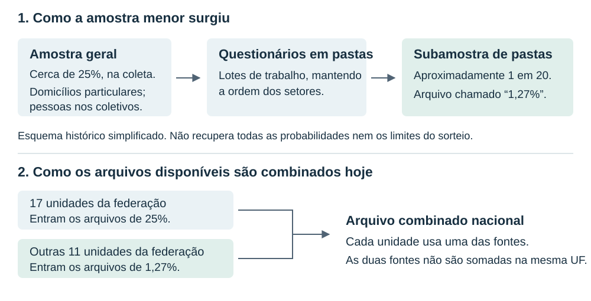
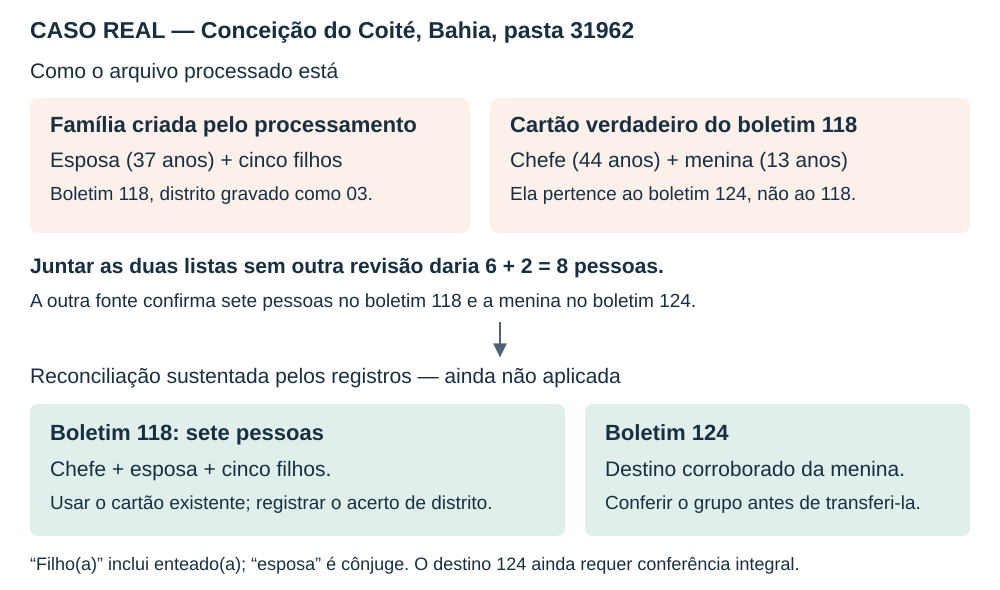
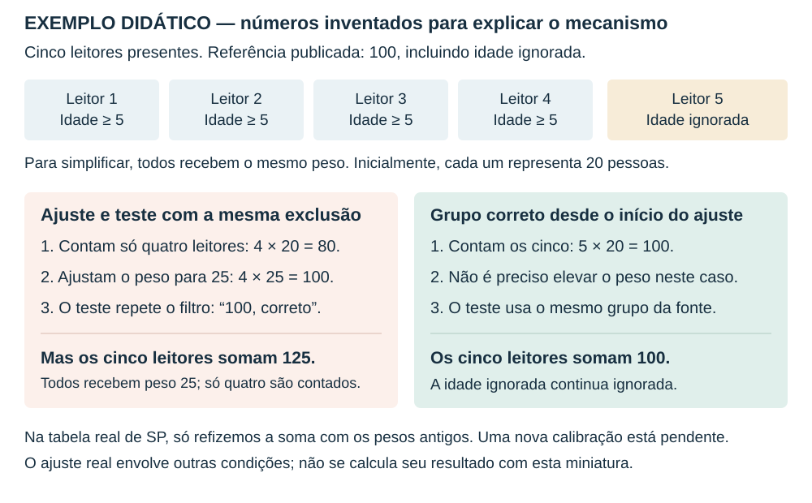
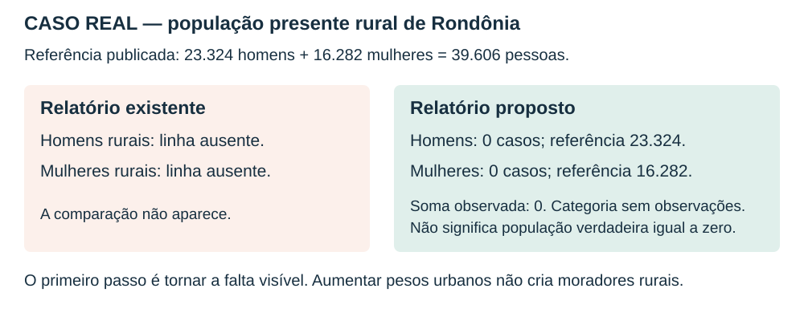

# O que aconteceu com os registros de 1960 — e como decidir o que corrigir

**Versão narrativa e ilustrada, de 22 de setembro de 2026.** Esta é a reescrita do parecer que reuniu as três revisões anteriores. As conclusões não foram convertidas em alterações nos dados. Não executei R/Rscript, não refiz pesos e não modifiquei os arquivos de produção. A [versão técnica de 21/09](microdata_1960_amostra_127_anexo_tecnico_20260921.md) está preservada integralmente para consulta.

O parecer anterior apresentou os resultados como uma lista de problemas já conhecidos pelo leitor. Faltou explicar a história que liga o arquivo original à regra de tratamento e, depois, à descoberta de um erro. Este texto começa por essa história.

A conclusão, em linguagem direta, é esta: **conseguimos ler e organizar quase todos os registros, mas algumas regras usadas para completar essa organização foram além do que os registros permitiam afirmar.** Algumas associaram pessoas à família errada; outras eliminaram pessoas cujas respostas eram iguais; um reparo mudou respostas que ainda eram legíveis. Além disso, certas comparações com os resultados publicados esconderam diferenças ou compararam grupos diferentes de pessoas.

Isso não significa que todos os registros estejam errados. Significa que não devemos tratar o arquivo inteiro como conferido enquanto essas decisões não forem resolvidas e seus efeitos reavaliados. Ao longo do texto, “ainda não aprovado” tem esse sentido, não o de inutilidade completa dos dados.

## Como usar este documento

A leitura pode seguir os capítulos em ordem. Cada caso principal explica **como estava o registro, por que a regra parecia razoável, o que ela fez, qual evidência a contradiz e como deveria ficar**. “Deveria” indica uma proposta sustentada pela evidência, não uma alteração já realizada.

Há três tipos de ilustração:

- **Casos reais:** os números identificam registros que podem ser encontrados nos arquivos. Não atribuímos nomes às pessoas.
- **Esquemas explicativos:** reorganizam visualmente registros ou etapas reais, sem reproduzir a aparência do formulário original.
- **Exemplo didático:** usa números inventados, expressamente identificados, apenas para tornar visível um mecanismo de cálculo.

No fim de cada conjunto de casos, “Como conferir” leva a um caderno com trechos literais, posições dos campos, linhas das fontes e localização da regra no programa. O texto principal usa palavras; o caderno guarda os códigos necessários para repetir a verificação.

## 1. Antes de falar em erro: que arquivo estamos tentando reconstruir?

### Uma linha não é necessariamente uma pessoa

O arquivo chamado **HHOLDA.txt** tem 1.074.328 linhas, cada uma com 62 posições. Ele conserva uma representação textual dos antigos registros em cartões. Algumas linhas descrevem a família e o domicílio; outras descrevem pessoas.

Um número isolado só tem sentido quando sabemos a posição em que aparece. Uma posição pode indicar sexo e presença; outra, parentesco; um conjunto de três posições, idade. **Ler o arquivo** significa separar essas posições e traduzir seus códigos para colunas. Essa disposição fixa dos campos é o que os documentos técnicos chamam de *layout*.

Por exemplo, o código de idade 999 significa “idade ignorada”. Ele reúne uma posição com o tipo de idade, 9, e duas posições com o número, 99. Não significa idade de 99 ou de 999 anos. E uma posição vazia nem sempre significa que uma resposta se perdeu: em alguns tipos de domicílio, a instrução era justamente não codificar certas perguntas.

### Pessoa, família e domicílio não são a mesma unidade

Uma pessoa é um registro individual. Uma família é o grupo identificado pelo boletim, isto é, pelo questionário. O domicílio é a unidade de moradia. Duas famílias podem compartilhar um domicílio; por isso, contar boletins não equivale a contar casas.

Imagine uma casa com uma família principal e uma segunda família. O arquivo pode ter dois boletins, mas as perguntas sobre água e cômodos estarem preenchidas apenas no da família principal. O espaço vazio no outro boletim não prova perda dessas respostas.

Essa distinção importa porque o tratamento reconstrói duas relações:

> Qual é a família desta pessoa? E a qual domicílio pertence essa família?

Um erro na primeira relação pode mudar a composição da família. Um erro na segunda pode alterar a contagem de domicílios ou atribuir a uma pessoa características da casa errada. Também pode mudar o peso usado para essa pessoa, porque o processamento utiliza pesos comuns dentro do domicílio.

Nos exemplos, “filho” e “filha” abreviam a categoria **filho ou enteado / filha ou enteada** do censo. “Esposa” descreve uma mulher registrada como cônjuge. Essas expressões não comprovam filiação biológica nem acrescentam informações às respostas originais.

### Como se encontra a família de uma pessoa

O programa procura uma identificação composta por unidade da federação, distrito, pasta e número do boletim. Nos textos técnicos, essa combinação é chamada de **chave**: funciona como um endereço do questionário.

A **pasta**, aqui, não é uma pasta do computador nem um município. Era um lote de trabalho em que foram reunidos questionários. O número de uma pasta ajuda a encontrar o registro, mas não substitui a identificação geográfica.

Quando uma dessas partes está errada, a busca pode fracassar mesmo que o cartão da família ainda exista. É a diferença decisiva entre:

- “não encontrei o cartão usando esta identificação”;
- “o cartão se perdeu e deixou de existir”.

Vários problemas da revisão começam quando a primeira frase foi tomada como prova da segunda.

### Por que temos duas amostras para comparar?

O IBGE selecionou uma amostra geral de aproximadamente 25% na coleta. Dela foi retirada uma amostra menor, por seleção de pastas, usada na publicação preliminar e conhecida no projeto como amostra de 1,27%.

Hoje, os arquivos de 25% estão disponíveis no projeto para 17 unidades da federação. Para outras 11, o arquivo combinado utiliza a amostra menor. **Nas 17 primeiras, as duas fontes podem ser comparadas; na compilação nacional, porém, não são somadas.** Entra uma fonte por unidade.

*Figura 1. A parte superior resume o procedimento histórico; a inferior mostra a escolha de fonte no produto atual. São relações diferentes. “UF” significa unidade da federação, incluindo os estados e territórios da organização da época.*

A outra cópia é muito útil para conferir pessoas e boletins. Mas não é um cadastro civil independente nem uma prova de que todos os campos de uma cópia estejam certos. Podemos confirmar um vínculo e, ao mesmo tempo, encontrar uma diferença na resposta sobre o domicílio. O primeiro caso abaixo mostra exatamente isso.

**Como conferir:** a descrição histórica está nos [Resultados Preliminares de 1965](fontes_1960/1965_resultados_preliminares_vol2.pdf#page=6), página impressa II, sexta página do PDF. Os campos e suas posições estão no [guia de leitura das pessoas](../read_guides/readguide_1960_amostra_127_pessoas.csv). As contagens gerais e os limites dos testes anteriores permanecem no [anexo técnico](microdata_1960_amostra_127_anexo_tecnico_20260921.md).

## 2. Quando a tentativa de recuperar uma família cria um vínculo errado

Os casos da Bahia e da Paraíba que seguem estão nos arquivos processados da amostra de **1,27%**. Para essas duas unidades, a compilação nacional escolhe a fonte de **25%**. Portanto, não se deve concluir que os mesmos defeitos estejam automaticamente no arquivo nacional; a explicação investiga o tratamento da fonte menor.

### Caso A — uma menina de Ipiaú foi ligada a uma família de Ibicaraí

**Como estava no original.** Na linha 302261 do HHOLDA há uma menina de cinco anos, registrada como filha e moradora presente. Seu registro aponta para Ipiaú, na Bahia, pasta 31606, boletim 031. O distrito, entretanto, está gravado como 01.

O cartão familiar correspondente existe no mesmo HHOLDA, na linha 302453. Nele, o distrito é 07. Essa diferença impede o encontro pela identificação completa.

**Qual era a lógica da regra.** Depois de tentar a identificação completa, a versão que produziu os arquivos existentes tratava certos grupos sem chefe ou cônjuge como continuação da família anterior. A justificativa registrada no código era que muitos desses grupos pareciam hóspedes ou visitantes listados à parte. A proximidade no arquivo era usada como pista de pertencimento.

Essa pista pode ser útil para investigar. Não é suficiente para decidir: registros próximos podem pertencer a boletins, pastas e municípios diferentes. Além disso, “não há chefe neste grupo” não significa “este grupo pertence ao chefe anterior”.

**O que a regra fez neste caso.** A menina foi ligada ao cartão da linha 302253, da pasta 31516, em Ibicaraí. Seu registro pessoal continuou guardando informações de Ipiaú, mas sua ligação familiar apontou para outra família. Não se trata de descobrir uma migração: trata-se de uma associação criada pelo processamento.

| Elemento que podemos observar | Registro da menina | Família à qual ela foi ligada | Cartão correspondente encontrado |
|---|---|---|---|
| Município identificado no guia | Ipiaú | Ibicaraí | Ipiaú |
| Número da pasta | 31606 | 31516 | 31606 |
| Número do boletim | 031 | 238 | 031 |
| Distrito | 01 | 01 | 07 |
| Linha no HHOLDA | 302261 | 302253 | 302453 |

**Por que a revisão considera o vínculo errado.** Na amostra de 25%, a linha 399500 reproduz os 25 campos pessoais comparados da menina e a situa no boletim 031 correspondente ao cartão que já existe no HHOLDA. Não estamos escolhendo apenas uma família geograficamente próxima: temos correspondência do conteúdo individual e do boletim.

**Como deveria ficar.** A proposta é documentar a correção da identificação distrital desta pessoa e ligá-la ao cartão existente da linha 302453. Não há motivo para criar uma nova família nem para eliminar a menina.

Há um limite importante: o tipo do domicílio difere entre as duas cópias desse boletim — rústico no HHOLDA e durável na outra fonte. A evidência para corrigir **a ligação da pessoa** não autoriza copiar **todas as características do domicílio**. São duas decisões, e a segunda permanece separada.

**O que já foi feito e o que não foi.** A regra de anexação ao anterior foi bloqueada para futuras reconstruções nos casos pendentes. O arquivo gravado ainda contém a ligação antiga. Bloquear a repetição de um erro não corrige o dado que já estava salvo.

Este caso dá materialidade ao problema geral: 1.008 pessoas foram anexadas ao anterior; em 70 aparecem conflitos geográficos identificados pela auditoria. As 70 não esgotam os vínculos a conferir. E conflitos de pasta, distrito e município podem ocorrer na mesma pessoa, por isso suas contagens não devem ser somadas.

### Caso B — uma família “perdida” já tinha cartão; e uma fusão simples também estaria errada

O segundo caso é de Conceição do Coité, Bahia, pasta 31962, boletim 118.

**Como estava no original.** Seis pessoas aparecem juntas nas linhas 315134 a 315139: uma esposa de 37 anos e cinco filhos, com idades registradas de 8, 14, 12, 4 e 10 anos. Todas trazem distrito 03.

Mais adiante, o HHOLDA contém o cartão do boletim 118, linha 315732, seguido do chefe, de 44 anos, linha 315733. Neste trecho, o distrito é 05. O cartão não desapareceu; a diferença de distrito impediu que os seis fossem encontrados pela mesma identificação.

**Qual era a lógica da correção aplicada.** Quando um grupo sem cartão correspondente continha chefe ou cônjuge, o programa criava uma família nova. O raciocínio era: “a presença de um chefe ou cônjuge indica uma família própria; se não há cartão ligado a ela, esse cartão deve ter se perdido”.

A primeira parte é uma pista de estrutura familiar. A segunda é uma hipótese sobre a história do arquivo. Um código divergente também produz a falta de correspondência, sem que tenha havido perda do cartão.

**Como ficou no arquivo processado.** A esposa e os cinco filhos viraram uma família criada pelo programa, sem as respostas do domicílio. O chefe permaneceu ligado ao cartão verdadeiro. Mas há uma complicação: uma menina de 13 anos, linha 315736, que traz boletim 124, também foi ligada ao cartão do boletim 118 pela regra do registro anterior.

*Figura 2. São duas decisões erradas que se cruzam. Juntar as listas atuais sem conferir quem já está no destino produziria oito pessoas, não as sete sustentadas para o boletim 118.*

**Qual evidência permite reconstruir a situação.** Na fonte de 25%, o boletim 118 contém o chefe, a esposa e os cinco filhos: sete pessoas, com correspondência nos campos pessoais comparados. A menina de 13 anos corresponde à ordem 6 do boletim 124, linha 645897 do arquivo de 25%. O cartão desse boletim também existe no HHOLDA, linha 315168, e coincide nos 15 campos familiares comparados.

Essa conferência adicional foi feita ao preparar o exemplo narrativo. Ela explica por que a recomendação curta de “reconciliar a família criada” precisava ser mais precisa.

**Como deveria ficar, neste caso específico.**

1. O chefe, a esposa e os cinco filhos devem ser reunidos sob o cartão existente do boletim 118, registrando a evidência para corrigir o distrito dos seis.
2. A menina de 13 anos deve ser preservada e ter seu vínculo revisto para o cartão do boletim 124, um destino fortemente corroborado. **Antes de executar essa transferência, falta conferir toda a composição e multiplicidade atuais desse destino.** Esta ilustração não aprovou antecipadamente a reorganização completa do boletim 124. Ela não deve ser apagada.
3. A identificação familiar criada apenas para os seis deixa de representar uma família separada; a alteração de identificadores e de contagens precisa ser registrada.
4. Depois, é necessário rever os domicílios, as contagens e os pesos afetados. Não basta trocar um número de família e considerar todo o restante automaticamente correto.

Essa sequência é uma proposta sustentada para **estes registros**. Não é uma autorização para fundir todos os grupos parecidos. Das 150 famílias criadas pelo programa, 141 têm cartão candidato na mesma unidade, pasta e boletim, mas há casos com diferenças adicionais. A existência de candidato inicia a conferência; não a encerra.

No arquivo nacional combinado, há 179 pessoas provenientes de 59 dessas famílias criadas. Como o tipo de domicílio está ausente, o compilador as classifica como particulares por uma regra residual: aquilo que não foi reconhecido como coletivo recebe o outro rótulo. A forma adequada é registrar tipo não determinado enquanto não houver evidência suficiente. “Não sei se é coletivo” não equivale a “sei que é particular”.

### E as famílias que realmente dividem um domicílio?

Há boletins em que o próprio código informa “família principal”, “segunda família” ou “terceira família”. Nesses casos, a sequência do arquivo e a concordância da identificação oferecem uma base melhor para reunir famílias no mesmo domicílio.

Mesmo assim, a regra deve conferir as partes da identificação. A revisão inventariou 373 encadeamentos desse tipo. Encontrou diferenças entre cópias em 37 pares comparáveis, mas isso **não prova que os 37 vínculos estejam errados**. Mostra onde a explicação precisa ser conferida.

O tratamento adequado é distinguir as situações: relação explicitamente codificada; vínculo recuperado por correspondência demonstrada; e vínculo ainda desconhecido. Não transformar todos em “família certa” só porque receberam um número válido.

**Como conferir os casos A e B:** o [caderno de vínculos e duplicatas](parecer_1960_evidencias/vinculos.md) traz as linhas originais, os grupos atuais, as correspondências de 25% e os campos comparados. Os nomes Ipiaú, Ibicaraí e Conceição do Coité vêm do [guia de municípios](../read_guides/1960_municipios.csv), linhas 849, 847 e 878. A regra de reconstrução está na função build_families_1960_amostra_127, no [código de preparação](../R/microdata_1960_amostra_127.R), em torno das linhas 501–622.

## 3. Quando duas pessoas têm respostas iguais: por que isso não basta para excluir uma

### Caso C — dois pares de filhos com idade ignorada

**Como estava no original.** No boletim 166 da pasta 19124, em Mamanguape, na Paraíba, há sete registros pessoais. Entre eles, aparecem dois filhos do sexo masculino com respostas iguais entre si e duas filhas com respostas iguais entre si. **Todas as sete pessoas, inclusive chefe e cônjuge, têm idade ignorada.** Não podemos chamar os filhos de crianças sem conhecer suas idades.

Não precisamos supor que sejam gêmeos. Basta reconhecer que sexo, parentesco, idade ignorada e outras respostas comuns podem ser iguais em pessoas diferentes. O arquivo não contém nomes que permitam distingui-las civilmente.

**Por que surgiu a regra de exclusão.** Há sequências no arquivo que parecem repetições de registros. A regra antiga procurava conteúdo idêntico dentro de uma família e, entre outros critérios, considerava que duas ou mais repetições indicavam um bloco copiado.

A lógica é compreensível: se um trecho foi copiado duas vezes, contá-lo duas vezes criaria pessoas inexistentes. O salto indevido foi tomar uma pista de cópia como prova suficiente de cópia, sem conferir quantas ocorrências legítimas havia na família.

**O que foi eliminado.** A regra retirou as linhas 168805 e 168806, uma ocorrência de cada par. O grupo passou de sete para cinco registros pessoais.

| Parte da família | HHOLDA antes da exclusão | Arquivo após a regra antiga | Fonte de 25% |
|---|---:|---:|---:|
| Filhos com o primeiro perfil, masculino e idade ignorada | 2 | 1 | 2 |
| Filhas com o segundo perfil, feminino e idade ignorada | 2 | 1 | 2 |
| Chefe, cônjuge e terceiro filho masculino, de perfil diferente | 3 | 3 | 3 |
| **Total** | **7** | **5** | **7** |

**Por que a evidência favorece a restauração.** O cartão familiar de 25%, linha 84593, declara sete pessoas. As linhas 84596–84597 preservam os dois filhos; as 84598–84599, as duas filhas, com números de ordem distintos no boletim. A outra cópia, portanto, sustenta as duas ocorrências de cada perfil.

Isso não permite distinguir nominalmente cada integrante dos pares. Permite comparar quantas ocorrências foram preservadas. Essa evidência contradiz o fundamento usado para eliminar uma ocorrência de cada par: manter duas ocorrências é melhor sustentado do que reduzir cada perfil a uma.

**Como deveria ficar.** A proposta é restaurar as duas linhas neste boletim, preservar sua origem e registrar o motivo. A regra geral não deve dizer “respostas iguais são uma pessoa”; deve perguntar “quantas ocorrências deste perfil são sustentadas pelas fontes?”.

Essa última pergunta é o que o parecer técnico chamava de **multiplicidade**. É apenas a quantidade de vezes que um perfil aparece, não um conceito de identidade pessoal.

Há um segundo exemplo que evita outra correção excessiva. Num boletim de Pernambuco, um perfil aparece quatro vezes no HHOLDA, duas na fonte de 25%, mas apenas uma foi mantida. A evidência sugere restaurar **uma ocorrência**, chegando a duas — não devolver indiscriminadamente as três excluídas.

Por isso, o saldo de 31 restaurações sugeridas na revisão não é igual às 39 exclusões envolvidas nos perfis problemáticos. Também não significa que faltem 31 pessoas no arquivo combinado nacional: esses casos pertencem às unidades em que a compilação usa a fonte de 25%, não a versão menor que sofreu as exclusões.

**Situação atual.** A regra antiga foi impedida de excluir automaticamente esses candidatos em nova execução. As exclusões ainda estão nos arquivos já gravados. Das 2.850 linhas retiradas no tratamento histórico, algumas têm boa evidência de repetição, outras não. A proposta não é restaurar todas nem aprovar todas: é registrar uma decisão por perfil, ocorrência e fonte.

**Como conferir:** o [caderno de vínculos e duplicatas](parecer_1960_evidencias/vinculos.md) contém o boletim completo da Paraíba. A [auditoria anterior](microdata_1960_amostra_127_auditoria_vinculos.md) detalha os demais grupos. A regra de exclusão e seu bloqueio estão na função dedup_1960_amostra_127, no [código de preparação](../R/microdata_1960_amostra_127.R), em torno das linhas 461–499.

## 4. Um reparo que mudou a escolaridade: números permitidos também podem estar errados

### Caso D — o zero excedente no registro de uma menina do Rio Grande do Sul

**O problema original.** A linha 951431 estava danificada: havia um fragmento deslocado e espaços no meio. O reparo procurou recuperar a parte legível, recolocá-la nas posições esperadas e deixar em branco a parte que não conseguia recuperar.

Esse princípio é razoável: recuperar o que está preservado e não inventar o que se perdeu. O problema não é ter tentado reparar. É que o texto escolhido como reparo contém um zero excedente na região dos campos de escolaridade.

O caso é de uma menina de 12 anos, registrada como outro parente, pasta 81076, boletim 016. A fonte de 25% conserva seu correspondente na linha 252042.

**Vamos olhar apenas a região que mudou.** Cada barra abaixo separa um campo; as barras e os colchetes foram acrescentados para a ilustração e não pertencem ao arquivo.

| Origem da leitura | Série frequentada — uma posição | Grau do curso frequentado — uma posição | Curso completo — duas posições |
|---|---:|---:|---:|
| Fragmento original legível, retirados os espaços | 6 | 2 | 00 |
| Texto usado pelo reparo e gravado no arquivo atual | **[0]** | **6** | **20** |
| Registro correspondente na fonte de 25% | 6 | 2 | 00 |
| Proposta restrita a esses campos | 6 | 2 | 00 |

O 6 que deveria ocupar o primeiro campo foi parar no segundo. O 2 que deveria ocupar o segundo passou a iniciar o campo de duas posições. Os zeros consecutivos impedem identificar exatamente onde alguém inseriu o caractere ao escrever o reparo; **o deslocamento dos campos é que está demonstrado**.

Traduzindo os códigos, o efeito não é pequeno:

| Pergunta | O fragmento preservado e a outra fonte dizem | O reparo atual passou a dizer |
|---|---|---|
| Série frequentada | 3ª série | Cursa o 1º ano elementar |
| Grau do curso frequentado | Elementar | Ignorado |
| Curso completo | Sem curso completo | Ginasial, médio de 1º ciclo |

**Por que a conferência automática não detectou.** Todos os números do reparo existem no dicionário: 0 é permitido no primeiro campo, 6 no segundo, e 20 no terceiro. O teste respondeu corretamente à pergunta “estes são códigos permitidos?”. Ele não respondeu à pergunta “estas eram as respostas desta menina?”.

É por isso que o arquivo pode dizer “registro recuperado” e, ao mesmo tempo, conter valores recuperados incorretamente. A marca de recuperação informa que houve uma intervenção; não certifica seu acerto.

**Qual seria a correção adequada.** Restaurar somente as posições 34 a 37 para a sequência 6200. Isso recupera o trecho sustentado pelo próprio fragmento e pela outra fonte. Não se deve simplesmente apagar um zero e deslocar todo o restante da linha; a posição da barra final e dos demais campos também importa.

As perguntas posteriores, nas posições 39 a 54, foram deixadas sem informação no reparo. Devem continuar assim nesta proposta. Copiar as respostas adicionais da fonte de 25% exigiria outra decisão, com justificativa própria. Corrigir três campos comprovados não autoriza completar o resto por arrastamento.

Esse erro está na amostra de 1,27%. O arquivo combinado utiliza 25% para o Rio Grande do Sul e não reproduz o defeito. Também não se resolve a ligação familiar desta menina apenas corrigindo sua escolaridade.

**Como conferir:** o [caderno do reparo e da gravação](parecer_1960_evidencias/reparo_e_gravacao.md) mostra a linha original inteira, o texto do reparo, a linha do arquivo de 25%, as posições de cada fonte e os rótulos do manual. A decisão está na linha 99 do [arquivo de correções](../read_guides/1960_amostra_127_correcoes.csv). Os rótulos estão nas linhas 166–192 do [código do censo transcrito](../read_guides/1960_codigo_do_censo.csv). Nada disso foi alterado nesta reescrita.

## 5. Conferir com a publicação: por que “bateu o total” pode enganar

Antes dos próximos casos, duas palavras precisam ficar claras.

Um **peso** indica quanto um registro contribui para uma estimativa. Se uma pessoa tem peso 4, sua contribuição à contagem estimada é quatro, não uma. O peso pode deixar de ser inteiro.

**Calibrar os pesos** é ajustá-los para que certas somas coincidam com referências escolhidas — por exemplo, o total publicado de homens e mulheres ou de leitores. Essas somas de referência eram chamadas de “margens” ou “controles” no parecer anterior.

Esse ajuste só faz sentido se a soma do arquivo e a referência falarem do **mesmo grupo de pessoas**. A expressão técnica “universo da comparação” significa precisamente isso: quem deve entrar naquela conta.

### Caso E — a pessoa sem idade conhecida ainda pode entrar na tabela histórica de leitores

**Uma pessoa real.** No arquivo de 25% de São Paulo, a linha original 1434472 é uma mulher moradora presente, que sabe ler e não frequenta escola. Sua idade está expressamente codificada como ignorada. Seu peso gravado é aproximadamente 3,9826.

A palavra “presente” se refere à presença na data de referência do censo. Não é sinônimo de moradora: visitantes também podem ser presentes, e moradores ausentes continuam sendo residentes. Para a tabela de alfabetização examinada aqui, o grupo de comparação é o dos presentes.

**Por que a regra parecia correta.** O título da tabela se refere a pessoas de cinco anos e mais. O programa então selecionou quem tinha idade numérica conhecida de pelo menos cinco anos. Isso é uma interpretação natural se olharmos apenas o título.

**O detalhe da fonte que muda a decisão.** A publicação explica que as idades ignoradas entram nos totais quando a informação é apresentada com um limite mínimo de idade. Na página impressa XIII, o grupo de idade ignorada:

> “é incluído no total sempre que as informações têm por base um limite mínimo de idade para os informantes.”

Não é uma instrução para inventar a idade da mulher, nem para dizer que toda idade ignorada pertence biologicamente à faixa de cinco anos e mais. É a convenção usada para construir **aquele total publicado**. Para comparar ou ajustar pesos a ele, precisamos reproduzir essa convenção.

Fonte visual: [Série Nacional, página XIII, 12ª página do PDF](fontes_1960/1960_serie_nacional_vol1_brasil.pdf#page=12).

**O erro ocorreu duas vezes.** O programa que ajusta os pesos de 25% excluiu os leitores de idade ignorada. O programa que confere o resultado repetiu a mesma exclusão. Assim, ambos trabalharam com o mesmo grupo incorreto.

*Figura 3. Exemplo didático, não uma reprodução de cinco pessoas do censo. O peso comum simplifica a demonstração. O ajuste real envolve várias condições simultâneas e não pode ser refeito por essa continha.*

O exemplo mostra por que uma conferência precisa verificar primeiro **quem entrou na soma**. Repetir o mesmo filtro do ajuste pode confirmar sua aritmética e não perceber sua interpretação errada.

**Qual é o tamanho real do problema?** Nos arquivos de 25%, ficaram fora dessa conta 9.395 leitores presentes com idade declarada ignorada. Seus pesos atuais somam 36.562,0023. Isso é a contribuição que foi omitida; não é uma contagem de 36.562 registros individuais.

As 34 comparações estaduais de leitores — dois sexos nas 17 unidades — aparecem com diferença arredondada zero. São Paulo permite ver o que acontece ao corrigir apenas a seleção, sem mexer nos pesos:

| Comparação em São Paulo | Referência publicada | Soma antiga, excluindo idade ignorada | Soma incluindo idade ignorada, com os mesmos pesos |
|---|---:|---:|---:|
| Homens que sabem ler | 4.089.706 | 4.089.706 | 4.097.859,19 |
| Mulheres que sabem ler | 3.557.693 | 3.557.693 | 3.565.911,11 |

O resultado corrigido **deixa de coincidir**. Isso é esperado: os pesos antigos foram ajustados a uma seleção diferente. Não seria correto voltar a excluir as pessoas para recuperar a diferença zero.

**Como deveria ficar.** A regra de ajuste e a de conferência precisam incluir os leitores cuja idade foi declarada ignorada, conforme a publicação. Primeiro se corrige a definição do grupo. Depois, numa execução autorizada, os pesos terão de ser recalculados e conferidos com as demais condições. Não há neste parecer uma previsão dos novos pesos.

As diferentes partes do projeto também não estão na mesma situação. O ajuste da amostra de 1,27% já inclui os declarados ignorados nesse total; sua validação definitiva recém-reformulada os retirou, introduzindo uma regressão. Em 25%, ajuste e validação os excluem; o validador combinado também os exclui. A comparação com os preliminares de 1,27% tem tratamento próprio. A correção precisa respeitar essas diferenças, não aplicar a mesma edição mecanicamente em todas as funções.

Finalmente, idade **declarada ignorada** não é idade **danificada**. Há quatro presentes da Guanabara no compilado com idade em anos, mas número de anos perdido; a validação os trata como ignorados declarados. Isso precisa ser separado. A nota da publicação não autoriza transformar qualquer campo ilegível em uma declaração que não temos.

**Como conferir:** o [caderno de validação](parecer_1960_evidencias/validacao.md) contém a pessoa real de São Paulo, as linhas 777–778 do relatório de 25%, as referências publicadas e a recontagem por sexo. A seleção usada no ajuste está em torno das linhas 568–574 e 621 do [programa de 25%](../R/microdata_1960_amostra_25.R).

### Caso F — o rural de Rondônia não aparece na conferência

O arquivo de Rondônia tem 675 pessoas; 666 são presentes nos códigos conhecidos. Não há registro classificado como rural. Os pesos dos presentes somam 70.232, o total estadual publicado, mas toda essa soma fica na parte urbana.

A publicação, por sua vez, divide esse total em 30.626 pessoas urbanas e 39.606 rurais. Portanto, coincidir com o total estadual não demonstra que o arquivo represente corretamente a divisão urbano–rural.

**Como a linha desaparece.** O programa começa contando os grupos encontrados nas pessoas: homens urbanos, mulheres urbanas e assim por diante. Como não encontra rural, não cria uma linha rural. Na etapa seguinte, busca o total publicado apenas para as linhas que já criou. O rural continua ausente.

Essa operação é chamada de *junção* ou *join* no código. O nome técnico não é o problema; a decisão relevante é **qual lista é preservada**. Se preservamos só os grupos observados, deixamos de mostrar grupos que deveriam ter sido comparados.

*Figura 4. A proposta muda a apresentação da limitação, não cria moradores rurais nem resolve por si só a representatividade da amostra.*

**Como deveria ficar.** Começar pela lista de comparações exigidas pela publicação e procurar a contribuição da amostra para cada uma. Para os homens rurais, devem aparecer zero registros, soma observada zero e referência 23.324. Para as mulheres, zero registros, soma zero e referência 16.282. As diferenças são negativas e equivalem a −100%.

Essa diferença não significa que sabemos que a população rural verdadeira era zero. Significa que, com os registros e a classificação existentes, não há observações dessa categoria para produzir a comparação desejada.

**Então o que fazer além de mostrar a falta?** Primeiro conferir se há erro de classificação ou perda de informação; no caso de Rondônia, a auditoria confirmou a ausência do código rural no arquivo examinado. Depois, reconhecer a limitação de uso. Não existe multiplicador que transforme uma pessoa classificada como urbana em observação rural.

Se uma condição do ajuste exigir um total rural positivo, mas nenhuma pessoa puder contribuir para ela, o programa deve apontar a impossibilidade. Uma eventual decisão de trabalhar apenas com totais mais amplos, agregar categorias ou deixar de estimar aquele grupo precisa ser explícita. Nenhuma dessas opções deve aparecer como simples “correção” de uma célula vazia.

**Não é um caso isolado do relatório.** O validador combinado deveria apresentar 1.566 comparações pessoais na grade examinada, mas apresenta 1.346. Faltam 220, sendo 210 com referência positiva. Parte são totais que não foram construídos; parte são categorias sem observações. É importante distinguir as duas causas.

Além disso, a tabela domiciliar não é construída pelos validadores de 25% e do combinado. Suas 168 referências estaduais estão fora dessa conferência. Não são 168 resultados reprovados: são comparações ainda não realizadas.

**Como conferir:** o [caderno de validação](parecer_1960_evidencias/validacao.md) reproduz as linhas urbanas 803–804 do relatório combinado e indica as referências rurais nas linhas 1142–1144 do [arquivo de totais definitivos](censo_1960_resultados_definitivos_serie_nacional.csv). A ausência das linhas rurais foi conferida por identificação completa, não por uma leitura de algumas linhas do relatório.

### Caso G — resposta “ignorada” e pergunta não codificada foram trocadas

Uma informação desconhecida pode aparecer de pelo menos três maneiras diferentes:

1. A resposta foi registrada como **ignorada**, usando um código próprio.
2. A pergunta **não devia ser codificada** naquele tipo de registro.
3. A resposta deveria existir, mas está **perdida ou ilegível**.

Não é seguro juntar essas três situações numa mesma categoria.

**Dois domicílios reais tornam a diferença visível.**

Neste caso, “regra atual” significa o código de validação reformulado, ainda não executado em R. Seu comportamento foi reproduzido na auditoria separada em Python; não estamos apresentando uma nova saída do programa R como se já tivesse sido gerada.

| Domicílio | O que está no arquivo | O que isso quer dizer | O que a regra atual faz |
|---|---|---|---|
| Bahia, linha 303650 | Tipo durável; abastecimento de água com código 4 | A resposta sobre água foi explicitamente codificada como ignorada | Deixa o domicílio fora da categoria “outra forma/sem declaração” |
| Sergipe, linha 284026 | Tipo improvisado; campo de água vazio | O manual manda não codificar os quesitos seguintes nesse tipo | Inclui o vazio como se fosse resposta “outra forma/sem declaração” |

**Por que a regra parecia útil.** O programa agrupou “outra forma de abastecimento” com “sem declaração” e tratou qualquer ausência como sem declaração. A intenção de reunir desconhecidos era simples; o problema foi esquecer o código explícito de ignorado e não distinguir o vazio produzido pelas instruções do formulário.

**Como deveria ficar.** Na variável criada apenas para comparação, incluir os códigos explícitos correspondentes a “outra forma” e “ignorado”. Separar as ausências por motivo: pergunta não codificada naquele tipo, parte domiciliar não preenchida por ser família secundária, ou informação realmente perdida. Os valores originais não precisam ser alterados para corrigir essa classificação.

Na amostra de 1,27%, há 101 domicílios com água explicitamente ignorada que ficaram fora da categoria. Em sentido contrário, entraram 49 improvisados com salto previsto, uma família secundária sem esse bloco preenchido e três domicílios duráveis com ausência que ainda requer diagnóstico.

Nos dois exemplos da tabela, a contribuição de 73,27 do domicílio baiano deve entrar, e a de 69,72 do sergipano deve sair dessa categoria. A comparação de toda a região Leste muda de aproximadamente +1,62% para +1,64% em relação à publicação, mantendo os pesos e o restante da seleção. **A diferença aumenta um pouco, mas a classificação fica melhor fundamentada.** Reduzir a diferença a qualquer custo não é um critério de correção.

**Como conferir:** o [caderno de validação](parecer_1960_evidencias/validacao.md) traz os valores sem arredondamento, o total do Leste e os campos de cada domicílio. O [código transcrito do censo](../read_guides/1960_codigo_do_censo.csv), linhas 681 e 700–701, distingue a instrução de salto dos códigos de água.

### Outras comparações que precisam da mesma disciplina

A lista abaixo mantém questões importantes da revisão anterior, explicadas pelo tipo de decisão necessário:

- **Cor:** a publicação agrega as declarações referentes a indígenas em pardos. Para reproduzir essa tabela histórica, a comparação deve somá-las nessa categoria, sem apagar o código original do microdado. A reformulação de 1,27% as deixou sem correspondência; os validadores de 25% e do combinado já fazem a agregação corretamente. Não há razão para alterar essas duas partes que já estão certas.
- **Atividade econômica:** uma pessoa pode ter atividade registrada, mas perder o detalhe sobre o ramo. Três casos reais têm atividade e ocupação, mas foram tratados como inativos porque faltou o ramo. Deve-se consultar a resposta sobre atividade e reservar uma situação de ramo desconhecido. Ausência de detalhe não prova ausência de trabalho.
- **Domicílio permanente:** a tabela definitiva examinada é de domicílios particulares permanentes, mas a seleção inclui 49 improvisados. “Particular” e “permanente” não são sinônimos. A correção deve selecionar o mesmo tipo de moradia da tabela, mantendo os improvisados no arquivo para outras análises, não apagá-los.
- **Domicílio sem lista de pessoas:** existe um caso em São Paulo, linha 780535, sem pessoa ligada. Eu havia escrito que todos os particulares tinham residente conhecido; essa afirmação estava errada. Entre os que têm lista, não apareceu um caso sem residente conhecido. A ausência de lista, entretanto, não prova que o domicílio estivesse vazio nem ocupado apenas por visitantes. Sua situação permanece desconhecida.
- **Estado conjugal:** uma suspeita anterior sobre a classificação de divorciados foi descartada depois da consulta à publicação. Não se deve “corrigir” um tratamento que a fonte sustenta. Desquitados e divorciados entram no total, mas não na categoria “separados” desse quadro: a publicação define separados como aqueles que se separaram sem desquite ou divórcio.
- **Tabelas ainda não feitas:** faltam cruzamentos de estado conjugal com a atividade da qual a pessoa depende e comparações de aluguel. “Não reconstruído” significa que a regra não foi implementada, não que os resultados sejam zero ou que a reconstrução seja impossível.

A regra geral pode ser expressa sem jargão:

| Situação encontrada | O relatório deve mostrar | Não deve afirmar |
|---|---|---|
| Nenhum caso da categoria, mas a comparação é definida | Zero observado, quantidade de casos zero e aviso da falta | “Não existe população dessa categoria” |
| Cálculo ainda não implementado | “Não calculado” | Zero |
| Registro existe, mas não pode ser classificado | Quantos casos e quanto peso ficaram sem classificação | Que todos pertencem à categoria residual |
| Peso inválido ou ausente | Que a soma não pode ser aceita nessa condição | Uma soma silenciosa só dos pesos disponíveis |
| Referência publicada igual a zero | Diferença absoluta; percentual não definido quando implica dividir por zero | Um percentual numérico fabricado |

O termo **NA**, que aparece no código, significa valor ausente. Ele não explica sozinho por que está ausente. Essa explicação precisa vir da fonte, da regra aplicada e do registro da decisão.

## 6. O desenho amostral: o que sabemos e o que estamos reconstruindo

**Desenho amostral** é o procedimento pelo qual as unidades foram escolhidas: o que entrou no sorteio, em que ordem, em quais grupos e com que chances. Não é apenas uma fórmula que o programa estatístico aceita.

A documentação sustenta uma seleção geral de aproximadamente um quarto e uma seleção posterior de pastas dentro dessa amostra. Também descreve quatro grupos de pastas, segundo a composição urbana, rural e mista e o porte urbano. Essa é a base histórica para tratar a pasta como um grupo de observações selecionadas em conjunto.

### Por que a pasta importa mesmo depois de termos todas as pessoas em linhas

Imagine, apenas para explicar, dez pessoas espalhadas por dez áreas e dez pessoas de uma mesma área. Os dois arquivos têm dez linhas, mas podem conter quantidades diferentes de informação independente sobre uma característica territorial. Pessoas próximas compartilham condições locais.

Um **conglomerado** é esse conjunto selecionado em bloco; aqui, a pasta tem esse papel na subamostra. Um **estrato** é um grupo dentro do qual se organiza a seleção ou a análise — por exemplo, uma separação de pastas por situação. As palavras não acrescentam prova histórica; nomeiam aspectos do procedimento.

A análise do projeto usa uma reconstrução por unidade da federação e quatro grupos de situação. Isso tem evidência favorável: ao ordenar as pastas reconstruídas, muitas selecionadas aparecem com intervalos próximos de vinte. Mas ainda não recuperamos de forma completa a lista histórica, os limites de cada série e seus reinícios.

**Como foi feita a inferência.** Partimos de um conjunto de pastas recuperado dos arquivos disponíveis, classificamos essas pastas e examinamos a distância entre as selecionadas. Na série corrigida por unidade e grupo, 472 de 611 intervalos são exatamente vinte; 552 ficam entre dezenove e vinte e um.

Esses resultados tornam a hipótese plausível. Não demonstram que cada lista histórica tinha exatamente os limites que reconstruímos. Se o cadastro reconstruído perdeu pastas ou classificou alguma de outra forma, as posições também mudam.

A revisão identificou dois problemas nessa própria investigação: uma recodificação repetida de Alagoas alterava posições, e a construção de certas sequências misturava grupos diferentes dentro da mesma unidade. A primeira foi corrigida apenas no script; as figuras antigas não foram refeitas. É preciso recomputar e rotular a evidência antes de usá-la para uma conclusão histórica mais forte.

### Por que 1,27% não é uma probabilidade exata recuperada

Se as duas frações fossem exatamente um quarto e um vigésimo, o produto seria um em oitenta, ou 1,25%. O inverso seria 80: cada unidade representaria, em média, oitenta antes de outros ajustes.

O projeto usa 1 dividido por 0,0127, aproximadamente 78,74, como peso inicial associado ao nome do arquivo. Essa convenção pode ser explicitada; não deve ser apresentada como a probabilidade histórica exata de cada pessoa, porque a revisão não recuperou essa prova.

Fernando de Noronha ilustra outra distinção. O ajuste utiliza base 4, sob a hipótese de que a pasta entrou com certeza na segunda seleção. Alguns metadados, porém, continuam informando base 78,74 e calculando o fator de ajuste sobre ela.

Um **fator de ajuste** é a divisão entre peso final e peso inicial. Se o denominador informado não é o usado no cálculo, o usuário pode interpretar incorretamente a intensidade do ajuste. A proposta é alinhar cálculo e descrição, deixando a hipótese de certeza identificada como hipótese. Não mudar pesos arbitrariamente para harmonizar rótulos.

### Os totais publicados continuam úteis, embora também sejam estimativas

Não estou propondo abandonar os resultados definitivos das 17 unidades por terem sido estimados com a amostra de 25%. São os referenciais disponíveis que o projeto escolheu usar.

O cuidado é mais preciso: **ajustar um arquivo a uma estimativa publicada não transforma essa estimativa em uma contagem sem incerteza**.

Um exemplo inventado ajuda. Suponha que uma publicação estime 1.000 pessoas num grupo. Depois do ajuste, o nosso arquivo também soma 1.000. A diferença entre os dois números é zero porque impusemos essa igualdade. Isso não prova que a população verdadeira seja exatamente 1.000; ela pode diferir porque o número de referência veio de uma amostra.

O cálculo futuro da **variância**, isto é, uma medida de quanto a estimativa mudaria sob outras seleções possíveis, precisa respeitar essa incerteza. Não o fiz nesta revisão, conforme a decisão de deixá-lo para depois. Também não concluí que a aproximação atual seja necessariamente conservadora, no sentido de nunca subestimar o erro.

Há ainda uma nuance documental: a origem do total depende da pergunta, não só do estado. As perguntas domiciliares eram do boletim de amostra; por isso, seus totais têm base amostral também nas outras 11 unidades. Não se deve carimbar todas as tabelas de uma mesma unidade como se tivessem a mesma origem.

**Como deveria ficar a apresentação do desenho.** Separar três níveis: o procedimento descrito na publicação; as partes reconstruídas a partir dos arquivos; e as escolhas adotadas para análise. A descrição dos pesos deve informar a base efetivamente usada e a origem de cada referência. O cálculo de incerteza fica explicitamente pendente, sem impedir que os erros de vínculo e de classificação sejam corrigidos antes.

**Como conferir:** a [publicação preliminar, página II](fontes_1960/1965_resultados_preliminares_vol2.pdf#page=6) descreve a formação e seleção de pastas. A [nota sobre o desenho](microdata_1960_amostra_127_revisao_desenho.md) e o [anexo técnico preservado](microdata_1960_amostra_127_anexo_tecnico_20260921.md) documentam a classificação, os intervalos, as hipóteses e os limites. Este capítulo não recalcula variâncias nem certifica a especificação de um programa estatístico.

## 7. O que já foi conferido, o que falta mudar e o que ainda não sabemos

### Ler corretamente uma decisão errada continua produzindo um erro

A reprodução independente da leitura dos 25 campos pessoais das 897.009 pessoas coincidiu com o arquivo processado, descontadas exatamente as 19 imputações identificadas de nacionalidade.

**Imputar**, aqui, significa preencher uma informação antes ausente ou ilegível mediante uma regra. As 19 têm correspondência na fonte de 25% com os outros 24 campos pessoais iguais e o valor preenchido confirmado. Isso é evidência favorável para essas imputações; não é aprovação genérica de qualquer preenchimento.

Essa conferência da leitura é importante: mostra que a aplicação das posições e das decisões foi reproduzida. O caso do zero excedente explica seu limite. Dois leitores podem produzir os mesmos valores se ambos recebem o mesmo texto reparado incorretamente.

Também passaram conferências de quantidades, nomes e tipos de colunas dos arquivos finais. Nos 11 estados/territórios que usam 1,27%, os campos selecionados de pesos, contagens e marcas de tratamento foram preservados na passagem para o combinado. Até o arquivo final, a comparação detalhada de valores terminou apenas para Roraima. Não se deve ampliar esse resultado para todas as colunas do país.

### Uma marca “sem problema” não significa necessariamente “examinado e aprovado”

No código, algumas marcas de inconsistência dependem de idade, sexo do chefe ou ano de casamento. Quando faltam dados para testar, o resultado pode terminar como FALSE, isto é, sem marca.

A interpretação segura é “esta regra não sinalizou o registro”. Não é “a consistência foi comprovada”. Um tratamento mais informativo separaria:

- teste realizado sem apontar contradição;
- teste não aplicável àquele registro;
- teste impossível porque faltam informações.

Essas situações devem ser descritas no arquivo de decisões. Não precisam ser convertidas em respostas demográficas novas.

### Gravar o arquivo não depende hoje de aprovar as comparações

O projeto tem programas que produzem relatórios de comparação. O problema é a relação deles com a gravação dos dados.

O percurso atual, simplificado, é:

    Dados preparados ──┬── relatório de comparação
                       └── arquivo final

Os dois resultados podem ser produzidos em caminhos paralelos. Pedir a gravação do arquivo não exige necessariamente que o relatório tenha sido produzido e aprovado. E um relatório com diferenças grandes continua sendo um arquivo gerado com sucesso.

A relação desejada seria:

    Dados preparados → comparações → decisão explícita → liberação do arquivo
                                           │
                                           └── pendência: não liberar como aprovado

“Decisão explícita” não significa exigir diferença zero em todas as tabelas. Algumas comparações não devem fechar exatamente e outras usam referências estimadas. Significa definir quais falhas impedem aceitação, quais diferenças são esperadas e quais precisam de justificativa.

As novas interrupções por problemas de integridade já existentes no código são outra coisa: bloqueiam certos tratamentos, mas não transformam automaticamente todos os relatórios em requisitos de aprovação.

**Como conferir:** o [caderno do reparo e da gravação](parecer_1960_evidencias/reparo_e_gravacao.md) localiza as dependências em _targets.R e mostra onde o validador escreve um relatório sem retornar uma aprovação do conteúdo.

### A descrição do produto também precisa falar do arquivo realmente entregue

O dicionário informa percentuais de preenchimento das duas partes da amostra, mas calcula esses números usando somente Sergipe e Guanabara como representantes. Um resultado de 100% na Guanabara não significa 100% nas 11 unidades que usam a amostra menor.

Por exemplo, o código de bairro aparece como 100% preenchido na descrição dessa parte. Quando se considera a parte inteira, o preenchimento é 28,3% nos domicílios e 22,9% nas pessoas. Isso não demonstra perda de bairros: mostra que o denominador da descrição não é nacional.

A correção adequada é dizer claramente que se trata de estados de exemplo, ou calcular os percentuais de todo o conjunto que o rótulo pretende descrever. O dicionário também deve registrar os tipos finais das colunas — texto, número, indicador — e não apenas os tipos de uma etapa intermediária.

Há ainda dois riscos de programação apontados por leitura do código, sem falha reproduzida: alterações isoladas no arquivo de tipos não estão declaradas como dependência rastreada; e a gravação não verifica o sucesso da renomeação final antes de apagar o temporário. São pendências de segurança e repetibilidade, não provas de que os arquivos atuais foram corrompidos.

### O que continua fora de uma aprovação completa

Não concluímos a identidade e o pertencimento de todas as famílias. Não conferimos cada exclusão e cada reparo contra uma fonte bruta. Não fizemos uma segunda transcrição integral de todas as tabelas publicadas, nem uma auditoria completa de ocupação, migração, escolaridade, renda, fecundidade e todos os cruzamentos demográficos.

Também faltam: resolver as diferenças entre cópias, conferir todas as margens municipais de 25%, completar as tabelas de validação ainda não construídas, conferir nacionalmente todas as transferências de valores até a saída e executar os testes R em condição segura. As probabilidades históricas e as variâncias após ajuste permanecem, em parte, questões próprias de investigação.

Portanto, “última revisão” deve significar que existe um relato consolidado das evidências e pendências — não que nenhuma nova informação possa mudar uma decisão. A preparação dos exemplos já mostrou como o caso de uma família pode envolver mais de uma regra ao mesmo tempo.

### A ordem prática das correções

Primeiro, registrar decisões para os casos de pessoas, famílias, duplicatas e reparos: o que muda, com qual prova e o que permanece desconhecido. Segundo, fixar o significado de cada comparação com a publicação. Terceiro, testar essas decisões em exemplos pequenos, incluindo casos que devem continuar sem solução automática.

Só depois virão a execução autorizada, a nova geração dos arquivos e a conferência dos efeitos. O desenho reconstruído deve continuar descrito com suas hipóteses. A etapa de variância pode permanecer adiada, como solicitado.

O resultado esperado não é um arquivo sem valores ausentes nem um relatório com todas as diferenças iguais a zero. É um arquivo em que **cada correção tenha justificativa verificável, cada ausência tenha significado conhecido quando possível e cada conclusão respeite a evidência disponível**.

## 8. Como auditar os exemplos sem decifrar o parecer inteiro

### Primeiro escolha a pergunta, depois abra a fonte

| Pergunta que você quer conferir | Documento com a evidência organizada |
|---|---|
| A menina de cinco anos pertence ao cartão encontrado em Ipiaú? | [Vínculos e duplicatas — caso Bahia 31606/031](parecer_1960_evidencias/vinculos.md) |
| Por que juntar os seis de Conceição do Coité ao cartão atual daria oito pessoas? | [Vínculos e duplicatas — caso Bahia 31962/118](parecer_1960_evidencias/vinculos.md) |
| Por que duas ocorrências iguais foram preservadas na outra fonte? | [Vínculos e duplicatas — caso Paraíba 19124/166](parecer_1960_evidencias/vinculos.md) |
| Qual zero deslocou os campos de escolaridade? | [Reparo, posições e rótulos do RS](parecer_1960_evidencias/reparo_e_gravacao.md) |
| Quais leitores foram omitidos? Por que corrigir a soma desfaz a igualdade? | [Validação — caso de São Paulo](parecer_1960_evidencias/validacao.md) |
| Onde deveria aparecer o rural de Rondônia? | [Validação — referência e linhas ausentes](parecer_1960_evidencias/validacao.md) |
| Por que ignorado e vazio não são a mesma resposta sobre água? | [Validação — dois domicílios reais](parecer_1960_evidencias/validacao.md) |

O **número de linha do HHOLDA ou do arquivo de 25%** conta a partir de 1 na fonte original. Num CSV de documentação, os números citados contam o cabeçalho como linha 1. Num arquivo processado, a coluna chamada “linha” guarda a referência ao original: ela não é a posição atual daquela pessoa depois de ordenar ou excluir registros.

Os arquivos **Parquet** são apenas o formato em que as tabelas processadas foram gravadas. Os **CSVs** são tabelas textuais. Um arquivo **gzip**, com extensão .gz, é uma fonte textual comprimida. Nenhum desses formatos, por si só, diz se o conteúdo está correto.

As notas de evidência foram preservadas em uma pasta de documentação, não apenas em arquivos temporários. Elas contêm os trechos e resultados consultados e apontam para as fontes completas. A [orientação de auditoria](parecer_1960_evidencias/LEIA_ME.md) explica os limites e os passos de conferência.

### Três cuidados para não transformar proposta em fato

**“Confirmado no arquivo”** significa que o conteúdo foi encontrado nas fontes indicadas. **“Proposta sustentada”** significa que a evidência favorece determinada alteração, ainda não aplicada. **“Indeterminado”** significa que não temos base suficiente para escolher uma resposta ou ligação única.

A justificativa de uma regra antiga é reconstruída a partir do código e de seus comentários. Ela não é uma afirmação sobre a intenção pessoal de quem a escreveu. As explicações deste texto procuram mostrar por que a regra poderia parecer razoável e em que ponto a evidência não permite mantê-la.

Por fim, concordância entre cópias ou entre programas é uma evidência limitada. As cópias podem compartilhar origem; os programas podem compartilhar a mesma interpretação errada. Por isso os exemplos combinam, quando disponíveis, o texto original, o código de tratamento, a outra fonte e a convenção da publicação.

**Estado final desta entrega:** explicação e documentação reescritas; exemplos selecionados reconferidos; ilustrações e trilhas de evidência acrescentadas. As propostas permanecem propostas. Não houve correção de produção, nova calibração, cálculo de variância ou execução de R/Rscript.
